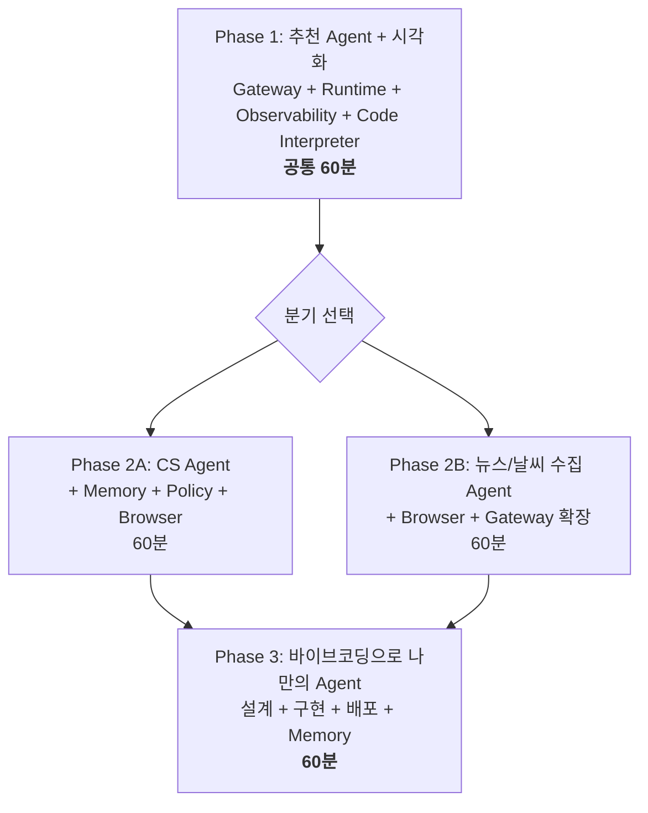
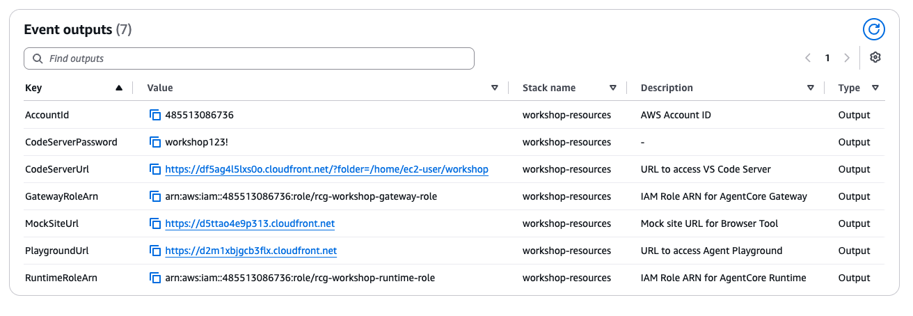
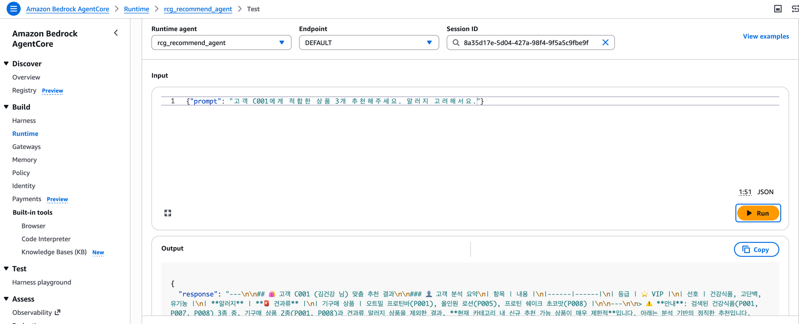

# Build! Deploy! Observe! — 리테일 Agent 실전 구축 워크샵 가이드

> **From PoC to Production**: Strands Agents + Amazon Bedrock AgentCore로 리테일 Agent를 처음부터 끝까지 직접 만들고 배포하는 핸즈온 워크샵 가이드입니다.

온라인 쇼핑몰에서 견과류 알러지가 있는 고객이 "간단히 먹을 단백질 식품 추천해줘"라고 물었을 때, Agent가 고객 프로필(알러지)을 조회하고, 구매 이력을 확인하고, 재고 있는 상품 중 알러지 성분을 제외하고 답변합니다. 이 워크샵에서는 이런 Agent를 **직접 만들고, AgentCore Runtime에 배포하고, 실시간으로 관찰**합니다.

이 저장소는 [MkDocs Material](https://squidfunk.github.io/mkdocs-material/)로 작성된 워크샵 가이드 문서 소스입니다.

---

## 이 워크샵이 특별한 이유

- 처음부터 끝까지 **AgentCore 위에서** 동작합니다 — 로컬 Python 실행이 아닙니다.
- 여러분이 만드는 Agent는 만든 즉시 **프로덕션 HTTPS 엔드포인트**가 됩니다.
- 배포한 Agent를 **Agent Playground** 웹 화면에서 바로 대화하며 테스트할 수 있습니다.


---

## 오늘 사용하는 AgentCore 서비스

| 서비스 | 역할 | 도입 시점 |
|--------|------|----------|
| **Gateway** | Tool을 MCP 프로토콜로 Agent에 연결 | Phase 1 |
| **Runtime** | Agent를 HTTPS 엔드포인트로 배포 | Phase 1 |
| **Observability** | 실시간 Trace + GenAI Dashboard | Phase 1 |
| **Code Interpreter** | Agent가 Python 코드를 실행하여 시각화 생성 | Phase 1 |
| **Memory** | 고객 맥락/대화 이력 저장 & 조회 | Phase 2A / Phase 3 |
| **Policy** | 가드레일 + 에스컬레이션 규칙 | Phase 2A |
| **Browser** | Mock 사이트에서 실시간 정보 수집 | Phase 2 |

## 워크샵 구조 (5시간)



| Phase | 만드는 것 | 추가되는 AgentCore 서비스 |
|-------|----------|-----------------|
| **Phase 1** | 상품 추천 Agent + 매출 시각화 | Gateway, Runtime, Observability, Code Interpreter |
| **Phase 2A** | CS 자동화 Agent + 경쟁사 가격 비교 | + Memory, Policy, Browser |
| **Phase 2B** | 뉴스/날씨 수집 Agent | + Browser, Gateway 확장 |
| **Phase 3** | 나만의 Agent (바이브코딩) | Runtime + Gateway + Memory 조합 |

참가자는 Phase 1을 공통으로 진행한 뒤, Phase 2A(CS Agent) 또는 Phase 2B(뉴스/날씨 수집 Agent) 중 하나를 선택해 진행하고, Phase 3에서 바이브코딩으로 나만의 Agent를 만듭니다.

---

## 워크샵 진행 환경

이 워크샵은 **AWS Workshop Studio**로 배포된 참가자별 개별 AWS 계정 + 사전 구성된 EC2 인스턴스(VS Code Server) 위에서 진행됩니다. 로컬에 별도로 설치할 것은 없습니다 — 참가자는 브라우저만 있으면 됩니다.

- **VS Code Server** — 브라우저 기반 IDE, Agent 코드 작성
- **Python 3.12 + Node.js 22 + AgentCore CLI** — 사전 설치 완료
- **Lambda 11개 + Mock 사이트** — 실습에 쓰이는 샘플(Mock) 데이터
- **Agent Playground** — 배포한 Agent를 웹 화면에서 즉시 테스트

자세한 접속 절차는 가이드의 [환경 세팅](docs/setup.md) 페이지를 참고하세요.

---

## 가이드 미리보기

| Home | Runtime 배포 | Agent Playground 연결 |
|---|---|---|
|  |  |  |

---

## 가이드 문서 구조

```
docs/
├── index.md              # Home — 워크샵 소개, 서비스 개요, 타임테이블
├── setup.md               # 환경 세팅 — Event Outputs 확인, Code Server 접속
├── phase1/                 # 첫 Agent, 세상에 내보내기 (Gateway/Runtime/Observability)
├── phase2a/                # CS Agent (Memory/Policy/Browser)
├── phase2b/                # 뉴스/날씨 수집 Agent (Gateway 확장/Browser)
├── phase3/                 # 바이브코딩으로 나만의 Agent 만들기 (Runtime/Gateway/Memory)
└── appendix/                # 서비스 맵, Next Steps, FAQ
```

전체 목차와 네비게이션은 [`mkdocs.yml`](mkdocs.yml)에 정의되어 있습니다.

---

## 로컬에서 가이드 실행하기

이 저장소는 문서 소스이므로, 다음과 같이 로컬에서 mkdocs로 미리보기할 수 있습니다.

```bash
git clone https://github.com/kjhyuok/rcg-agentcore-workshop-guide.git
cd rcg-agentcore-workshop-guide

python3 -m venv .venv
source .venv/bin/activate
pip install -r requirements.txt

mkdocs serve
```

브라우저에서 `http://127.0.0.1:8000`으로 접속하면 실시간으로 렌더링된 가이드를 볼 수 있습니다. `docs/` 하위 마크다운 파일을 수정하면 자동으로 리로드됩니다.

정적 사이트로 빌드하려면:

```bash
mkdocs build
```

---

## 워크샵 코드 저장소

이 저장소는 **가이드 문서**만 담고 있습니다. 참가자가 실제로 작성/배포하는 Agent 코드, 인프라 스크립트(CloudFormation/CDK), Mock 데이터 Lambda는 별도의 코드 저장소에 있습니다. 가이드 각 Step에 안내된 파일 경로(`~/workshop/starter-code/...`)를 참고하세요.

---

## 라이선스 / 문의

내부 워크샵용 자료입니다. 문의사항은 워크샵 진행 SA에게 연락해 주세요.
