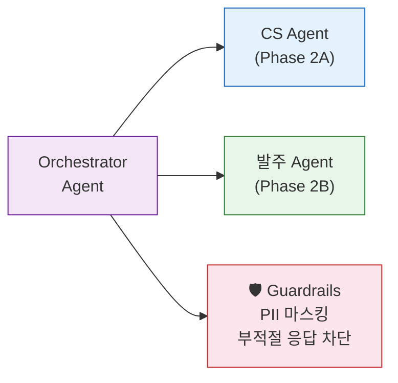

# 부록: 돌아가서 할 일 (Next Steps)

!!! abstract "Workshop은 시작입니다"
    오늘 만든 것은 Mock Lambda 기반 프로토타입입니다.
    실제 서비스로 전환하려면 아래 로드맵을 따르세요.

---

## 4주 로드맵

### Week 1: 실제 API 연결

| 할 일 | 방법 | 핵심 포인트 |
|--------|------|------------|
| Mock Lambda → 실제 API | Gateway Target만 교체 | **Agent 코드 수정 불필요** |
| 데이터 소스 연결 | Lambda에서 RDS/DynamoDB 호출 | 기존 DB 그대로 활용 |
| 인증 설정 | Identity로 API Key/OAuth2 | 보안 연결 |

```bash
# Mock Lambda → 실제 API 전환 예시
# Agent 코드는 그대로! Gateway Target만 변경!

agentcore gateway update-target \
  --gateway-id $GATEWAY_ID \
  --name "inventory_status" \
  --endpoint "arn:aws:lambda:ap-northeast-2:${ACCOUNT}:function:real-inventory-api"
```

!!! tip "핵심 인사이트"
    오늘의 가장 중요한 교훈:
    **Gateway Target을 바꾸면 Agent 코드를 한 줄도 안 고치고 실제 서비스가 됩니다.**
    이것이 AgentCore의 "관심사 분리" 아키텍처입니다.

---

### Week 2: Memory + Policy 고도화

| 할 일 | 방법 |
|--------|------|
| Memory 데이터 축적 | 실제 사용자 인터랙션 기록 시작 |
| Policy 규칙 세분화 | 부서별/직급별 차등 규칙 |
| A/B 테스트 | Prompt 변형 비교 (Observability 활용) |

```python
# Policy 규칙 세분화 예시
{
  "rules": [
    {"role": "intern", "limit": 100000, "action": "REQUIRE_APPROVAL"},
    {"role": "manager", "limit": 1000000, "action": "REQUIRE_APPROVAL"},
    {"role": "director", "limit": 5000000, "action": "ALLOW"},
    {"time": "after_hours", "action": "BLOCK"}
  ]
}
```

---

### Week 3: 멀티 Agent & Guardrails

| 할 일 | 방법 |
|--------|------|
| Agent 간 연동 | Identity로 Agent-to-Agent 호출 |
| Guardrails 추가 | 유해 콘텐츠/민감정보 필터링 |
| 에러 핸들링 | Fallback Agent, 재시도 로직 |



---

### Week 4: 프로덕션 & 평가

| 할 일 | 방법 |
|--------|------|
| 부하 테스트 | Runtime 스케일링 확인 |
| 평가 파이프라인 | 정확도/만족도/비용 자동 측정 |
| 모니터링 알림 | Observability → CloudWatch Alarm |
| 사내 시연 | Phase 3 발표 형식 재활용 |

---

## 프로덕션 체크리스트

### 필수 항목

- [ ] **Mock → Real API** 전환 완료
- [ ] **에러 핸들링** — Lambda 타임아웃, 네트워크 에러 대응
- [ ] **인증/인가** — Identity 설정으로 API Key 안전 관리
- [ ] **Guardrails** — PII 필터링, 유해 콘텐츠 차단
- [ ] **비용 모니터링** — 토큰 사용량, Lambda 호출 수 추적
- [ ] **Policy 규칙** — 프로덕션에 맞는 금액/권한 기준 재설정

### 권장 항목

- [ ] **멀티 Agent** — Orchestrator 패턴으로 복잡한 워크플로우 분해
- [ ] **평가 자동화** — 주기적 정확도 테스트
- [ ] **A/B 테스트** — System Prompt 변형으로 성능 비교
- [ ] **Memory 정리** — 오래된 기록 TTL 설정
- [ ] **Fallback** — LLM 에러 시 규칙 기반 대응

---

## Mock → Real 전환 가이드

| Layer | Mock (오늘) | Real (적용 시) | 변경 방법 |
|-------|------------|---------------|----------|
| Tool | Mock Lambda (하드코딩 응답) | 실제 API 호출 Lambda | Gateway Target 교체 |
| Memory | Workshop Memory | 프로덕션 Memory (별도 생성) | 환경변수 변경 |
| Policy | 단순 금액 규칙 | 부서/시간/권한 복합 규칙 | Policy 업데이트 |
| Model | Claude Sonnet 4 | 요구사항에 맞는 모델 | Agent 코드 model_id 변경 |
| Agent Code | **그대로 사용 가능** | 필요 시 Prompt만 개선 | System Prompt 수정 |

!!! note "Agent 코드는 거의 안 바뀝니다"
    오늘 작성한 Agent 코드의 **구조**는 프로덕션에서도 동일합니다.
    바뀌는 것은 Gateway Target(외부), Policy 규칙(외부), 환경변수뿐입니다.

---

## 3차 행사 연계

!!! info "다음 기회"
    이번 2차 Workshop에서 만든 Agent를 **3차 행사에서 실전 적용 사례로 발표**할 수 있습니다.

    **3차 행사 예정 내용:**
    
    - 실제 API 연동 결과 공유
    - 프로덕션 운영 경험 (Observability 활용)
    - 멀티 Agent 아키텍처 심화
    - 참가사 간 Best Practice 교류

---

## 도움이 필요할 때

| 상황 | 리소스 |
|------|--------|
| AgentCore 기술 질문 | AWS SA 채널 (Slack) |
| 코드 문제 | Workshop GitHub repo Issues |
| 아키텍처 상담 | SA 1:1 미팅 요청 |
| 추가 학습 | [AgentCore 공식 문서](https://docs.aws.amazon.com/bedrock/latest/userguide/agents-core.html) |

---

!!! success "마무리"
    오늘 여러분은 **AgentCore의 5개 서비스를 직접 조합**하여
    프로덕션 수준의 Agent를 만들었습니다.

    돌아가서 **Gateway Target만 실제 API로 교체**하면,
    오늘의 프로토타입이 **내일의 서비스**가 됩니다.

    "모델은 선택, **플랫폼은 AWS**"
