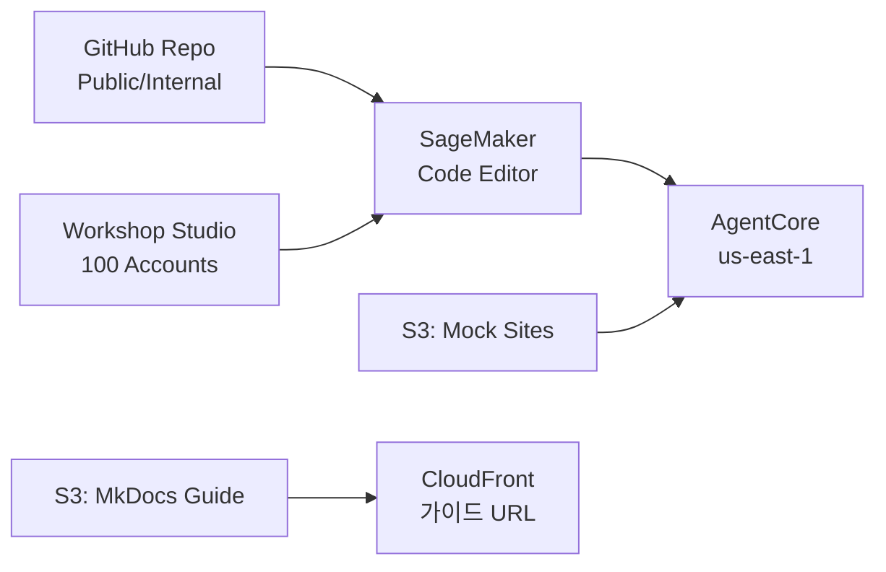

# SA 운영 가이드: 환경 구축 & 배포

!!! abstract "이 페이지는 SA(운영진) 전용입니다"
    참가자에게는 공개하지 않습니다. 워크샵 인프라 준비, Git Repo 세팅, SageMaker Code Editor 환경 구성을 다룹니다.

!!! danger "mkdocs.yml nav에서 제외되어 있지만 URL 직접 접근은 막히지 않습니다"
    이 파일은 참가자용 CloudFront 배포본에는 **포함시키지 마세요**. `mkdocs build` 시 `docs/appendix/sa-guide.md`를 site 빌드 대상에서 제외(별도 브랜치/별도 빌드 또는 `exclude` 플러그인 사용)하거나, 참가자 공개용 배포 직전에 이 파일을 리포지토리에서 빼고 빌드하세요.

---

## 전체 아키텍처 (운영 관점)



---

## 1. Git Repository 세팅

### 1-1. Repo 구조

```
rcg-agentcore-workshop/
├── README.md                    # 참가자용 Quick Start
├── .gitignore
├── starter-code/
│   ├── agents/
│   │   ├── phase1_recommend.py
│   │   ├── phase2a_cs.py
│   │   ├── phase2b_demand.py
│   │   └── phase3_orchestrator.py
│   ├── scripts/
│   │   ├── setup-gateway.py
│   │   ├── setup-memory.py
│   │   ├── deploy-agent.sh
│   │   └── run-evaluation.py
│   ├── lambdas/                 # SA가 사전 배포 (참가자 참고용)
│   │   ├── customer_profile/
│   │   ├── product_search/
│   │   ├── purchase_history/
│   │   ├── cs_lookup_order/
│   │   ├── cs_return_policy/
│   │   ├── cs_process_return/
│   │   ├── cs_delivery_status/
│   │   ├── demand_inventory/
│   │   ├── demand_sales_trend/
│   │   ├── demand_external_factors/
│   │   └── demand_purchase_order/
│   ├── data/                    # Mock 데이터 (참고용)
│   ├── client_app.py            # Streamlit UI (선택)
│   └── requirements.txt
├── infra/                       # SA 전용 — 참가자 불필요
│   ├── bootstrap.sh             # SageMaker Code Editor 초기 설정
│   ├── deploy-lambdas.sh        # Lambda 11개 일괄 배포
│   ├── deploy-mock-sites.sh     # Mock 사이트 S3 배포
│   ├── cfn-workshop-base.yaml   # IAM + Lambda + S3 CloudFormation
│   └── cleanup.sh               # 워크샵 후 리소스 정리
└── mock-sites/                  # Browser Tool이 접속할 사이트
    ├── competitor-prices.html
    ├── trend-news.html
    └── weather-forecast.html
```

### 1-2. GitHub Repo 생성

```bash
# Option A: AWS 내부 CodeCommit
aws codecommit create-repository \
  --repository-name rcg-agentcore-workshop \
  --repository-description "RCG 2nd Workshop - AgentCore Hands-On"

# Option B: GitHub (Public or Private)
gh repo create rcg-agentcore-workshop --public --clone
```

### 1-3. .gitignore

```gitignore
# Python
__pycache__/
*.pyc
.venv/
.env

# IDE
.vscode/
.idea/

# OS
.DS_Store
Thumbs.db

# Workshop output
evaluation-results/
*.json.bak
```

### 1-4. README.md (참가자용)

```markdown
# 🚀 RCG AgentCore Workshop — Starter Code

## Quick Start

### 1. 환경 설정
source ./infra/bootstrap.sh

### 2. 가이드 접속
워크샵 가이드: https://<CLOUDFRONT_URL>

### 3. Phase 1 시작
cd starter-code
python3 scripts/setup-gateway.py
```

---

## 2. SageMaker Code Editor 환경 구성

### 2-1. Workshop Studio 설정

| 항목 | 값 |
|------|-----|
| Instance Type | `ml.t3.medium` (2 vCPU, 4GB) |
| Storage | 20GB EBS |
| Image | `SageMaker Distribution 2.x` (Python 3.10+) |
| Region | `us-east-1` |
| IAM Role | `rcg-workshop-participant-role` |
| Timeout | 5시간 |

### 2-2. Bootstrap 스크립트 (`infra/bootstrap.sh`)

```bash
#!/bin/bash
set -e

echo "🚀 RCG AgentCore Workshop — 환경 초기화"
echo "=========================================="

# --- 1. Python 가상환경 ---
echo "[1/6] Python 가상환경 생성..."
cd ~/
git clone <REPO_URL> workshop 2>/dev/null || (cd workshop && git pull)
cd workshop/starter-code

python3 -m venv .venv
source .venv/bin/activate

# --- 2. 패키지 설치 ---
echo "[2/6] 패키지 설치..."
pip install --upgrade pip -q
pip install -r requirements.txt -q

# --- 3. Playwright (Browser Tool용) ---
echo "[3/6] Playwright Chromium 설치..."
playwright install chromium --with-deps 2>/dev/null || playwright install chromium

# --- 4. AgentCore CLI ---
echo "[4/6] AgentCore CLI 설치..."
pip install bedrock-agentcore-cli -q 2>/dev/null || echo "⚠️  agentcore CLI 미설치 (pip 패키지 미공개 시 수동 설치)"

# --- 5. 환경변수 설정 ---
echo "[5/6] 환경변수 설정..."
export AWS_REGION=us-east-1
export ACCOUNT_ID=$(aws sts get-caller-identity --query Account --output text)

cat > ~/.workshop_env << 'EOF'
export AWS_REGION=us-east-1
export ACCOUNT_ID=$(aws sts get-caller-identity --query Account --output text)
export MOCK_SITE_URL="https://<MOCK_SITE_CLOUDFRONT>.cloudfront.net"
# 아래는 Phase 진행하며 채워짐
# export AGENTCORE_GATEWAY_URL=
# export AGENTCORE_MEMORY_ID=
EOF

echo 'source ~/.workshop_env' >> ~/.bashrc
source ~/.workshop_env

# --- 6. 검증 ---
echo "[6/6] 환경 검증..."
echo ""
echo "  AWS Account: $ACCOUNT_ID"
echo "  Region:      $AWS_REGION"
echo "  Python:      $(python3 --version)"
echo "  pip packages:"
pip list 2>/dev/null | grep -E "strands|bedrock|playwright|mcp" | sed 's/^/    /'
echo ""

# Bedrock 모델 접근 확인
python3 -c "
from strands import Agent
from strands.models import BedrockModel
model = BedrockModel(model_id='us.anthropic.claude-sonnet-5', region_name='us-west-2')
agent = Agent(model=model, system_prompt='테스트')
print(agent('안녕? 한 줄로 답해.'))
print('  ✅ Bedrock 모델 접근 OK')
" 2>/dev/null || echo "  ❌ Bedrock 모델 접근 실패 — IAM Role 확인 필요"

echo ""
echo "=========================================="
echo "✅ 환경 초기화 완료! Phase 1을 시작하세요."
echo "=========================================="
```

### 2-3. IAM Role 권한 (참가자용)

```json
{
  "Version": "2012-10-17",
  "Statement": [
    {
      "Sid": "BedrockAgentCore",
      "Effect": "Allow",
      "Action": [
        "bedrock:InvokeModel",
        "bedrock-agentcore:*"
      ],
      "Resource": "*"
    },
    {
      "Sid": "Lambda",
      "Effect": "Allow",
      "Action": [
        "lambda:InvokeFunction",
        "lambda:ListFunctions"
      ],
      "Resource": "arn:aws:lambda:us-east-1:*:function:rcg-workshop-*"
    },
    {
      "Sid": "IAMPassRole",
      "Effect": "Allow",
      "Action": "iam:PassRole",
      "Resource": "arn:aws:iam::*:role/rcg-workshop-*"
    },
    {
      "Sid": "CloudWatch",
      "Effect": "Allow",
      "Action": [
        "cloudwatch:GetMetricData",
        "logs:GetLogEvents",
        "logs:FilterLogEvents",
        "xray:GetTraceSummaries",
        "xray:BatchGetTraces"
      ],
      "Resource": "*"
    },
    {
      "Sid": "STS",
      "Effect": "Allow",
      "Action": "sts:GetCallerIdentity",
      "Resource": "*"
    }
  ]
}
```

---

## 3. Lambda 사전 배포

### 3-1. 일괄 배포 스크립트 (`infra/deploy-lambdas.sh`)

```bash
#!/bin/bash
set -e

REGION="us-east-1"
ROLE_ARN="arn:aws:iam::$(aws sts get-caller-identity --query Account --output text):role/rcg-workshop-lambda-role"
PREFIX="rcg-workshop"
LAMBDA_DIR="../starter-code/lambdas"

echo "🔧 Lambda 11개 일괄 배포"
echo "Region: $REGION"
echo "Role:   $ROLE_ARN"
echo ""

LAMBDAS=(
  "customer_profile:customer-profile"
  "product_search:product-search"
  "purchase_history:purchase-history"
  "cs_lookup_order:cs-lookup-order"
  "cs_return_policy:cs-return-policy"
  "cs_process_return:cs-process-return"
  "cs_delivery_status:cs-delivery-status"
  "demand_inventory:demand-inventory"
  "demand_sales_trend:demand-sales-trend"
  "demand_external_factors:demand-external-factors"
  "demand_purchase_order:demand-purchase-order"
)

for entry in "${LAMBDAS[@]}"; do
  DIR_NAME="${entry%%:*}"
  FUNC_NAME="${PREFIX}-${entry##*:}"

  echo -n "  ${FUNC_NAME}... "

  # Zip 패키징
  cd "${LAMBDA_DIR}/${DIR_NAME}"
  zip -q /tmp/${FUNC_NAME}.zip index.py
  cd - > /dev/null

  # 생성 또는 업데이트
  aws lambda create-function \
    --function-name "${FUNC_NAME}" \
    --runtime python3.12 \
    --handler index.handler \
    --role "${ROLE_ARN}" \
    --zip-file "fileb:///tmp/${FUNC_NAME}.zip" \
    --timeout 30 \
    --memory-size 128 \
    --region "${REGION}" \
    2>/dev/null && echo "✅ 생성" || \
  (aws lambda update-function-code \
    --function-name "${FUNC_NAME}" \
    --zip-file "fileb:///tmp/${FUNC_NAME}.zip" \
    --region "${REGION}" \
    > /dev/null 2>&1 && echo "🔄 업데이트")

  rm -f /tmp/${FUNC_NAME}.zip
done

echo ""
echo "✅ Lambda 배포 완료! 확인:"
echo "aws lambda list-functions --query \"Functions[?starts_with(FunctionName, '${PREFIX}')].FunctionName\" --output table --region ${REGION}"
```

### 3-2. Lambda IAM Role

```yaml
# cfn-workshop-base.yaml (발췌)
WorkshopLambdaRole:
  Type: AWS::IAM::Role
  Properties:
    RoleName: rcg-workshop-lambda-role
    AssumeRolePolicyDocument:
      Version: "2012-10-17"
      Statement:
        - Effect: Allow
          Principal:
            Service: lambda.amazonaws.com
          Action: sts:AssumeRole
    ManagedPolicyArns:
      - arn:aws:iam::aws:policy/service-role/AWSLambdaBasicExecutionRole
```

---

## 4. Mock 사이트 배포

### 4-1. S3 + CloudFront 배포

```bash
#!/bin/bash
# infra/deploy-mock-sites.sh

BUCKET="rcg-workshop-mock-sites-$(aws sts get-caller-identity --query Account --output text)"
REGION="us-east-1"

echo "🌐 Mock 사이트 배포"

# S3 버킷 생성
aws s3 mb "s3://${BUCKET}" --region "${REGION}" 2>/dev/null || true

# HTML 업로드
aws s3 sync ../mock-sites/ "s3://${BUCKET}/" \
  --content-type "text/html" \
  --cache-control "max-age=60"

# 퍼블릭 액세스 (또는 CloudFront OAC)
aws s3 website "s3://${BUCKET}" --index-document competitor-prices.html

echo ""
echo "✅ Mock 사이트 배포 완료"
echo "   URL: http://${BUCKET}.s3-website-${REGION}.amazonaws.com"
echo ""
echo "   경쟁사 가격: .../competitor-prices.html"
echo "   트렌드 뉴스: .../trend-news.html"
echo "   날씨 예보:   .../weather-forecast.html"
echo ""
echo "   이 URL을 bootstrap.sh의 MOCK_SITE_URL에 설정하세요."
```

---

## 5. MkDocs 가이드 배포

```bash
# MkDocs 빌드 & S3 배포
cd rcg-workshop-2nd-v2
python3 -m mkdocs build -f mkdocs.yml

aws s3 sync site/ s3://rcg-workshop-guide-${ACCOUNT_ID}/ \
  --delete --cache-control "max-age=300"

# CloudFront 무효화 (있는 경우)
# aws cloudfront create-invalidation --distribution-id EXXXXX --paths "/*"
```

---

## 6. D-Day 체크리스트

### D-21 (3주 전)

- [ ] GitHub Repo 생성 & 코드 push
- [ ] `bedrock-agentcore` 패키지 최신 버전 확인
- [ ] `agentcore` CLI 설치 방법 확정
- [ ] Workshop Studio 100석 예약

### D-14 (2주 전)

- [ ] Lambda 11개 배포 (`deploy-lambdas.sh`)
- [ ] Mock 사이트 3개 배포 (`deploy-mock-sites.sh`)
- [ ] IAM Role 생성 (참가자용 + Lambda용 + Gateway용)
- [ ] Bedrock model access 100명 동시 limit increase 요청
- [ ] Browser 세션 quota 확인 (동시 100명)
- [ ] Code Interpreter quota 확인

### D-7 (1주 전)

- [ ] SA 5명 전원 리허설 (bootstrap → Phase 3 전체 실행)
- [ ] MkDocs 가이드 CloudFront 배포
- [ ] Workshop Studio 테스트 계정 1개로 end-to-end 확인
- [ ] Orchestrator Agent 사전 배포 (Phase 3용)
- [ ] 네트워크 환경 테스트 (고객사 방화벽 이슈 등)

### D-1 (전날)

- [ ] Lambda warm-up (각 1회 호출)
- [ ] 가이드 URL 최종 확인
- [ ] 참가자 안내 메일 발송 (URL, 사전 준비 없음 안내)
- [ ] 시상품 준비

### D-Day

- [ ] 09:30 — SA 현장 도착, 네트워크 확인
- [ ] 09:45 — Workshop Studio 계정 배포 시작
- [ ] 10:00 — Keynote 시작
- [ ] 10:20 — 참가자 `source bootstrap.sh` 일제히 실행
- [ ] 각 Phase 시작 시 SA 실시간 모니터링 (CloudWatch)

---

## 7. 트러블슈팅

### 흔한 이슈 & 해결

| 증상 | 원인 | 해결 |
|------|------|------|
| `ModuleNotFoundError: strands` | venv 미활성화 | `source .venv/bin/activate` |
| `AccessDeniedException` (Bedrock) | IAM Role 권한 부족 | model access 승인 확인 |
| Gateway 생성 실패 | agentcore quota | Service Quotas에서 증설 |
| Browser Tool timeout | Playwright 미설치 | `playwright install chromium` |
| Memory API 에러 | Memory 미생성 | `AGENTCORE_MEMORY_ID` 확인 |
| `nest_asyncio` 에러 | Python 3.12+ 호환 | `pip install nest-asyncio>=1.6` |
| Code Editor 포트 접근 불가 | SageMaker 네트워크 | presigned URL 또는 proxy 사용 |

### 긴급 복구

```bash
# 참가자 Gateway가 꼬였을 때 — 리셋
python3 scripts/setup-gateway.py  # 멱등성 있음 (이미 존재하면 skip)

# Lambda 응답 안 될 때
aws lambda invoke --function-name rcg-workshop-customer-profile \
  --payload '{"body": "{\"customer_id\": \"C001\"}"}' /tmp/out.json \
  --region us-east-1
cat /tmp/out.json

# 전체 리소스 정리 (워크샵 종료 후)
./infra/cleanup.sh
```

---

## 8. 리소스 정리 (`infra/cleanup.sh`)

```bash
#!/bin/bash
echo "🧹 워크샵 리소스 정리"
echo "⚠️  이 작업은 되돌릴 수 없습니다. 계속하시겠습니까? (y/N)"
read -r confirm
[[ "$confirm" != "y" ]] && exit 0

REGION="us-east-1"
PREFIX="rcg-workshop"

# Lambda 삭제
echo "[1/4] Lambda 삭제..."
aws lambda list-functions \
  --query "Functions[?starts_with(FunctionName, '${PREFIX}')].FunctionName" \
  --output text --region ${REGION} | tr '\t' '\n' | while read fn; do
  aws lambda delete-function --function-name "$fn" --region ${REGION}
  echo "  삭제: $fn"
done

# S3 Mock 사이트 삭제
echo "[2/4] S3 Mock 사이트 삭제..."
BUCKET="${PREFIX}-mock-sites-$(aws sts get-caller-identity --query Account --output text)"
aws s3 rb "s3://${BUCKET}" --force 2>/dev/null || true

# IAM Role 삭제
echo "[3/4] IAM Role 삭제..."
for role in "${PREFIX}-lambda-role" "${PREFIX}-gateway-role" "${PREFIX}-participant-role"; do
  aws iam delete-role --role-name "$role" 2>/dev/null && echo "  삭제: $role" || true
done

# AgentCore 리소스 (Gateway, Memory, Runtime)
echo "[4/4] AgentCore 리소스는 참가자 계정에 생성되므로 Workshop Studio 종료 시 자동 정리됩니다."

echo ""
echo "✅ 정리 완료"
```
