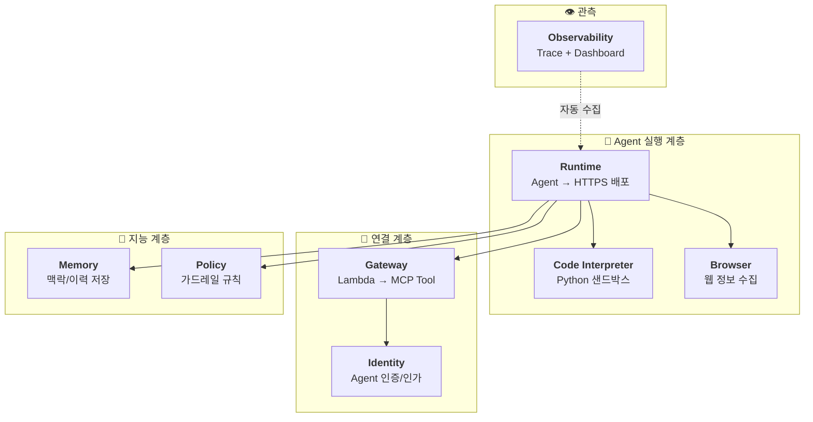
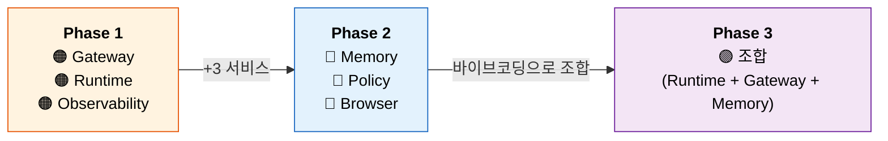
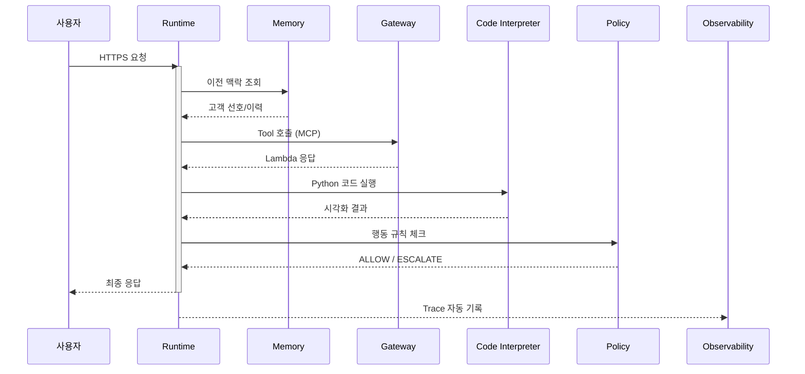
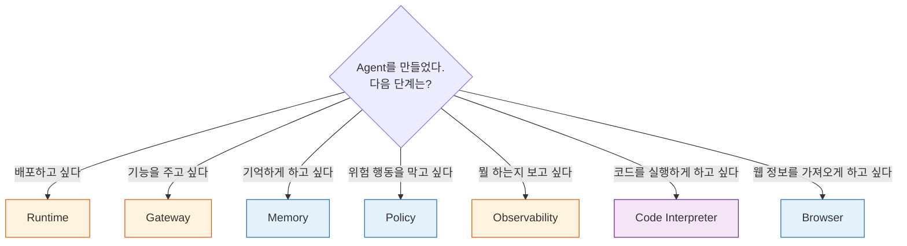

# 부록: AgentCore 서비스 한눈에 보기

::: info ℹ️ 오늘 사용한 7개 서비스
AgentCore는 Agent를 **만들고 → 배포하고 → 관찰하는** 풀스택 플랫폼입니다.
오늘 Workshop에서 7개 서비스를 직접 체험했습니다.
:::

## 플랫폼 전체 구조

## Phase별 서비스 도입 흐름

## 서비스 요청 흐름 (단일 Agent 호출)

## 7개 서비스 상세

### 🟠 Phase 1 서비스

#### Runtime — Agent를 서비스로 배포

| 항목 | 설명 |
|------|------|
| **한 줄 요약** | Python Agent 코드를 HTTPS 엔드포인트로 변환 |
| **핵심 명령** | `agentcore deploy`, `agentcore invoke` |
| **비유** | Lambda가 함수를 서비스하듯, Runtime은 **Agent를 서비스** |
| **사용 Phase** | 전 Phase (1, 2A, 2B, 3) |

#### Gateway — 외부 Tool을 Agent에 연결

| 항목 | 설명 |
|------|------|
| **한 줄 요약** | Lambda/API를 MCP Tool로 변환하여 Agent가 호출 가능하게 |
| **핵심 명령** | `create_gateway`, `create_gateway_target` |
| **비유** | API Gateway가 HTTP를 라우팅하듯, Gateway는 **Tool을 라우팅** |
| **사용 Phase** | Phase 1 (3개), Phase 2A (+4개), Phase 2B (+4개) |

::: tip Gateway의 핵심 가치
Agent 코드를 수정하지 않고 Gateway Target만 추가/변경하면 Agent 기능이 확장됩니다.
Mock Lambda → 실제 API 전환도 Agent 코드 변경 없이 가능합니다.
:::

#### Observability — Agent 행동을 투명하게

| 항목 | 설명 |
|------|------|
| **한 줄 요약** | 모든 Tool 호출, LLM 호출, 지연시간을 Trace로 기록 |
| **핵심 도구** | GenAI Dashboard, X-Ray Trace |
| **비유** | APM이 서버를 모니터링하듯, Observability는 **Agent를 모니터링** |
| **사용 Phase** | 전 Phase (자동 활성화 — 설정 불필요) |

#### Code Interpreter — Agent가 코드를 실행

| 항목 | 설명 |
|------|------|
| **한 줄 요약** | Agent가 Python 코드를 작성 & 실행하여 계산/시각화 |
| **핵심 코드** | `AgentCoreCodeInterpreter(region="us-west-2")` |
| **비유** | 계산기를 가진 Agent — 숫자를 "추측"이 아닌 "계산"으로 |
| **사용 Phase** | Phase 3 (선택 — ROI/할인율 계산 등) |

### 🔵 Phase 2 서비스

#### Memory — Agent에게 기억을 부여

| 항목 | 설명 |
|------|------|
| **한 줄 요약** | 대화 이력, 사용자 선호, 과거 결과를 저장/검색 |
| **핵심 코드** | `memory_client.retrieve_memories()`, `create_event()` |
| **비유** | CRM이 고객 정보를 기억하듯, Memory는 **Agent의 경험을 기억** |
| **사용 Phase** | Phase 2A (대화 맥락), Phase 3 (나만의 Agent 고도화) |

::: info 단기 기억 vs 장기 기억
- **단기 기억** (현재 대화): LLM Context Window가 담당
- **장기 기억** (이전 대화, 선호도): AgentCore Memory가 담당
:::

#### Policy — Agent에게 가드레일 설정

| 항목 | 설명 |
|------|------|
| **한 줄 요약** | 특정 조건에서 Agent 행동을 제한/승인 요구 |
| **핵심 코드** | `agentcore policy create --rules [...]` |
| **비유** | 결재 시스템이 금액별 승인을 요구하듯, Policy는 **Agent 행동을 통제** |
| **사용 Phase** | Phase 2A (5만원 환불 에스컬레이션) |

| | System Prompt | Policy |
|--|--|--|
| 방식 | LLM에게 "하지 마" 요청 | 시스템이 **강제 차단** |
| 신뢰도 | LLM이 무시할 수 있음 | **100% 적용 보장** |
| 변경 | Agent 재배포 필요 | 정책만 수정 |
| 감사 | 로그 없음 | Trace에 기록 |

#### Browser — 웹에서 실시간 정보 수집

| 항목 | 설명 |
|------|------|
| **한 줄 요약** | Agent가 웹사이트를 방문하여 정보를 추출 |
| **핵심 코드** | `AgentCoreBrowser(region="us-east-1")` |
| **비유** | Agent에게 브라우저를 주면 — 경쟁사 가격, 뉴스, 날씨를 직접 확인 |
| **사용 Phase** | Phase 2A (경쟁사 가격), Phase 2B (뉴스/날씨 수집) |

::: tip Phase 3는 새 서비스가 아니라 '조합'입니다
Phase 3에서는 새로운 서비스를 배우는 대신, 위 서비스들(Runtime + Gateway + Memory)을
**바이브코딩으로 조합**하여 나만의 Agent를 만들었습니다.
이것이 AgentCore의 핵심 — 서비스는 재료이고, Agent는 조합입니다.
:::

## 서비스 선택 의사결정 가이드

## 오늘 배운 핵심 패턴

| 패턴 | 설명 | 코드 한 줄 |
|------|------|-----------|
| **Agent = 조합** | Model + Prompt + Tools | `Agent(model=..., tools=[...])` |
| **Tool = Gateway** | Lambda ARN 몰라도 됨 | `gateway_tools = get_tools(url)` |
| **기억 = Memory** | 맥락 조회 → 프롬프트 주입 | `memory.retrieve_memories(...)` |
| **규칙 = Policy** | 코드 외부에서 행동 통제 | `policy create --rules [...]` |
| **관측 = 자동** | 배포만 하면 Trace 활성화 | 설정 불필요 |
| **시각화 = Code Interpreter** | Agent가 직접 차트 생성 | `tools=[ci.code_interpreter]` |
| **실시간 = Browser** | 웹사이트 방문 & 추출 | `tools=[browser.browser]` |
| **조합 = 바이브코딩** | 설계서 + 참고 코드 → 나만의 Agent | "이 설계서대로 만들어줘" |

::: tip ✅ 핵심 메시지
Agent 개발은 **"코드를 짜는 것"**이 아니라 **"서비스를 조합하는 것"**입니다.

- Gateway Target만 바꾸면 → Tool이 바뀜
- System Prompt만 바꾸면 → 역할이 바뀜
- Memory Strategy만 바꾸면 → 지능이 바뀜
- Policy Rule만 바꾸면 → 행동 범위가 바뀜

**여러분은 이미 프로덕션 Agent 개발자입니다.** 🎉
:::

