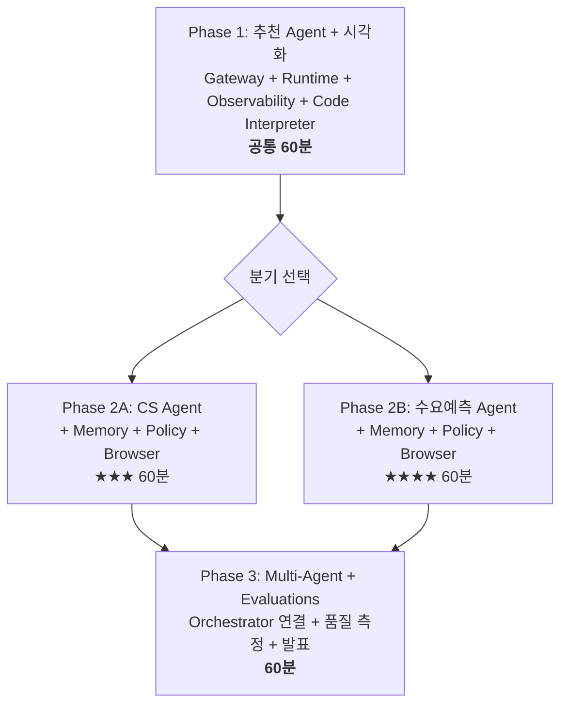

# RCG AI Platform Day #2

## PoC에서 프로덕션까지, Agent를 직접 만들어 배포하는 하루

---

온라인 쇼핑몰에서 고객이 "저번에 산 운동화랑 어울리는 양말 추천해줘"라고 물었을 때, 여러분의 Agent가 구매이력을 조회하고, 재고를 확인하고, 취향에 맞는 상품을 골라 답변합니다. 오늘 이 Agent를 직접 만들고 배포합니다.

!!! tip "이 워크샵이 특별한 이유"
    처음부터 끝까지 **AgentCore 위에서** 동작합니다. 로컬 Python 실행이 아닙니다.
    
    여러분이 만드는 Agent는 **즉시 프로덕션 엔드포인트**가 됩니다.

---

## 오늘 사용하는 AgentCore 서비스

| 서비스 | 역할 | 도입 시점 |
|--------|------|----------|
| **Gateway** | Tool을 MCP 프로토콜로 Agent에 연결 | Phase 1 |
| **Runtime** | Agent를 HTTPS 엔드포인트로 배포 | Phase 1 |
| **Observability** | 실시간 Trace + GenAI Dashboard | Phase 1 |
| **Code Interpreter** | Agent가 Python 코드를 실행하여 시각화 생성 | Phase 1 |
| **Memory** | 고객 맥락/대화 이력 저장 & 조회 | Phase 2 |
| **Policy** | 가드레일 + 에스컬레이션 규칙 | Phase 2 |
| **Browser** | Mock 사이트에서 실시간 정보 수집 | Phase 2 |
| **Multi-Agent (A2A)** | Orchestrator가 여러 Agent를 라우팅 | Phase 3 |
| **Evaluations** | Agent 품질 점수 자동 측정 | Phase 3 |

---

## 워크샵 구조

---

## 타임테이블

| 시간 | 세션 | 내용 |
|------|------|------|
| 10:00-10:20 | Keynote | AgentCore 비전 & 오늘의 목표 (20분) |
| 10:20-11:20 | **Phase 1** | 추천 Agent + Code Interpreter 시각화 (60분) |
| 11:20-11:30 | Break | 휴식 (10분) |
| 11:30-12:30 | **Phase 2** | 택1: CS Agent 또는 수요예측 Agent (60분) |
| 12:30-13:30 | 점심 | |
| 13:30-14:30 | **Phase 3** | Multi-Agent 연결 + Evaluations + 발표 (60분) |
| 14:30-14:50 | Wrap-up | 시상 & 마무리 (20분) |

---

## Phase별 학습 목표

| Phase | 만드는 것 | AgentCore 서비스 |
|-------|----------|-----------------|
| **Phase 1** | 상품 추천 Agent + 매출 시각화 | Gateway + Runtime + Observability + **Code Interpreter** |
| **Phase 2A** | CS 자동화 Agent + 경쟁사 가격 비교 | + Memory + Policy + **Browser** |
| **Phase 2B** | 수요 예측 Agent + 트렌드 수집 | + Memory + Policy + **Browser** |
| **Phase 3** | Multi-Agent 연결 + 품질 점수 | **Multi-Agent (A2A)** + **Evaluations** |

---

## 나의 진행 상태

체크하며 따라가세요:

- [ ] **환경 세팅** — `source bootstrap.sh` 실행 완료
- [ ] **Phase 1** — Gateway 생성, Agent 작성, Runtime 배포, Trace 확인
- [ ] **Phase 2 (택1)** — Memory + Policy + Browser 추가
- [ ] **Phase 3** — Orchestrator 등록, Evaluations 실행, 발표

---

## 시작하기

[환경 세팅](setup.md)으로 이동하세요.
