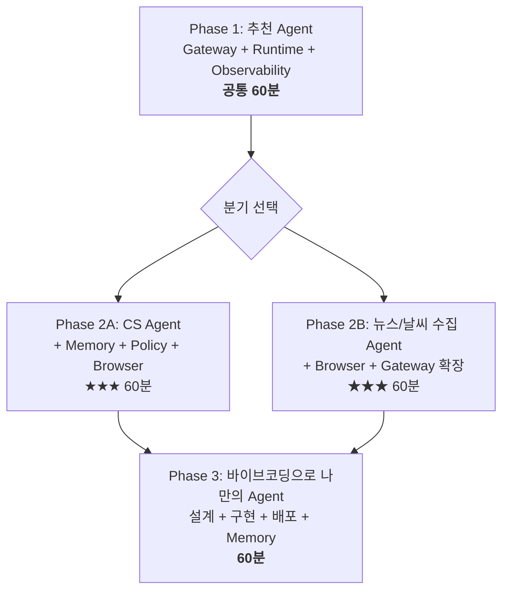

# RCG AI Platform Day #2

## PoC에서 프로덕션까지, Agent를 직접 만들어 배포하는 하루

---

온라인 쇼핑몰에서 견과류 알러지가 있는 고객이 "간단히 먹을 단백질 식품 추천해줘"라고 물었을 때, 여러분의 Agent가 고객 프로필(알러지)을 조회하고, 구매이력을 확인하고, 재고 있는 상품 중 알러지 성분을 제외하고 답변합니다. 오늘 이 Agent를 직접 만들고 배포합니다.

::: tip 이 워크샵이 특별한 이유
처음부터 끝까지 **AgentCore 위에서** 동작합니다. 로컬 Python 실행이 아닙니다.

여러분이 만드는 Agent는 **즉시 프로덕션 엔드포인트**가 됩니다.
:::

## Agent Playground — 내가 만든 Agent를 바로 테스트

오늘 여러분이 만드는 Agent는 코드로만 끝나지 않습니다. EC2에 미리 준비된 **Agent Playground** 웹 화면에서 실시간으로 대화하며 확인할 수 있습니다.

- **테스트에 쓰이는 데이터**는 실제 데이터가 아니라, 이 워크샵을 위해 만든 **Mock 데이터**입니다 (Lambda 함수 + 별도 Mock 사이트 URL에서 제공).
- Phase별로 `agentcore deploy`로 Agent를 배포하면 **Runtime ARN**이 출력됩니다. 이 ARN을 Playground 우측 상단 **⚙️ Settings**에서 입력하면, 별도 배포 작업 없이 **즉시 화면에서 내 Agent를 호출**할 수 있습니다.

::: tip 언제 사용하나요?
각 Phase에서 Agent를 배포한 직후, CLI(`agentcore invoke`) 대신 이 Playground에서 대화형으로 테스트하면 더 편합니다. 접속 URL은 Workshop Studio **Event Outputs**의 `PlaygroundUrl`에서 확인하세요 ([환경 세팅](setup.md) 참고).
:::

## 오늘 사용하는 AgentCore 서비스

| 서비스 | 역할 | 도입 시점 |
|--------|------|----------|
| **Gateway** | Tool을 MCP 프로토콜로 Agent에 연결 | Phase 1 |
| **Runtime** | Agent를 HTTPS 엔드포인트로 배포 | Phase 1 |
| **Observability** | 실시간 Trace + GenAI Dashboard | Phase 1 |
| **Code Interpreter** | Agent가 Python 코드를 실행하여 시각화 생성 | Phase 1 |
| **Memory** | 고객 맥락/대화 이력 저장 & 조회 | Phase 2A / Phase 3 |
| **Policy** | 가드레일 + 에스컬레이션 규칙 | Phase 2A |
| **Browser** | Mock 사이트에서 실시간 정보 수집 | Phase 2 |

## 워크샵 구조

## 타임테이블

| 시간 | 세션 | 내용 |
|------|------|------|
| 10:00-10:20 | Keynote | AgentCore 비전 & 오늘의 목표 (20분) |
| 10:20-11:20 | **Phase 1** | 추천 Agent + 시나리오별 Tool 호출 관찰 (60분) |
| 11:20-11:30 | Break | 휴식 (10분) |
| 11:30-12:30 | **Phase 2** | 택1: CS Agent 또는 뉴스/날씨 수집 Agent (60분) |
| 12:30-13:30 | 점심 | |
| 13:30-14:30 | **Phase 3** | 나만의 Agent 설계·바이브코딩·배포 (60분) |
| 14:30-14:50 | Wrap-up | 마무리 (20분) |

## Phase별 학습 목표

| Phase | 만드는 것 | AgentCore 서비스 |
|-------|----------|-----------------|
| **Phase 1** | 상품 추천 Agent | Gateway + Runtime + Observability |
| **Phase 2A** | CS 자동화 Agent + 경쟁사 가격 비교 | + Memory + Policy + **Browser** |
| **Phase 2B** | 뉴스/날씨 수집 Agent | + **Browser** + Gateway 확장 |
| **Phase 3** | 나만의 Agent (바이브코딩) | **Runtime + Gateway + Memory** 조합 |

## 나의 진행 상태

체크하며 따라가세요:

- [ ] **환경 세팅** — Workshop Studio **Event Outputs**의 `CodeServerUrl`로 VS Code Server 접속 (`~/workshop` 자동 오픈, 사전 구성 완료)
- [ ] **Phase 1** — Gateway 생성, Agent 작성, Runtime 배포, Trace 확인
- [ ] **Phase 2 (택1)** — 2A: Memory + Policy + Browser / 2B: Browser + Gateway 확장
- [ ] **Phase 3** — 설계서 작성, 바이브코딩, 배포, Memory 연동

## 시작하기

[환경 세팅](setup.md)으로 이동하세요.
