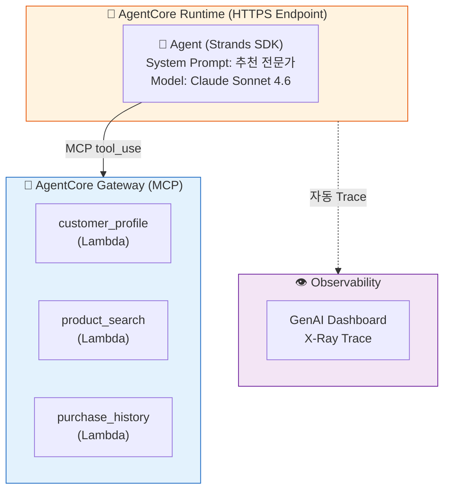
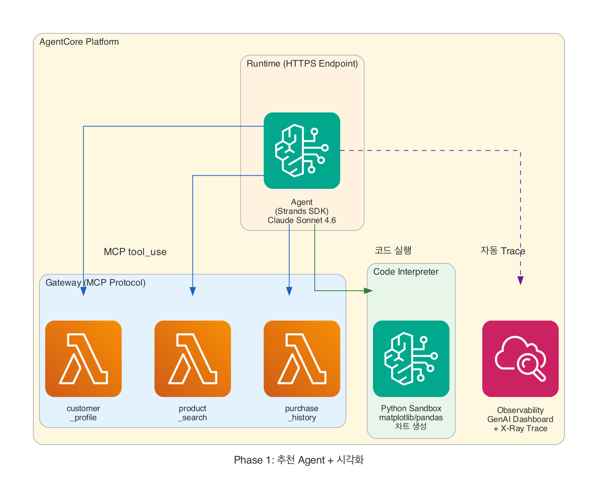

# Phase 1: 추천 Agent

고객이 "견과류 알러지가 있는데 뭐 추천해줄래요?"라고 물었습니다. 여러분의 Agent는 프로필을 확인하고, 알러지를 피하고, 취향에 맞는 상품을 골라 추천합니다. 신규 고객, 조건에 안 맞는 요청 등 다양한 시나리오에서 Agent가 Tool을 어떻게 판단하고 호출하는지도 함께 관찰합니다 — 이 모든 것이 AgentCore 위에서 동작합니다.

::: info ℹ️ 이 Phase에서 배우는 것
- **Gateway** — Lambda를 MCP Tool로 변환하여 Agent에 연결
- **Runtime** — Agent를 HTTPS 엔드포인트로 배포
- **Observability** — GenAI Dashboard에서 Trace 실시간 확인
- **핵심 패턴** — Agent = Model + Prompt + Gateway(Tools), 시나리오별 Tool 호출 전략
:::

## 개요

| 항목 | 내용 |
|------|------|
| 소요 시간 | 60분 |
| AgentCore 서비스 | Gateway, Runtime, Observability |
| 만드는 것 | 상품 추천 Agent (HTTPS 엔드포인트) |
| Tool 수 | 3개 (customer_profile, product_search, purchase_history) |

## 아키텍처

<!-- AWS 아이콘 버전 (롤백 시 이 블록만 삭제) -->
<figure>

  <figcaption>AWS 서비스 아이콘 기반 아키텍처</figcaption>
</figure>

## Steps

1. [Gateway 생성 & Tool 등록](step1-gateway.md) — Lambda를 MCP Tool로 변환
2. [Agent 코드 작성 + 시나리오 테스트](step2-agent.md) — Gateway Tool을 결합한 Agent 구성, 여러 시나리오로 Tool 호출 전략 관찰
3. [Runtime 배포](step3-runtime.md) — `agentcore deploy`로 HTTPS 엔드포인트 생성
4. [Observability](step4-observability.md) — GenAI Dashboard에서 Trace 확인

---

::: info Agent가 상황에 따라 Tool 호출을 조절합니다
신규 고객(구매 이력 없음), 조건을 만족하는 상품이 없는 경우, 특정 고객을 특정하지 않은 질문 등
다양한 시나리오에서 Agent가 Tool을 얼마나, 어떤 순서로 호출하는지가 다릅니다.
Step 2에서 이 차이를 직접 관찰하고, Step 4의 Trace로 다시 검증합니다.
:::

::: tip 핵심 포인트
이 Phase가 끝나면 여러분의 Agent는 **이미 프로덕션 엔드포인트**입니다.

로컬 Python이 아닙니다. 누구나 HTTPS로 호출할 수 있는 서비스가 됩니다.
:::

