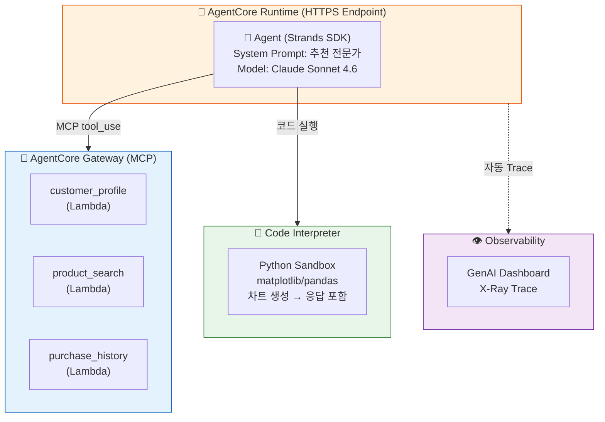

# Phase 1: 추천 Agent + 시각화

고객이 "견과류 알러지가 있는데 뭐 추천해줄래요?"라고 물었습니다. 여러분의 Agent는 프로필을 확인하고, 알러지를 피하고, 취향에 맞는 상품을 골라 추천합니다. 그리고 추천 이유를 Python 코드로 시각화하여 매출 차트까지 응답에 포함합니다 — 이 모든 것이 AgentCore 위에서 동작합니다.

!!! abstract "이 Phase에서 배우는 것"
    - **Gateway** — Lambda를 MCP Tool로 변환하여 Agent에 연결
    - **Code Interpreter** — Agent가 Python으로 추천 이유 시각화 (매출 차트 생성)
    - **Runtime** — Agent를 HTTPS 엔드포인트로 배포
    - **Observability** — GenAI Dashboard에서 Trace 실시간 확인
    - **핵심 패턴** — Agent = Model + Prompt + Gateway(Tools) + Code Interpreter(시각화)

---

## 개요

| 항목 | 내용 |
|------|------|
| 소요 시간 | 60분 |
| AgentCore 서비스 | Gateway, Runtime, Observability, Code Interpreter |
| 만드는 것 | 상품 추천 Agent (HTTPS 엔드포인트 + 시각화) |
| Tool 수 | 3개 (customer_profile, product_search, purchase_history) + Code Interpreter |

---

## 아키텍처

<!-- AWS 아이콘 버전 (롤백 시 이 블록만 삭제) -->
<figure markdown>
  { width="600" }
  <figcaption>AWS 서비스 아이콘 기반 아키텍처</figcaption>
</figure>

---

## Steps

1. [Gateway 생성 & Tool 등록](step1-gateway.md) — Lambda를 MCP Tool로 변환
2. [Agent + Code Interpreter 연동](step2-agent.md) — Gateway Tool + Python 시각화를 결합한 Agent 구성
3. [Runtime 배포](step3-runtime.md) — `agentcore deploy`로 HTTPS 엔드포인트 생성
4. [Observability](step4-observability.md) — GenAI Dashboard에서 Trace 확인

---

!!! note "Agent가 추천 이유를 Python 코드로 시각화합니다"
    Code Interpreter를 통해 Agent는 단순 텍스트 응답이 아니라, 
    매출 데이터 기반 차트나 카테고리 분포 그래프를 Python으로 생성하여 응답에 포함합니다.
    고객에게 "왜 이 상품을 추천했는지"를 데이터로 보여줍니다.

!!! tip "핵심 포인트"
    이 Phase가 끝나면 여러분의 Agent는 **이미 프로덕션 엔드포인트**입니다.
    
    로컬 Python이 아닙니다. 누구나 HTTPS로 호출할 수 있는 서비스가 됩니다.
    Code Interpreter 덕분에 Agent가 **스스로 코드를 작성하고 실행**합니다.
