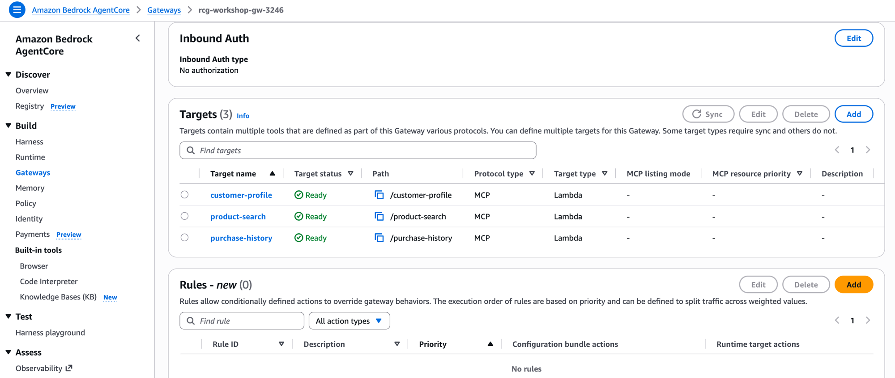
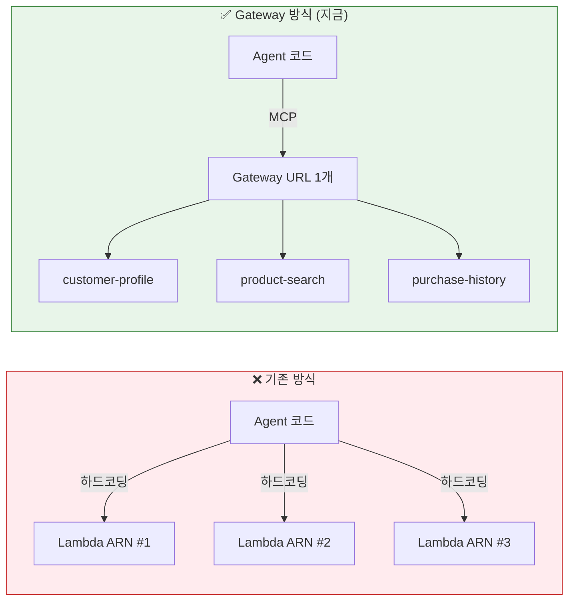
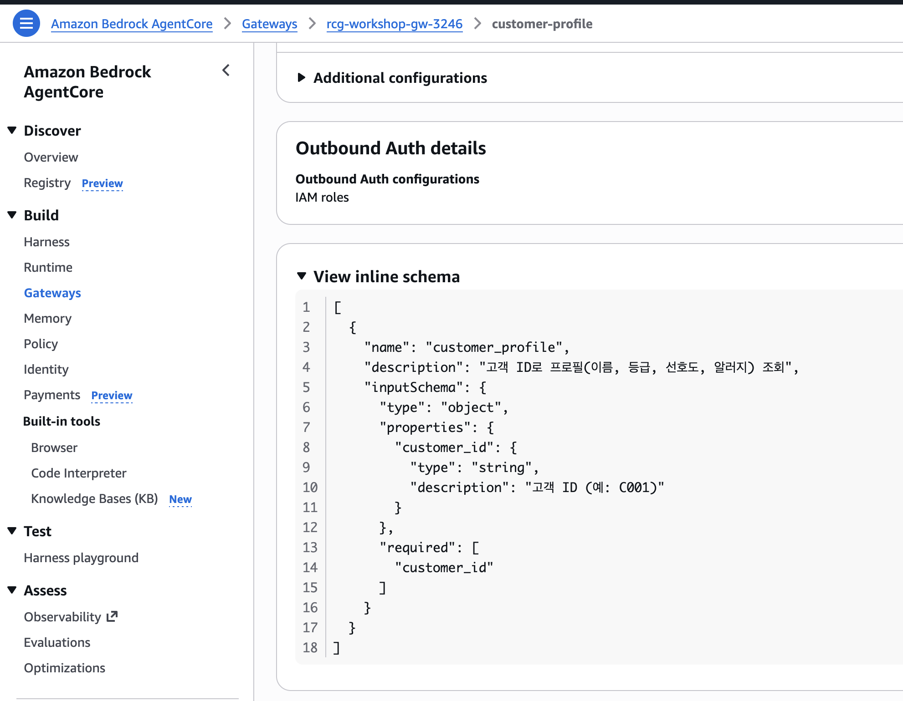

# Step 1: Gateway 생성 & Tool 등록 <span class="badge-time">⏱️ 10분</span> <span class="badge-difficulty">★☆☆</span>

<div class="step-progress">
  <span class="step active">● Step 1 Gateway</span>
  <span class="step-connector"></span>
  <span class="step">○ Step 2 Agent</span>
  <span class="step-connector"></span>
  <span class="step">○ Step 3 Runtime</span>
  <span class="step-connector"></span>
  <span class="step">○ Step 4 Observability</span>
</div>

::: info 이 Step의 목표
사전 배포된 Lambda 함수를 **AgentCore Gateway**에 MCP Tool로 등록합니다.

이후 Agent는 이 Gateway를 통해 Tool을 호출합니다.
:::


<div class="file-target">scripts/setup-gateway.py</div>

## Gateway란?

```
기존 방식:  Agent → 직접 Lambda 호출 (하드코딩)
AgentCore: Agent → Gateway(MCP) → Lambda (자동 라우팅)
```

**Gateway의 가치:**

- Agent 코드에 Lambda ARN을 하드코딩하지 않음
- Tool 추가/변경 시 Agent 재배포 불필요
- MCP 프로토콜로 표준화된 Tool 호출
- 인증/인가를 Gateway 레벨에서 처리

## 1-1. Gateway 생성 스크립트 실행

```bash
cd ~/workshop/starter-code
python3.12 scripts/setup-gateway.py
```

::: details 🧪 스크립트가 하는 일 (내부)
```python
# 1. Gateway 생성
client.create_gateway(
    name="rcg-workshop-gw-XXXX",
    protocolType="MCP",
    roleArn=ROLE_ARN,
)

# 2. Lambda를 Gateway Target으로 등록
client.create_gateway_target(
    gatewayIdentifier=gateway_id,
    name="customer-profile",
    targetConfiguration={
        "mcp": {
            "lambda": {
                "lambdaArn": lambda_arn,
                "toolSchema": {"inlinePayload": tool_schema}
            }
        }
    },
)
```
:::

## 1-2. 결과 확인

스크립트가 출력하는 정보를 확인하세요:

```
🎉 Gateway 설정 완료!
   Gateway ID:  gw-abc123def456
   Gateway URL: https://gw-abc123def456.gateway.agentcore.us-west-2.amazonaws.com

   export AGENTCORE_GATEWAY_URL=https://gw-abc123...
```

::: warning 환경변수 설정 필수
```bash
export AGENTCORE_GATEWAY_URL=<위에서 출력된 URL>
export GATEWAY_ID=<위에서 출력된 URL>
```
:::

## 1-3. Tool 등록 확인

```bash
aws bedrock-agentcore-control list-gateway-targets \
  --gateway-identifier "$GATEWAY_ID" \
  --query 'items[].[name, status]' --output table
```

::: details ✅ 정상 출력
```
----------------------------
|   ListGatewayTargets     |
+------------------+-------+
|  customer-profile | READY |
|  product-search   | READY |
|  purchase-history | READY |
+------------------+-------+
```
:::


::: info READY 상태 확인
Status가 `CREATING`이면 30초 정도 기다린 후 다시 확인하세요.
(일부 환경에서 `ACTIVE`로 표시될 수도 있습니다 — 둘 다 정상입니다)
:::

## 1-4. 우리가 만든 것 확인하기

### Console에서 확인

AWS Console에서 방금 생성한 Gateway를 확인해봅니다:

> Console → **Amazon Bedrock** → **AgentCore** → **Gateways** → `rcg-workshop-gw-XXXX` 클릭



3개 Target이 모두 **Ready** 상태이면 정상입니다.

### 지금까지 만든 것의 의미

방금 여러분은 **Lambda 함수 3개를 MCP 프로토콜의 Tool로 변환**했습니다. 이게 왜 중요할까요?



| 비교 | 하드코딩 방식 | Gateway 방식 (우리가 만든 것) |
|------|-------------|---------------------------|
| Tool 추가 | Agent 코드 수정 + 재배포 | Gateway에 Target 추가만 |
| Agent가 아는 것 | Lambda ARN 직접 알아야 함 | Gateway URL 1개만 알면 됨 |
| Tool 설명 | 코드에 주석으로 관리 | Schema의 description으로 표준화 |
| 인증 | 각 Lambda별 권한 설정 | Gateway가 일괄 처리 |

### Agent가 보는 Tool Schema

Agent(LLM)는 Lambda가 뭔지 모릅니다. 오직 **Tool Schema의 description**만 읽고 판단합니다:

| Tool 이름 | Agent가 읽는 설명 | 파라미터 |
|-----------|-----------------|---------|
| `customer_profile` | "고객 ID로 프로필(이름, 등급, 선호도, 알러지) 조회" | `customer_id` (string) |
| `product_search` | "카테고리와 태그로 상품 검색. 재고 있는 상품만 반환" | `category`, `tags` (string) |
| `purchase_history` | "고객의 최근 구매 이력 조회. 중복 추천 방지용" | `customer_id` (string) |

::: tip Tool Schema의 description = Agent의 판단 기준
Agent(LLM)는 사용자 질문을 받으면 이 description을 읽고 **어떤 Tool을 어떤 순서로 호출할지** 스스로 결정합니다.

예: "견과류 알러지가 있는 고객에게 추천해줘"

→ Agent 판단: "알러지 확인이 필요하니 `customer_profile`을 먼저 호출하자"

**description이 모호하면 Agent가 잘못된 시점에 호출합니다.** 이것이 Prompt Engineering 못지않게 중요한 **Tool Schema Engineering**입니다.
:::

### Tool Schema = Agent의 "설명서"

Console에서 Target을 클릭하면 **inline schema**를 확인할 수 있습니다:



이 JSON이 Agent(LLM)가 실제로 읽는 전부입니다:

```json
{
  "name": "customer_profile",
  "description": "고객 ID로 프로필(이름, 등급, 선호도, 알러지) 조회",
  "inputSchema": {
    "properties": {
      "customer_id": {
        "type": "string",
        "description": "고객 ID (예: C001)"
      }
    }
  }
}
```

::: warning description이 Agent 성능을 결정합니다
Agent(LLM)는 Lambda 코드를 볼 수 없습니다. **오직 description만 읽고** 이 Tool을 언제 호출할지 판단합니다.

| description 품질 | Agent 행동 |
|-----------------|-----------|
| "고객 프로필 조회" (모호) | 언제 호출할지 헷갈림 → 불필요한 호출 증가 |
| "고객 ID로 프로필(**알러지**, 선호도) 조회" (구체적) | 알러지 질문이 오면 즉시 호출 |

이것이 Prompt Engineering 못지않게 중요한 **Tool Schema Engineering**입니다.
:::

### Step 1 요약: 우리가 완성한 것

<div style="padding:20px;background:linear-gradient(135deg,#e3f2fd,#f3e5f5);border-radius:16px;border:1px solid #90caf9;margin:16px 0;">

<h4 style="margin-top:0;color:#1565c0;">AgentCore Gateway (<code>rcg-workshop-gw-XXXX</code>)</h4>

<div style="display:flex;gap:12px;flex-wrap:wrap;margin:12px 0;">
<div style="flex:1;min-width:140px;padding:12px;background:#fff;border-radius:10px;border-left:4px solid #ff9900;box-shadow:0 2px 4px rgba(0,0,0,0.05);">
<strong>customer-profile</strong><br/>
<span style="font-size:0.8em;color:#666;">Lambda → MCP Tool</span>
</div>
<div style="flex:1;min-width:140px;padding:12px;background:#fff;border-radius:10px;border-left:4px solid #ff9900;box-shadow:0 2px 4px rgba(0,0,0,0.05);">
<strong>product-search</strong><br/>
<span style="font-size:0.8em;color:#666;">Lambda → MCP Tool</span>
</div>
<div style="flex:1;min-width:140px;padding:12px;background:#fff;border-radius:10px;border-left:4px solid #ff9900;box-shadow:0 2px 4px rgba(0,0,0,0.05);">
<strong>purchase-history</strong><br/>
<span style="font-size:0.8em;color:#666;">Lambda → MCP Tool</span>
</div>
</div>

<p style="text-align:center;margin:12px 0 0 0;font-size:0.9em;color:#444;">
⬆️ Agent는 <strong>Gateway URL 1개</strong>로 3개 Tool 모두 접근<br/>
<span style="color:#888;">(Agent 코드에 Lambda ARN 없음!)</span>
</p>

</div>

- [x] **Gateway** = Lambda를 MCP Tool로 변환하는 **라우터**
- [x] **Tool Schema** = Agent에게 "이 Tool은 이렇게 쓰는 것"을 알려주는 **설명서**
- [x] **Agent는 Gateway URL만 알면 됨** (Lambda ARN 몰라도 됨)

---

::: tip ✅ 다음
Gateway 준비 완료! 이제 이 Gateway를 사용하는 **Agent의 두뇌**를 만듭니다. → [Step 2: Agent 코드 작성](step2-agent.md)
:::

