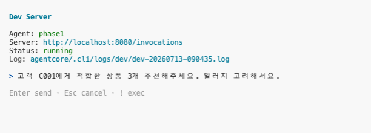
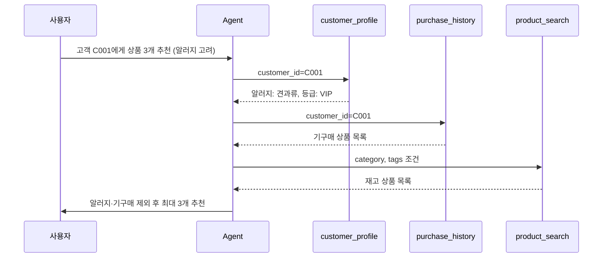
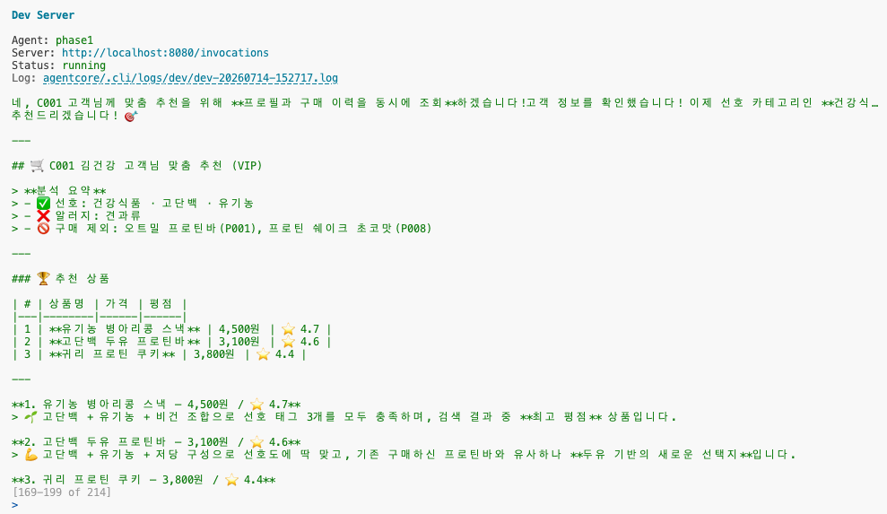

# Step 2: Agent 코드 작성 + 시나리오 테스트 <span class="badge-time">⏱️ 20분</span> <span class="badge-difficulty">★★☆</span>

<div class="step-progress">
  <span class="step done">✓ Step 1 Gateway</span>
  <span class="step-connector done"></span>
  <span class="step active">● Step 2 Agent</span>
  <span class="step-connector"></span>
  <span class="step">○ Step 3 Runtime</span>
  <span class="step-connector"></span>
  <span class="step">○ Step 4 Observability</span>
</div>

::: info 이 Step의 목표
Gateway에서 가져온 3개 Tool로 Agent를 구성하고, **여러 시나리오**로 호출하며
Agent가 상황에 따라 Tool을 얼마나, 어떤 순서로 쓰는지 관찰합니다.

Agent = Model + System Prompt + Gateway(Tools)
:::


<div class="file-target">agents/phase1_recommend.py</div>

## 핵심 패턴

```python
# AgentCore Native Agent의 구조
from strands import Agent
from strands.models import BedrockModel
from strands.tools.mcp import MCPClient
from mcp.client.streamable_http import streamablehttp_client

# Gateway를 MCPClient로 래핑 (Tool 목록을 자동으로 가져옴)
# 모듈 로드 시 1회만 생성 — 요청마다 새로 만들면 매번 MCP 핸드셰이크 비용이 붙음
mcp_client = MCPClient(lambda: streamablehttp_client(GATEWAY_URL))

# Agent 조립: Gateway(MCPClient)의 Tool을 그대로 전달
agent = Agent(
    model=model,
    system_prompt=SYSTEM_PROMPT,
    tools=[mcp_client]
)

# stream_async로 토큰이 생성되는 즉시 yield — 답을 다 만들 때까지 기다리지 않음
async for event in agent.stream_async("사용자 질문"):
    if event.get("data"):
        print(event["data"], end="")
```

`MCPClient`가 Gateway 연결과 Tool 목록 조회를 자동으로 처리합니다. Lambda ARN을 몰라도 됩니다.
Agent는 System Prompt의 지시에 따라 `customer_profile` → `purchase_history` → `product_search` 순서로 Tool을 호출합니다.

::: tip agent(prompt) vs agent.stream_async(prompt)
`agent("질문")`은 Agent가 답을 전부 만든 뒤에야 결과를 반환합니다 — Tool 호출이 몇 번 도는 동안 아무 반응이 없어 느리게 느껴집니다.
`agent.stream_async("질문")`은 토큰이 생성되는 즉시 하나씩 넘겨줍니다. `phase1_recommend.py`의 entrypoint는 이 방식을 씁니다(2-2 참고).
:::

## 2-1. agents/phase1_recommend.py 열기

Step 1에서 쓰던 터미널을 그대로 이어서 사용하면 됩니다. venv 활성화는 필요 없습니다 — 워크샵 환경은 `python3.12`에 라이브러리가 직접 설치되어 있습니다.

터미널 세션이 끊겼거나 환경변수가 비어 있으면 다음만 다시 실행하세요:

```bash
cd ~/workshop/starter-code
source ~/workshop/.env.w001
```

Explorer에서 `starter-code/agents/phase1_recommend.py`를 클릭하여 코드를 확인하세요:

```python title="agents/phase1_recommend.py — 핵심 부분"
import os
import uuid
from strands import Agent
from strands.models import BedrockModel
from strands.tools.mcp import MCPClient
from mcp.client.streamable_http import streamablehttp_client
from bedrock_agentcore.runtime import BedrockAgentCoreApp

# 환경변수 (agentcore deploy --env 로 주입)
GATEWAY_URL = os.environ.get("AGENTCORE_GATEWAY_URL", "")
REGION = os.environ.get("AWS_REGION", "us-west-2")

# MCPClient는 모듈 로드 시 1회만 생성 (요청마다 새로 만들면 매번 핸드셰이크 비용)
mcp_client = MCPClient(lambda: streamablehttp_client(GATEWAY_URL))

# 모델
model = BedrockModel(
    model_id="us.anthropic.claude-sonnet-4-6",
    region_name=REGION,
)
```

## 2-2. Gateway 연결 + entrypoint 코드

Agent가 Gateway에서 Tool을 가져와 호출하는 핵심 코드:

```python title="agents/phase1_recommend.py 내부"
@app.entrypoint
async def recommend_agent(payload: dict):
    user_message = payload.get("message", payload.get("prompt", ""))
    session_id = payload.get("session_id", f"sess-{uuid.uuid4()}")

    agent = Agent(
        model=model,
        system_prompt=SYSTEM_PROMPT,
        tools=[mcp_client],
    )

    # return 대신 yield — 토큰이 생성되는 즉시 흘려보냄 (SSE 스트리밍)
    full_text = ""
    async for event in agent.stream_async(user_message):
        chunk = event.get("data")
        if chunk:
            full_text += chunk
            yield {"type": "chunk", "response": chunk, "session_id": session_id}

    yield {"type": "done", "response": full_text, "session_id": session_id}
```

::: info MCPClient가 하는 일
`MCPClient`는 Gateway URL에 연결하여 등록된 Tool 목록을 자동으로 가져옵니다. 비동기 연결, 세션 관리, Tool 목록 조회를 모두 내부에서 처리하므로 `asyncio.run()`을 직접 호출할 필요가 없습니다. Runtime 내부에서는 IAM Role 기반으로 인증됩니다.
:::


::: info entrypoint가 async generator인 이유
함수가 `return`이 아니라 `yield`를 쓰면, `BedrockAgentCoreApp`이 이를 자동으로 SSE(Server-Sent Events) 스트리밍 응답으로 변환합니다.
참가자가 `agentcore invoke`로 호출하면 답을 다 만들 때까지 기다리지 않고, 토큰이 생성되는 즉시 화면에 흘러나옵니다 (3-3 참고).
:::


::: tip System Prompt = Agent의 행동을 결정하는 핵심
같은 Tool이라도 Prompt가 다르면 Agent의 행동이 완전히 달라집니다.

- "알러지 제외" 규칙이 없으면 → 견과류 상품도 추천할 수 있음
- "프로필 먼저 조회" 규칙이 없으면 → 바로 검색부터 할 수 있음
:::

## 2-3. 로컬 테스트 — 여러 시나리오로 Tool 호출 전략 관찰

배포 전에 로컬에서 동작을 확인합니다:

```bash
cd ~/workshop/starter-code/agents/phase1
agentcore dev --no-browser
```

해당 명령어를 실행하면 아래와 Terminal에서 Agent를 테스트 해볼수 있습니다.


같은 Agent에게 아래 4가지 시나리오를 순서대로 입력해보고, **매번 Tool을 어떤 순서·횟수로 호출하는지** 비교하세요.

::: tip 미리보기: 시나리오마다 호출 패턴이 다릅니다
4가지 시나리오는 겉보기엔 비슷한 질문이지만, System Prompt의 규칙이 서로 다른 조건에서 충돌하도록 설계되어 있습니다. 아래는 **시나리오 1**의 예상 호출 순서입니다 — 실제로 실행해서 이 순서와 일치하는지 확인하세요.



나머지 3개 시나리오는 이 순서에서 **호출이 빠지거나(시나리오 4), 결과가 비거나(시나리오 2), 규칙이 충돌(시나리오 3)** 하는 경우입니다. 직접 실행해서 Agent가 어떻게 다르게 반응하는지 비교해보세요.
:::

### 시나리오 1 — 기본 추천 (알러지 고려)

```bash
고객 C001에게 적합한 상품 3개 추천해주세요. 알러지 고려해서요
```

::: details ✅ 정상 출력 예시


고객 프로필(알러지: 견과류)과 구매 이력을 먼저 조회한 뒤, 남은 후보 중 알러지·구매 이력과 겹치지 않는 상품 3개를 정확히 추천합니다.
조건을 만족하는 상품이 3개보다 적으면 Agent는 있는 만큼만 추천합니다 — 억지로 3개를 채우려고 존재하지 않는 상품을 만들어내지 않도록 System Prompt에 명시되어 있습니다.
:::

### 시나리오 2 — 목록에 없는 고객 ID

```bash
고객 C099에게 상품을 추천해주세요
```

::: tip C099는 워크샵 Mock 데이터에 없는 임의의 ID입니다
`customer_profile`/`purchase_history`가 이 ID를 빈 결과로 주는지, 에러를 내는지는 Mock Lambda 구현에 따라 다를 수 있습니다.
어느 쪽이든 **관찰 대상**입니다 — Agent가 빈 결과/에러를 받고도 상품을 지어내서 추천하면 안 됩니다.
:::


**관찰 포인트**: Tool 결과가 비어있거나 에러일 때, Agent가 이를 어떻게 처리하는지 확인하세요. "이미 구매한 상품은 추천하지 않음" 규칙을 지킬 데이터가 없을 때 Agent가 임의로 상품을 지어내지 않고, 있는 정보만으로 정직하게 답하는지가 핵심입니다.

### 시나리오 3 — 조건을 만족하는 상품이 0개인 경우

```bash
고객 C001에게 견과류 성분이 들어간 상품만 추천해주세요
```

**관찰 포인트**: System Prompt의 "알러지 성분 포함 상품은 절대 제외" 규칙과 "견과류만 추천해달라"는 사용자 요청이 충돌합니다. Agent가 규칙을 우선시해서 "추천 가능한 상품이 없습니다"라고 정직하게 답하는지, 아니면 사용자 요청에 따라 규칙을 어기는지 확인하세요.

### 시나리오 4 — 모호한 질문 (Tool 호출 범위 판단)

```bash
요즘 잘 나가는 상품이 뭐예요?
```

**관찰 포인트**: 특정 고객 ID가 없는 질문입니다. Agent가 `customer_profile`을 호출하지 않고 바로 `product_search`만으로 답하는지, 아니면 고객 정보를 먼저 물어보는지 확인하세요. System Prompt의 "고객 프로필을 먼저 조회" 규칙이 특정 고객을 전제로 한 규칙인지, 모든 질문에 무조건 적용되는 규칙인지가 여기서 드러납니다.

## 관찰 포인트 정리

::: info ℹ️ 4가지 시나리오에서 공통으로 확인할 것
- ✅ Agent가 Gateway를 통해 **3개 Tool을 자동으로 인식**했는가?
- ✅ 상황에 따라 Tool 호출 순서·횟수가 달라지는가, 아니면 항상 고정된 순서로 호출하는가?
- ✅ Tool 결과가 비어있거나 조건에 안 맞을 때, 있는 그대로 정직하게 답하는가 (지어내지 않는가)?
- ✅ System Prompt의 규칙과 사용자 요청이 충돌할 때 어느 쪽을 우선하는가?

Step 4의 Observability에서 이 시나리오들의 Trace를 다시 확인하며 "왜 이렇게 호출했는지"를 검증합니다.
:::


<div style="padding:16px;background:linear-gradient(135deg,#e3f2fd,#f3e5f5);border-radius:14px;border:1px solid #90caf9;margin:16px 0;display:flex;gap:16px;align-items:center;">
<div style="flex:0 0 auto;font-size:2em;">🔍</div>
<div>
<strong>여기서 관찰한 건 "겉보기 결과"입니다.</strong><br/>
<span style="font-size:0.9em;color:#444;">Step 4에서는 GenAI Dashboard의 Trace/Span으로 <strong>Agent 내부에서 실제로 어떤 Tool을 몇 번, 몇 초 걸려 호출했는지</strong>를 그림으로 확인합니다. 지금 세운 "예상"이 맞았는지 다음 Step에서 바로 검증하세요.</span>
</div>
</div>

---

::: tip ✅ 다음
Agent 동작 확인! → [Step 3: Runtime 배포](step3-runtime.md)
:::

