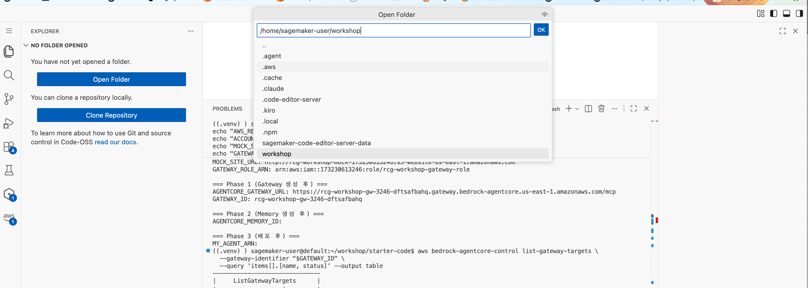

# Step 2: Agent 코드 작성 + Code Interpreter 연동 <span class="badge-time">⏱️ 20분</span> <span class="badge-difficulty">★★☆</span>

<div class="step-progress">
  <span class="step done">✓ Step 1 Gateway</span>
  <span class="step-connector done"></span>
  <span class="step active">● Step 2 Agent</span>
  <span class="step-connector"></span>
  <span class="step">○ Step 3 Runtime</span>
  <span class="step-connector"></span>
  <span class="step">○ Step 4 Observability</span>
</div>

!!! info "이 Step의 목표"
    Gateway에서 Tool 목록을 가져오고, **Code Interpreter**를 추가하여 **Agent를 구성**합니다.
    
    Agent = Model + System Prompt + Gateway(Tools) + Code Interpreter

<div class="file-target">agents/phase1_recommend.py</div>

---

## 핵심 패턴

```python
# AgentCore Native Agent의 구조
from strands import Agent
from strands.models import BedrockModel
from strands.tools.mcp import MCPClient
from strands_tools.code_interpreter import AgentCoreCodeInterpreter
from mcp.client.streamable_http import streamablehttp_client

# Gateway를 MCPClient로 래핑 (Tool 목록을 자동으로 가져옴)
# 모듈 로드 시 1회만 생성 — 요청마다 새로 만들면 매번 MCP 핸드셰이크 비용이 붙음
mcp_client = MCPClient(lambda: streamablehttp_client(GATEWAY_URL))

# Code Interpreter 추가
code_interpreter_tool = AgentCoreCodeInterpreter(region="us-east-1")

# Agent 조립: Gateway(MCPClient) + Code Interpreter
agent = Agent(
    model=model,
    system_prompt=SYSTEM_PROMPT,
    tools=[mcp_client, code_interpreter_tool.code_interpreter]
)

# stream_async로 토큰이 생성되는 즉시 yield — 답을 다 만들 때까지 기다리지 않음
async for event in agent.stream_async("사용자 질문"):
    if event.get("data"):
        print(event["data"], end="")
```

`MCPClient`가 Gateway 연결과 Tool 목록 조회를 자동으로 처리합니다. Lambda ARN을 몰라도 됩니다.
Code Interpreter를 추가하면 Agent가 데이터 분석이나 계산이 필요할 때 Python 코드를 실행할 수 있습니다.

!!! tip "agent(prompt) vs agent.stream_async(prompt)"
    `agent("질문")`은 Agent가 답을 전부 만든 뒤에야 결과를 반환합니다 — Tool 호출이 몇 번 도는 동안 아무 반응이 없어 느리게 느껴집니다.
    `agent.stream_async("질문")`은 토큰이 생성되는 즉시 하나씩 넘겨줍니다. `phase1_recommend.py`의 entrypoint는 이 방식을 씁니다(2-3 참고).

---

## 2-1. agents/phase1_recommend.py 열기

Code Editor 좌측 상단 **"Open Folder"** → `/home/sagemaker-user/workshop` 입력 → **OK**



!!! warning "폴더를 열면 터미널이 새로 시작됩니다"
    환경변수와 venv가 초기화됩니다. 터미널에서 아래를 실행하세요:
    ```bash
    cd ~/workshop/starter-code
    source .venv/bin/activate
    source ~/workshop/.env.w001
    ```

Explorer에서 `starter-code/agents/phase1_recommend.py`를 클릭하여 코드를 확인하세요:

```python title="agents/phase1_recommend.py — 핵심 부분"
import os
import uuid
from strands import Agent
from strands.models import BedrockModel
from strands.tools.mcp import MCPClient
from strands_tools.code_interpreter import AgentCoreCodeInterpreter
from mcp.client.streamable_http import streamablehttp_client
from bedrock_agentcore.runtime import BedrockAgentCoreApp

# Gateway URL (환경변수에서 읽음)
GATEWAY_URL = os.environ.get("AGENTCORE_GATEWAY_URL", "")
REGION = "us-east-1"

# 모델
model = BedrockModel(
    model_id="us.anthropic.claude-sonnet-4-6",
    region_name=REGION,
)
```

!!! tip "Code Interpreter가 필요한 이유"
    상품 추천 시 가격 비교, 할인율 계산, 통계 분석 등을 Agent가 직접 Python 코드로 수행할 수 있습니다.
    Gateway Tool만으로는 "이 상품들 중 가성비 1위는?"에 대한 정확한 계산이 어렵습니다.

---

## 2-2. System Prompt에 Code Interpreter 지시 추가 (직접 수정!)

!!! example "실습: 직접 코드를 수정합니다"
    `agents/phase1_recommend.py`를 열고 `SYSTEM_PROMPT` 부분을 찾으세요.
    
    기존에는 "행동 규칙"만 있습니다. 여기에 **Code Interpreter 활용 지시**를 추가합니다.

현재 코드의 System Prompt 끝부분 (`## 제약` 위)에 아래 블록을 추가하세요:

```python
## 계산이 필요할 때
- 가격 비교, 할인율 계산, 평점 분석은 code_interpreter를 사용하세요
- 수치 기반 판단은 반드시 코드로 검증하세요
- 추천 근거를 시각화할 때도 code_interpreter로 차트 생성
```

!!! tip "왜 이걸 추가하나요?"
    Agent에게 Code Interpreter를 Tool로 줘도, **"언제 쓰라"고 안 알려주면 안 씁니다.**
    
    | System Prompt | Agent 행동 |
    |--------------|-----------|
    | Code Interpreter 지시 없음 | 텍스트로만 추천 (차트 없이 글로만 설명) |
    | "code_interpreter로 차트 생성" 추가 | 추천 근거를 matplotlib 차트로 시각화하여 응답에 포함 |
    
    **Tool을 주는 것 ≠ Tool을 쓰게 하는 것.** Prompt로 행동을 유도해야 합니다.

!!! tip "System Prompt = Agent의 행동을 결정하는 핵심"
    같은 Tool이라도 Prompt가 다르면 Agent의 행동이 완전히 달라집니다.
    
    - "알러지 제외" 규칙이 없으면 → 견과류 상품도 추천할 수 있음
    - "프로필 먼저 조회" 규칙이 없으면 → 바로 검색부터 할 수 있음

---

## 2-3. Gateway 연결 + Tool 조합 코드

Agent가 Gateway에서 Tool을 가져오고, Code Interpreter와 합치는 핵심 코드:

```python title="Gateway + Code Interpreter → Agent 연결 (phase1_recommend.py 내부)"
# MCPClient는 모듈 로드 시 1회만 생성 (요청마다 새로 만들면 매번 핸드셰이크 비용)
mcp_client = MCPClient(lambda: streamablehttp_client(GATEWAY_URL))


@app.entrypoint
async def recommend_agent(payload: dict):
    user_message = payload.get("message", payload.get("prompt", ""))
    session_id = payload.get("session_id", f"sess-{uuid.uuid4()}")

    agent = Agent(
        model=model,
        system_prompt=SYSTEM_PROMPT,
        tools=[mcp_client],
    )

    # return 대신 yield — 토큰이 생성되는 즉시 흘려보냄 (SSE 스트리밍)
    full_text = ""
    async for event in agent.stream_async(user_message):
        chunk = event.get("data")
        if chunk:
            full_text += chunk
            yield {"type": "chunk", "response": chunk, "session_id": session_id}

    yield {"type": "done", "response": full_text, "session_id": session_id}
```

!!! info "MCPClient가 하는 일"
    `MCPClient`는 Gateway URL에 연결하여 등록된 Tool 목록을 자동으로 가져옵니다. 비동기 연결, 세션 관리, Tool 목록 조회를 모두 내부에서 처리하므로 `asyncio.run()`을 직접 호출할 필요가 없습니다. Runtime 내부에서는 IAM Role 기반으로 인증됩니다.

!!! info "entrypoint가 async generator인 이유"
    함수가 `return`이 아니라 `yield`를 쓰면, `BedrockAgentCoreApp`이 이를 자동으로 SSE(Server-Sent Events) 스트리밍 응답으로 변환합니다.
    참가자가 `agentcore invoke`로 호출하면 답을 다 만들 때까지 기다리지 않고, 토큰이 생성되는 즉시 화면에 흘러나옵니다 (3-3 참고).

---

## 2-4. 로컬 테스트

배포 전에 로컬에서 동작을 확인합니다:

```bash
cd ~/workshop/starter-code
python3 agents/phase1_recommend.py
```

이 명령은 Agent를 로컬 서버로 시작합니다. 다른 터미널에서 호출하세요:

```bash
agentcore invoke --local '{"message": "고객 C001에게 적합한 상품 3개 추천해주세요. 알러지 고려해서요."}'
```

??? success "정상 출력 예시"
    entrypoint가 async generator라서 실제로는 `{"type": "chunk", ...}` 이벤트가 여러 번 출력되다가 마지막에 `{"type": "done", ...}`으로 마무리됩니다(3-3 참고). 최종 텍스트만 보면 대략 이런 내용입니다:
    ```
    김건강 고객님 (VIP) 맞춤 추천

    - 알러지: 견과류 | 선호: 건강식품, 고단백, 유기농
    - 기구매 제외: 오트밀 프로틴바(P001), 프로틴 쉐이크 초코맛(P008)

    추천 상품
    1. 저당 프로틴 워터 (2,500원, ★4.2) — 고단백/무설탕, 견과류 미포함
    2. 유기농 현미 누룽지 (3,800원, ★4.4) — 유기농, 견과류 미포함

    알러지로 제외한 상품
    - 유기농 그래놀라 (견과류 포함)
    - 오트밀 프로틴바 (견과류 포함 + 기구매)
    ```
    조건을 만족하는 상품이 3개보다 적으면 Agent는 있는 만큼만 추천합니다 — 억지로 3개를 채우려고 존재하지 않는 상품을 만들어내지 않도록 System Prompt에 명시되어 있습니다.

---

## 관찰 포인트

!!! abstract "실행 결과에서 아래를 확인하세요"
    - ✅ Agent가 Gateway를 통해 **3개 Tool을 자동으로 인식**했는가?
    - ✅ `customer_profile` → `purchase_history` → `product_search` 순서로 호출했는가?
    - ✅ 알러지(견과류) 상품을 정확히 제외했는가?

---

!!! success "다음"
    Agent 동작 확인! → [Step 3: Runtime 배포](step3-runtime.md)
