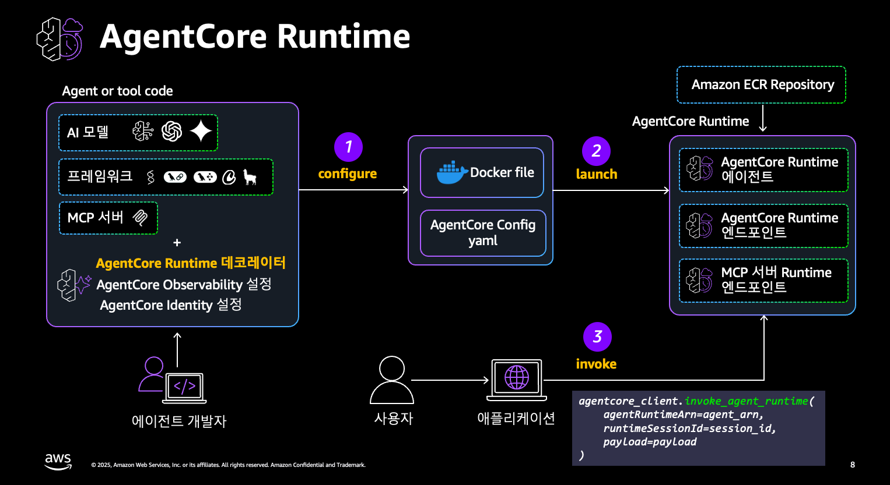
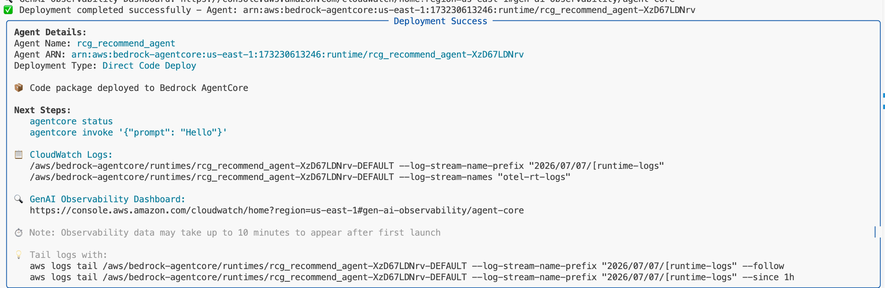
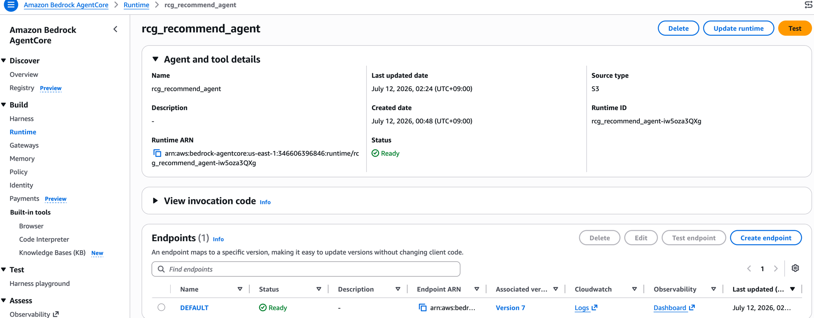

# Step 3: Runtime 배포 <span class="badge-time">⏱️ 15분</span> <span class="badge-difficulty">★★☆</span>

<div class="step-progress">
  <span class="step done">✓ Step 1 Gateway</span>
  <span class="step-connector done"></span>
  <span class="step done">✓ Step 2 Agent</span>
  <span class="step-connector done"></span>
  <span class="step active">● Step 3 Runtime</span>
  <span class="step-connector"></span>
  <span class="step">○ Step 4 Observability</span>
</div>

!!! info "이 Step의 목표"
    로컬에서 동작 확인된 Agent를 **AgentCore Runtime**에 배포합니다.
    
    결과: HTTPS 엔드포인트가 생성되어 누구나 호출 가능한 서비스가 됩니다.

<div class="file-target">scripts/deploy-agent.sh</div>

---

## Runtime이란?

```
로컬 실행:    python3 agents/phase1_recommend.py  → 내 PC에서만 동작
Runtime 배포: agentcore deploy                    → HTTPS 엔드포인트 (전세계)
```

**AgentCore Runtime**은 Agent/Tool 코드를 컨테이너로 감싸 완전관리형 서버리스 환경에서 실행하는 AgentCore의 핵심 서비스입니다. Strands, LangGraph, CrewAI 등 **프레임워크에 상관없이**, Claude·GPT 등 **모델에 상관없이** 동일한 방식으로 배포할 수 있고, 세션마다 격리된 실행 환경에서 동작해 한 사용자의 대화가 다른 사용자에게 섞이지 않습니다.



Agent 개발자는 코드에 **AgentCore Runtime 데코레이터**(Observability·Identity 설정)를 붙이고 `configure`(① Dockerfile + Config yaml 생성) → `launch`(② Amazon ECR에 push해 Runtime 리소스 생성)를 거칩니다. 이후 사용자는 애플리케이션을 통해 `invoke_agent_runtime()`(③)으로 Runtime 엔드포인트를 호출합니다.

!!! info "이 워크샵은 configure/launch를 한 번에 처리합니다"
    Starter Toolkit의 원래 CLI는 `agentcore configure` → `agentcore launch` 두 단계로 나뉘어 있지만, 이 워크샵의 `deploy-agent.sh`는 최신 CDK 기반 CLI인 **`agentcore deploy -y`** 한 명령으로 위 ①②를 함께 처리합니다. 개념적으로는 위 그림과 동일한 과정이 내부에서 일어납니다.

**Runtime의 가치:**

- Agent 코드를 서버리스로 실행 (인프라 관리 불필요, Amazon ECR 이미지 기반)
- HTTPS + SigV4 인증 (보안) — `invoke_agent_runtime()` API로 호출
- 세션 단위로 격리된 실행 환경 (동시 다중 사용자에도 대화가 서로 섞이지 않음)
- Observability 자동 활성화 (Trace, Logs) — Step 4에서 바로 확인

---

## 3-1. 배포 실행

```bash
cd ~/workshop/starter-code
chmod +x scripts/deploy-agent.sh
./scripts/deploy-agent.sh phase1
```

!!! info "배포 시간: 약 3~5분"
    내부적으로: 코드 패키징 → S3 업로드 → Runtime 생성 → 엔드포인트 활성화

??? success "배포 완료 시 출력 화면"
    아래와 같이 **Deployment Success** 패널이 표시되면 성공입니다:
    
    
    
    - **Agent ARN** — 배포된 Agent의 고유 식별자
    - **CloudWatch Logs** — 실시간 로그 확인용 경로
    - **GenAI Observability Dashboard** — Step 4에서 사용할 대시보드 URL

---

## 3-2. 배포 상태 확인

```bash
cd workshop/starter-code/agents/phase1
agentcore status 
```

??? success "정상 출력"
    ```
    AgentCore Status (target: default, us-west-2)

    Agents
    phase1: Deployed - Runtime: READY (arn:aws:bedrock-agentcore:us-west-2:485513086736:runtime/phase1_phase1-ybgIKZDPO5)
    URL: https://bedrock-agentcore.us-west-2.amazonaws.com/runtimes/arn%3Aaws%3Abedrock-agentcore%3Aus-west-2%3A485513086736%3Aruntime%2Fphase1_phase1-ybgIKZDPO5/invocations
    ```

---

## 3-3. 배포된 Agent 호출 테스트

```bash
cd ~/workshop/starter-code/agents/phase1
agentcore invoke --prompt "고객 C001에게 상품 3개 추천해주세요"
```

!!! info "출력이 여러 줄의 JSON으로 나옵니다 — 정상입니다"
    Agent가 토큰을 실시간으로 스트리밍하기 때문에, 한 번의 응답이 아니라 `{"type": "chunk", "response": "...", ...}` 형태의 이벤트가 여러 번 출력되다가 마지막에 `{"type": "done", "response": "<전체 텍스트>", ...}`로 끝납니다.
    답을 다 만들 때까지 기다리지 않고 생성되는 즉시 보여주기 때문에 체감 응답 속도가 훨씬 빠릅니다. 최종 결과만 확인하려면 마지막 `"done"` 이벤트의 `response` 필드를 보면 됩니다.

---

## 3-4. Console에서 Runtime Test로 확인

배포된 Agent를 **AWS Console에서 직접 테스트**할 수 있습니다:

1. Console → **Amazon Bedrock** → **AgentCore** → 좌측 **Runtime**
2. `rcg_recommend_agent` 클릭 → 우측 상단 **Test** 버튼 클릭



3. Input에 아래 JSON을 붙여넣고 **Run** 클릭:


```json
{"message": "고객 C001에게 적합한 상품 3개 추천해주세요. 알러지 고려해서요."}
```

!!! tip "Runtime Test의 가치"
    - CLI 타임아웃 걱정 없이 **긴 응답도 확인 가능**
    - Session ID가 자동 생성됨 (33자 이상 필요)
    - Output에서 Agent 전체 응답을 JSON으로 확인
    - 배포 직후 정상 동작 여부를 빠르게 검증

!!! info "message vs prompt"
    `phase1_recommend.py`는 `payload.get("message", payload.get("prompt", ""))`로 두 키를 모두 받지만, CLI invoke와 통일하기 위해 이 가이드에서는 항상 `message`를 사용합니다.

다양한 질문으로 테스트해보세요:

- `{"message": "고객 C002에게 뷰티 상품 추천해줘"}`
- `{"message": "가장 평점 높은 음료 3개는?"}`
- `{"message": "견과류 없는 간식 찾아줘"}`

---

## 3-4b. Agent Playground에 연결

CLI·Console로 배포를 확인했다면, 이제 웹 화면에서 대화형으로 테스트해봅니다. 방금 확인한 **Agent ARN**(`arn:aws:bedrock-agentcore:...:runtime/phase1_phase1-...`)을 Agent Playground에 등록하면 됩니다.

1. Workshop Studio **Event Outputs**의 `PlaygroundUrl`로 접속
2. 우측 상단 **⚙️ Settings** 클릭 → **추천 Agent (Phase 1)** 입력란에 Agent ARN 붙여넣기 → **저장**


3. 좌측 **상품 추천 Agent** 카드가 `ACTIVE`로 바뀌면 채팅창에서 바로 질문 가능


이후 Phase 2, 3에서도 배포할 때마다 이 화면에서 바로 테스트해볼 수 있습니다.

---

## 3-5. 배포 전 vs 후 비교

| 항목 | 로컬 (Step 2) | Runtime 배포 (지금) |
|------|--------------|-------------------|
| 실행 방법 | `python3 agents/...py` | HTTPS API 호출 |
| 접근 | 내 PC만 | 인터넷 어디서든 |
| 인증 | 없음 | SigV4 (IAM) |
| 스케일 | 1명 | 다수 동시 |
| 모니터링 | 없음 | Observability 자동 |
| 코드 변경 | 즉시 반영 | `agentcore deploy` 필요 |

---

!!! tip "축하합니다!"
    여러분의 첫 번째 Agent가 **프로덕션 엔드포인트**로 동작하고 있습니다.
    
    이제 이 Agent의 동작을 **실시간으로 관찰**해봅시다.

---

!!! success "다음"
    → [Step 4: Observability (Trace 확인)](step4-observability.md)
