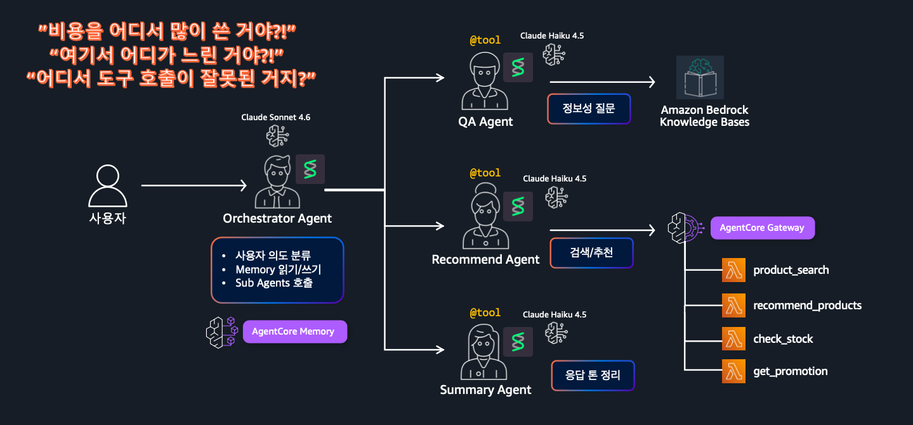
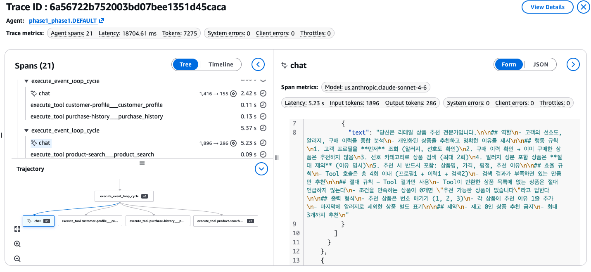
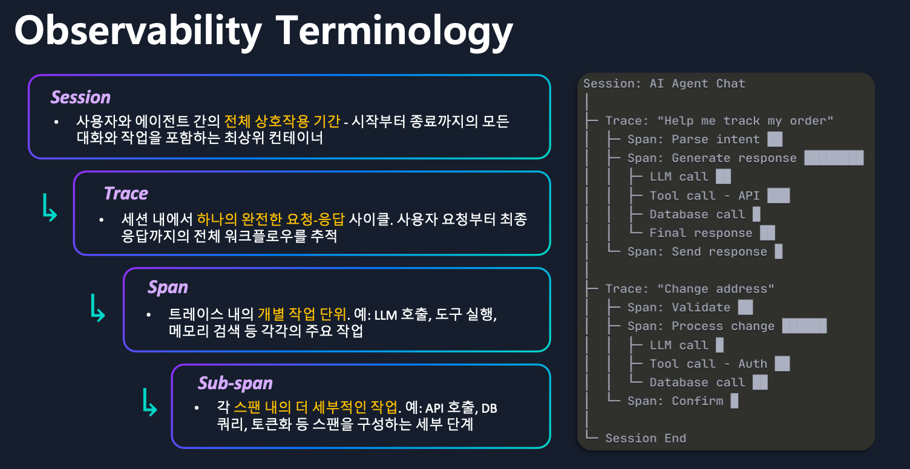

# Step 4: Observability (Trace 확인) <span class="badge-time">⏱️ 15분</span> <span class="badge-difficulty">★☆☆</span>

<div class="step-progress">
  <span class="step done">✓ Step 1 Gateway</span>
  <span class="step-connector done"></span>
  <span class="step done">✓ Step 2 Agent</span>
  <span class="step-connector done"></span>
  <span class="step done">✓ Step 3 Runtime</span>
  <span class="step-connector done"></span>
  <span class="step active">● Step 4 Observability</span>
</div>

::: info 이 Step의 목표
배포된 Agent의 동작을 **GenAI Observability Dashboard**에서 실시간 관찰합니다.

Agent가 어떤 Tool을 어떤 순서로 호출했는지, 각 단계의 소요 시간을 확인합니다.
:::

## Observability란?

Agent가 Multi-Agent 구조로 커지고 여러 Tool을 조합해서 쓸수록, 문제가 생겼을 때 이런 질문에 답하기 어려워집니다.



"비용을 어디서 많이 쓴 거야?!", "여기서 어디가 느린 거야?!", "어디서 도구 호출이 잘못된 거지?" — Orchestrator가 여러 Sub Agent(QA/Recommend/Summary)를 호출하고, 각 Sub Agent가 다시 Gateway를 통해 여러 Lambda Tool을 호출하는 구조에서는 **어느 구간에서 시간/비용이 소모됐는지 눈으로 봐야 알 수 있습니다.** Observability는 이 호출 트리 전체를 추적해서 이 질문들에 즉시 답할 수 있게 해줍니다.

Agent 내부에서 일어나는 모든 일을 **투명하게 추적**합니다:

- 어떤 Tool을 호출했는지
- 각 호출에 얼마나 걸렸는지
- LLM이 몇 토큰을 사용했는지
- 에러가 어디서 발생했는지

**AgentCore Runtime에 배포하면 자동으로 활성화됩니다.** (사전 구성된 워크샵 환경에서 Transaction Search가 이미 활성화되어 있습니다)

### Tracing 상태 확인

Console → Bedrock → AgentCore → Runtime → `phase1_phase1` → 하단 **Log deliveries and tracing** 섹션에서 확인:


::: tip ✅ Tracing: ✅ Enabled 확인
사전 구성된 워크샵 환경에서 Transaction Search가 이미 활성화되어 있기 때문에, `deploy-agent.sh`로 배포하면 Tracing이 자동 활성화됩니다.

- **Tracing** = Agent의 Tool 호출 순서, latency, 토큰 사용량 추적 (필수)
- **Log delivery** = 별도 목적지로 로그 전송 (optional, 설정 불필요)
:::

## 4-1. CLI로 Trace 확인

`agentcore` 명령은 프로젝트 디렉토리 안에서 실행해야 합니다. 먼저 이동하세요:

```bash
cd ~/workshop/starter-code/agents/phase1
```

```bash
agentcore traces list --runtime phase1
```

::: warning --runtime 값은 프로젝트 별칭입니다 (Runtime 리소스 이름과 다름!)
`--runtime`에는 AgentCore Runtime 리소스 이름(`phase1_phase1-2jGPAQEdsM` 같은 실제 ARN에 들어가는 이름)이 아니라, **로컬 `agentcore.json`에 등록된 프로젝트 별칭**(이 워크샵에서는 `phase1`)을 넣습니다. `--runtime phase1_phase1`로 실행하면 `Runtime 'phase1_phase1' not found. Available: phase1`처럼 사용 가능한 별칭을 알려줍니다.
:::

Trace ID, Timestamp, Session ID 목록과 CloudWatch Console 딥링크가 함께 출력됩니다. 기본적으로 최근 12시간, 최대 20개까지 표시됩니다 (`--since`, `--limit` 옵션으로 조정 가능). 특정 Trace의 상세 내용을 JSON 파일로 내려받으려면 위 목록에서 확인한 Trace ID를 넣어 실행하세요:

```bash
agentcore traces get <traceId>
```

`Trace saved to: .../agentcore/.cli/traces/phase1-<traceId>.json`처럼 로컬 JSON 파일 경로와, 같은 Trace를 CloudWatch Console에서 바로 열 수 있는 딥링크가 함께 출력됩니다. 그 Console 링크를 열면 아래처럼 Span 트리와 각 Span의 상세(모델, latency, 토큰 수, 실제 System Prompt/응답 내용)를 확인할 수 있습니다:



이 예시는 `execute_event_loop_cycle`이 2번 반복되며 `customer_profile` → `purchase_history` → `product_search` 순서로 3개 Tool을 호출한 뒤, 두 번의 `chat`(LLM 호출)으로 응답을 완성한 과정을 보여줍니다 — 전체 21개 Span, 18.7초, 7,275 토큰.

::: info Trace 데이터 지연
첫 invoke 후 Trace가 나타나기까지 **최대 10분**이 걸릴 수 있습니다.
목록이 비어 있으면 잠시 대기 후 재시도하세요.
:::

## 4-2. GenAI Observability Dashboard

Dashboard를 보기 전에 용어를 먼저 정리합니다. Session 안에 여러 Trace가 있고, Trace 안에 여러 Span이 있고, Span 안에 다시 Sub-span이 있는 **계층 구조**입니다:



- **Session** — 사용자와 Agent 간 전체 상호작용 기간. 대화 시작부터 종료까지의 최상위 컨테이너
- **Trace** — Session 내에서 하나의 완전한 요청-응답 사이클. 사용자 요청부터 최종 응답까지 전체 워크플로우
- **Span** — Trace 내의 개별 작업 단위 (LLM 호출, Tool 실행, Memory 조회 등)
- **Sub-span** — Span 내부의 더 세부적인 작업 (API 호출, DB 쿼리, 토큰화 등)

아래 GenAI Dashboard의 **Traces 탭**과 **Spans 탭**이 각각 이 Trace/Span 레벨을 보여주는 화면입니다.

AWS Console에서 직접 확인해봅시다:

1. AWS Console → CloudWatch → 좌측 **GenAI Observability** → **Bedrock AgentCore**
2. 또는 직접 URL: `https://console.aws.amazon.com/cloudwatch/home?region=us-west-2#gen-ai-observability/agent-core`
3. Agent 드롭다운에서 `phase1_phase1` 선택

### Traces 탭 — 호출 이력 확인


배포된 Agent의 모든 호출 이력이 Trace ID, Spans, Latency와 함께 표시됩니다.

### Spans 탭 — Tool별 세부 추적

**Spans** 탭에서는 Agent가 호출한 모든 개별 동작을 볼 수 있습니다:


- `chat us.anthropic.claude-sonnet-4-6` — LLM 호출 (모델, 토큰 수)
- `mcp tools/call product-search___product_search` — Gateway Tool 호출
- `execute_event_loop_cycle` — Agent 실행 루프

### Trace 상세 — Timeline 뷰

Trace ID를 클릭하면 **20개 Span의 시간축 분포**를 한눈에 볼 수 있습니다:


- **AgentCore.Runtime.Invoke** → 전체 17.5초
- **invoke_agent Strands Agents** → Agent 실행 구간
- **chat** → LLM 호출 (각각의 latency, input/output tokens)
- **mcp tools/list, mcp.session** → Gateway 연결 + Tool 목록 조회
- 우측 패널: 모델명, latency, 토큰 수, System Prompt 내용까지 확인 가능

::: info 이 상세 Trace를 보려면
`deploy-agent.sh`에서 `AGENT_OBSERVABILITY_ENABLED=true` 환경변수와 `aws-opentelemetry-distro` 패키지가 필요합니다.
**사전 구성된 워크샵 환경과 `deploy-agent.sh`에서 이미 설정했으므로** 별도 작업 없이 확인 가능합니다.
:::


### Dashboard에서 볼 수 있는 것

| 메트릭 | 의미 |
|--------|------|
| **Invocations** | Agent 호출 횟수 |
| **Latency P50/P95** | 응답 시간 분포 |
| **Token Usage** | 입력/출력 토큰 사용량 |
| **Tool Calls** | Tool별 호출 횟수 |
| **Error Rate** | 에러 비율 |

## 4-3. 직접 호출하고 Trace 확인하기

배포된 Agent를 호출하고 Dashboard에서 Trace를 확인하세요:

```bash
agentcore invoke --runtime phase1 --session-id "obs-test-002-$(uuidgen)" "고객 C002에게 뷰티 상품 추천해주세요"
```

::: warning session-id는 33자 이상이어야 합니다
`--session-id`에 짧은 문자열(`obs-test-002`)만 넣으면 `Value at 'runtimeSessionId' failed to satisfy constraint: Member must have length greater than or equal to 33` 에러가 납니다. `$(uuidgen)`으로 뒤에 UUID를 붙여 33자를 넉넉히 채우세요. `--session-id`를 생략하면 CLI가 자동으로 유효한 세션 ID를 생성합니다.
:::

1~2분 후 GenAI Dashboard → **Spans** 탭에서 확인:

- [ ] **Tool 호출 순서** — `mcp tools/call customer-profile`, `product-search` 등이 보이는가?
- [ ] **LLM 호출** — `chat us.anthropic.claude-sonnet-4-6` span이 몇 개인가?
- [ ] **전체 소요시간** — Timeline에서 병목 구간이 어디인가?
- [ ] **토큰 사용량** — 우측 패널에서 Input tokens / Output tokens 확인

## 4-4. 에러 시나리오 디버깅

존재하지 않는 고객으로 호출해봅니다:

```bash
agentcore invoke --runtime phase1 --session-id "error-test-003-$(uuidgen)" "고객 C999에게 추천해주세요"
```

::: details ✅ 정상 출력 예시
```
고객 프로필과 구매 이력을 동시에 조회하겠습니다!죄송합니다. 고객 C999에 대한 정보를 찾을 수 없습니다.

❌ 추천 불가 사유
- 고객 프로필 조회 결과: 고객 C999를 찾을 수 없습니다 (404 오류)
- 고객의 선호도, 알러지 정보를 확인할 수 없어 안전한 개인화 추천이 불가능합니다.

⚠️ 알러지 정보 없이 상품을 추천할 경우, 고객에게 위험할 수 있어 추천을 진행하지 않습니다.

💡 해결 방법
1. 고객 ID 재확인 — 혹시 C999가 맞나요? 다른 ID(예: C001, C010 등)를 입력하신 건 아닌지 확인 부탁드립니다.
2. 고객 등록 여부 확인 — 해당 고객이 시스템에 등록되어 있는지 확인이 필요합니다.
```
Agent가 `customer_profile` Tool의 404 에러를 그대로 삼키지 않고, 사용자에게 원인과 해결 방법까지 안내하며 **알러지 정보 없이는 추천을 진행하지 않는다는 안전 규칙**을 지킨 것을 확인할 수 있습니다.
:::

Dashboard에서 관찰:

- Agent가 `customer_profile` Tool로부터 에러 응답을 받았을 때 **어떻게 대처하는지** 확인
- 에러에도 불구하고 사용자에게 적절한 안내를 하는가?

::: tip Observability의 진짜 가치
문제가 생겼을 때 **어디서 실패했는지** 즉시 파악할 수 있습니다.

- Tool이 에러를 반환했나? → Spans 탭에서 해당 Tool span 확인
- LLM이 잘못 판단했나? → `chat` span 클릭 → Input/Output 메시지 확인
- 느린 응답? → Timeline에서 가장 긴 Span이 병목
:::

## Phase 1 완료!

축하합니다. 여러분은 지금:

- [x] **Gateway** — 3개 Lambda를 MCP Tool로 등록
- [x] **Runtime** — Agent를 HTTPS 엔드포인트로 배포
- [x] **Observability** — Trace로 Agent 동작을 실시간 관찰

이제 이 Agent에 **Memory**(맥락 유지)와 **Policy**(행동 제어)를 추가합니다.

---

<div class="phase-complete">
<h3>🎉 Phase 1 완료!</h3>
<p>여러분의 Agent는 이미 <b>프로덕션 HTTPS 엔드포인트</b>로 동작하고 있습니다.</p>
<p>이제 Agent에 새로운 능력을 추가합니다. 아래에서 택1 하세요:</p>
<div class="next-options">
<a href="../../phase2a/" class="option-2a">📞 Phase 2A: CS 자동화 Agent (★★★)</a>
<a href="../../phase2b/" class="option-2b">📰 Phase 2B: 뉴스/날씨 수집 Agent (★★★)</a>
</div>
</div>
