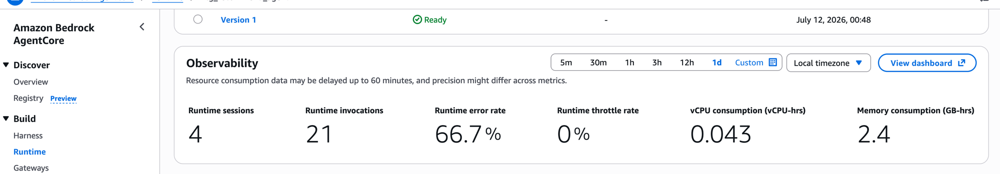
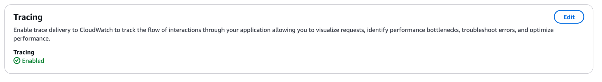
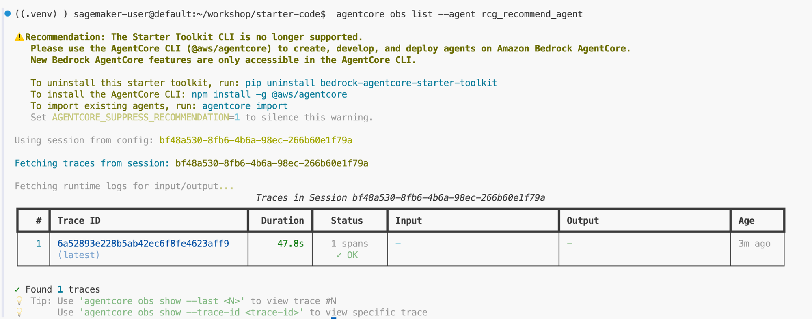
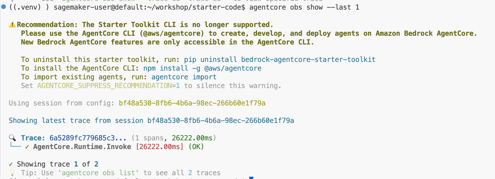
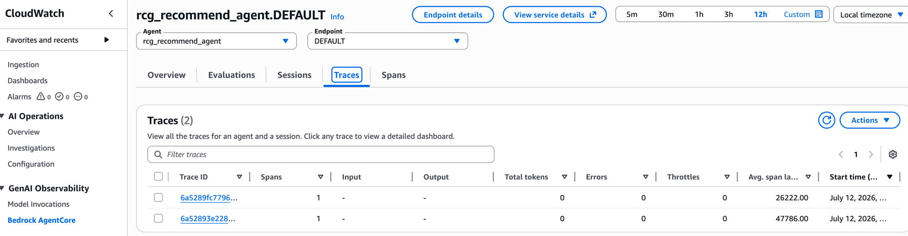
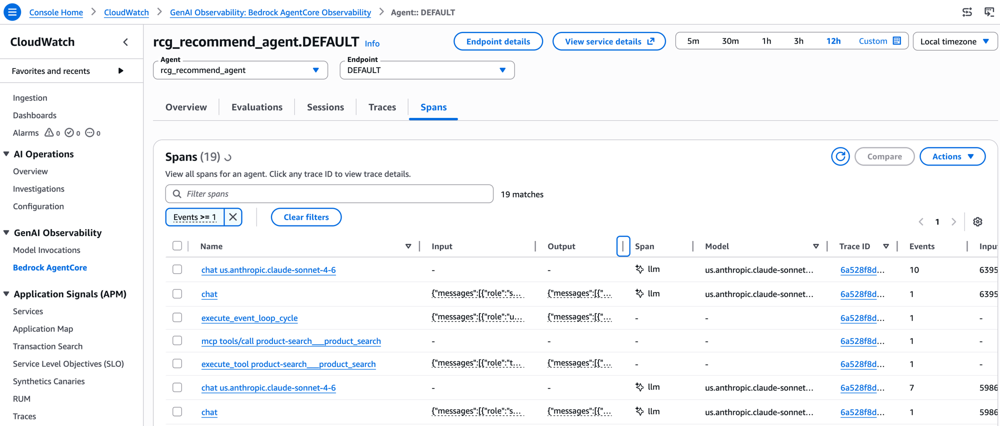
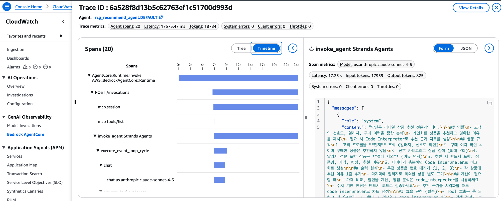

# Step 4: Observability (Trace 확인) <span class="badge-time">⏱️ 15분</span> <span class="badge-difficulty">★☆☆</span>

<div class="step-progress">
  <span class="step done">✓ Step 1 Gateway</span>
  <span class="step-connector done"></span>
  <span class="step done">✓ Step 2 Agent</span>
  <span class="step-connector done"></span>
  <span class="step done">✓ Step 3 Runtime</span>
  <span class="step-connector done"></span>
  <span class="step active">● Step 4 Observability</span>
</div>

::: info 이 Step의 목표
배포된 Agent의 동작을 **GenAI Observability Dashboard**에서 실시간 관찰합니다.

Agent가 어떤 Tool을 어떤 순서로 호출했는지, 각 단계의 소요 시간을 확인합니다.
:::

## Observability란?

Agent 내부에서 일어나는 모든 일을 **투명하게 추적**합니다:

- 어떤 Tool을 호출했는지
- 각 호출에 얼마나 걸렸는지
- LLM이 몇 토큰을 사용했는지
- 에러가 어디서 발생했는지

**AgentCore Runtime에 배포하면 자동으로 활성화됩니다.** (환경 세팅의 `onestop.sh`에서 Transaction Search를 사전 설정했습니다)

### Tracing 상태 확인

Console → Bedrock → AgentCore → Runtime → `rcg_recommend_agent` → 하단 **Log deliveries and tracing** 섹션에서 확인:





::: tip ✅ Tracing: ✅ Enabled 확인
`onestop.sh`에서 Transaction Search를 사전 설정했기 때문에, `deploy-agent.sh`로 배포하면 Tracing이 자동 활성화됩니다.

- **Tracing** = Agent의 Tool 호출 순서, latency, 토큰 사용량 추적 (필수)
- **Log delivery** = 별도 목적지로 로그 전송 (optional, 설정 불필요)
:::

## 4-1. CLI로 Trace 확인

```bash
agentcore obs list --agent rcg_recommend_agent
```



Trace ID, Duration, Status를 확인할 수 있습니다. 상세 Trace를 보려면:

```bash
agentcore obs show --last 1
```



`AgentCore.Runtime.Invoke` span에서 전체 소요 시간과 상태(OK)를 확인할 수 있습니다.

::: info Trace 데이터 지연
첫 invoke 후 Trace가 나타나기까지 **최대 10분**이 걸릴 수 있습니다.
"No spans found"가 나오면 잠시 대기 후 재시도하세요.
:::


::: details ✅ Trace 출력 예시
```
Trace: ac-tr-67aa52c5
Duration: 3,439ms
Status: SUCCESS

Spans:
├─ [RUNTIME] Invoke received (2ms)
├─ [MODEL] Claude Sonnet 4.6 — in:1,200 out:89 — tool_use (2.1s)
├─ [GATEWAY] customer_profile — PERMIT (184ms)
├─ [MODEL] Claude Sonnet 4.6 — in:1,450 out:67 — tool_use (1.8s)
├─ [GATEWAY] purchase_history — PERMIT (92ms)
├─ [MODEL] Claude Sonnet 4.6 — in:1,680 out:112 — tool_use (2.0s)
├─ [GATEWAY] product_search — PERMIT (156ms)
├─ [GATEWAY] product_search — PERMIT (148ms)
├─ [MODEL] Claude Sonnet 4.6 — in:2,100 out:423 — end_turn (2.8s)
└─ [RUNTIME] Complete — SUCCESS (3,439ms)
```
:::

## 4-2. GenAI Observability Dashboard

AWS Console에서 직접 확인해봅시다:

1. AWS Console → CloudWatch → 좌측 **GenAI Observability** → **Bedrock AgentCore**
2. 또는 직접 URL: `https://console.aws.amazon.com/cloudwatch/home?region=us-west-2#gen-ai-observability/agent-core`
3. Agent 드롭다운에서 `rcg_recommend_agent` 선택

### Traces 탭 — 호출 이력 확인



배포된 Agent의 모든 호출 이력이 Trace ID, Spans, Latency와 함께 표시됩니다.

### Spans 탭 — Tool별 세부 추적

**Spans** 탭에서는 Agent가 호출한 모든 개별 동작을 볼 수 있습니다:



- `chat us.anthropic.claude-sonnet-4-6` — LLM 호출 (모델, 토큰 수)
- `mcp tools/call product-search___product_search` — Gateway Tool 호출
- `execute_event_loop_cycle` — Agent 실행 루프

### Trace 상세 — Timeline 뷰

Trace ID를 클릭하면 **20개 Span의 시간축 분포**를 한눈에 볼 수 있습니다:



- **AgentCore.Runtime.Invoke** → 전체 17.5초
- **invoke_agent Strands Agents** → Agent 실행 구간
- **chat** → LLM 호출 (각각의 latency, input/output tokens)
- **mcp tools/list, mcp.session** → Gateway 연결 + Tool 목록 조회
- 우측 패널: 모델명, latency, 토큰 수, System Prompt 내용까지 확인 가능

::: info 이 상세 Trace를 보려면
`deploy-agent.sh`에서 `AGENT_OBSERVABILITY_ENABLED=true` 환경변수와 `aws-opentelemetry-distro` 패키지가 필요합니다.
**환경 세팅의 `onestop.sh`와 `deploy-agent.sh`에서 이미 설정했으므로** 별도 작업 없이 확인 가능합니다.
:::


### Dashboard에서 볼 수 있는 것

| 메트릭 | 의미 |
|--------|------|
| **Invocations** | Agent 호출 횟수 |
| **Latency P50/P95** | 응답 시간 분포 |
| **Token Usage** | 입력/출력 토큰 사용량 |
| **Tool Calls** | Tool별 호출 횟수 |
| **Error Rate** | 에러 비율 |

## 4-3. 직접 호출하고 Trace 확인하기

배포된 Agent를 호출하고 Dashboard에서 Trace를 확인하세요:

```bash
agentcore invoke \
  --agent rcg_recommend_agent \
  '{"message": "고객 C002에게 뷰티 상품 추천해주세요", "session_id": "obs-test-002"}'
```

1~2분 후 GenAI Dashboard → **Spans** 탭에서 확인:

- [ ] **Tool 호출 순서** — `mcp tools/call customer-profile`, `product-search` 등이 보이는가?
- [ ] **LLM 호출** — `chat us.anthropic.claude-sonnet-4-6` span이 몇 개인가?
- [ ] **전체 소요시간** — Timeline에서 병목 구간이 어디인가?
- [ ] **토큰 사용량** — 우측 패널에서 Input tokens / Output tokens 확인

## 4-4. 에러 시나리오 디버깅

존재하지 않는 고객으로 호출해봅니다:

```bash
agentcore invoke \
  --agent rcg_recommend_agent \
  '{"message": "고객 C999에게 추천해주세요", "session_id": "error-test-003"}'
```

Dashboard에서 관찰:

- Agent가 `customer_profile` Tool로부터 에러 응답을 받았을 때 **어떻게 대처하는지** 확인
- 에러에도 불구하고 사용자에게 적절한 안내를 하는가?

::: tip Observability의 진짜 가치
문제가 생겼을 때 **어디서 실패했는지** 즉시 파악할 수 있습니다.

- Tool이 에러를 반환했나? → Spans 탭에서 해당 Tool span 확인
- LLM이 잘못 판단했나? → `chat` span 클릭 → Input/Output 메시지 확인
- 느린 응답? → Timeline에서 가장 긴 Span이 병목
:::

## Phase 1 완료!

축하합니다. 여러분은 지금:

- [x] **Gateway** — 3개 Lambda를 MCP Tool로 등록
- [x] **Runtime** — Agent를 HTTPS 엔드포인트로 배포
- [x] **Observability** — Trace로 Agent 동작을 실시간 관찰

이제 이 Agent에 **Memory**(맥락 유지)와 **Policy**(행동 제어)를 추가합니다.

---

<div class="phase-complete">
<h3>🎉 Phase 1 완료!</h3>
<p>여러분의 Agent는 이미 <b>프로덕션 HTTPS 엔드포인트</b>로 동작하고 있습니다.</p>
<p>이제 Agent에 새로운 능력을 추가합니다. 아래에서 택1 하세요:</p>
<div class="next-options">
<a href="../../phase2a/" class="option-2a">📞 Phase 2A: CS 자동화 Agent (★★★)</a>
<a href="../../phase2b/" class="option-2b">📰 Phase 2B: 뉴스/날씨 수집 Agent (★★★)</a>
</div>
</div>
