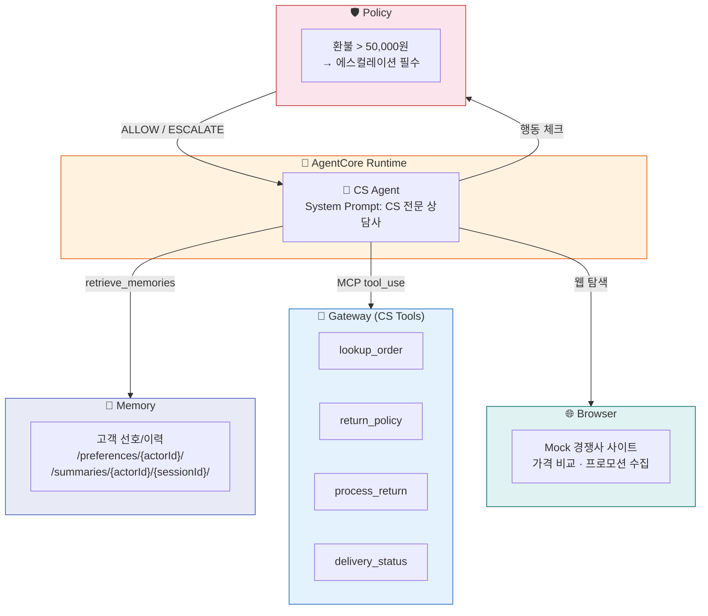
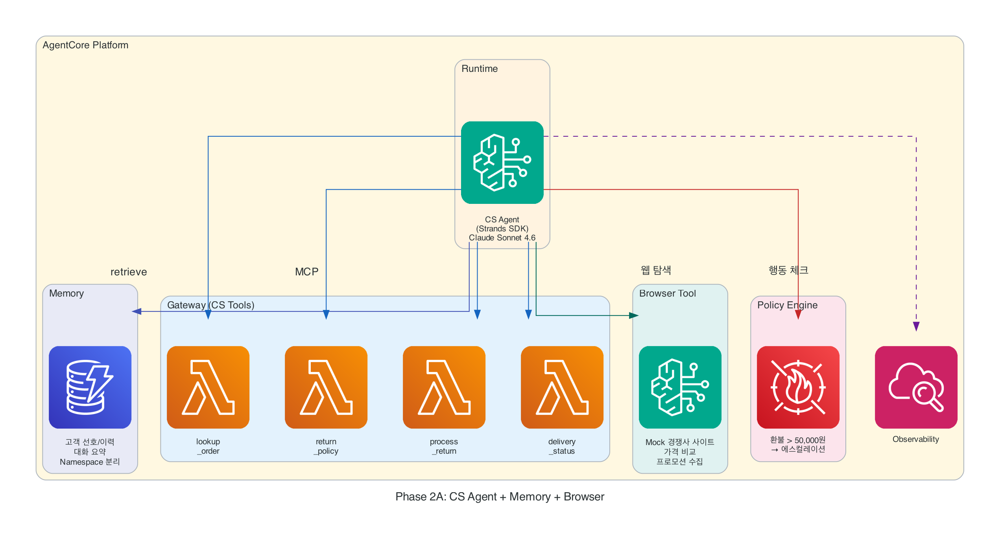

# Phase 2A: 기억하는 CS Agent + 경쟁사 가격 비교

"보조배터리 충전이 안 됩니다. 환불 받고 싶어요." — 하루에 수백 건 들어오는 CS 문의. 이 Agent는 주문을 조회하고, 정책을 확인하고, 적절한 보상을 안내합니다. 다음에 이 고객이 다시 오면 지난 대화를 기억하고, 경쟁사 가격까지 조회해서 더 나은 안내를 합니다.

!!! abstract "이 Phase에서 추가하는 것"
    - **Memory** — 고객의 이전 대화 맥락과 선호를 기억
    - **Policy** — 에스컬레이션 규칙 (5만원 초과 시 승인 필요)
    - **Gateway 확장** — CS Tool 4개 추가 등록
    - **Browser** — Mock 경쟁사 사이트에서 실시간 가격 조회 & 비교 안내

!!! info "Browser는 사전 배포된 Mock 사이트를 조회합니다"
    실제 경쟁사 사이트가 아닌, 운영진이 미리 배포한 Mock 가격 비교 사이트에 접속합니다.
    Agent가 브라우저로 해당 사이트를 탐색하여 경쟁사 가격 정보를 수집하고, 고객에게 비교 안내합니다.

---

## Phase 1과의 차이

| Phase 1 (추천) | Phase 2A (CS + Browser) |
|---------------|-------------------------|
| Gateway + Runtime + Observability + Code Interpreter | + **Memory** + **Policy** + **Browser** |
| 상태 없음 (매번 새로) | **대화 맥락 유지** |
| 규칙 위반 없음 | **에스컬레이션 분기** |
| Tool 3개 + Code Interpreter | Tool 4개 추가 + **Browser** (총 8개) |
| 시각화 응답 | **경쟁사 가격 실시간 비교** |

---

## 아키텍처

<!-- AWS 아이콘 버전 (롤백 시 이 블록만 삭제) -->
<figure markdown>
  { width="700" }
  <figcaption>AWS 서비스 아이콘 기반 아키텍처</figcaption>
</figure>

---

## Steps

1. [Memory 생성 & Strategy](step1-memory.md) — 고객 맥락 저장 구조 설계
2. [경쟁사 가격 조회 연결 (Gateway + Browser)](step2-gateway.md) — CS Tool 4개 + Browser로 Mock 사이트 가격 조회
3. [Agent + Memory + Browser 연동](step3-agent.md) — 맥락 + 경쟁사 가격을 프롬프트에 주입
4. [Policy (에스컬레이션)](step4-policy.md) — 금액 기반 자동 분기

---

!!! tip "핵심 학습"
    - Memory = "이 고객과 전에 무슨 대화를 했는지 기억"
    - Policy = "이 조건에서는 반드시 이렇게 행동해야 한다"
    - Browser = "경쟁사 가격을 실시간으로 조회하여 고객에게 비교 정보 제공"
