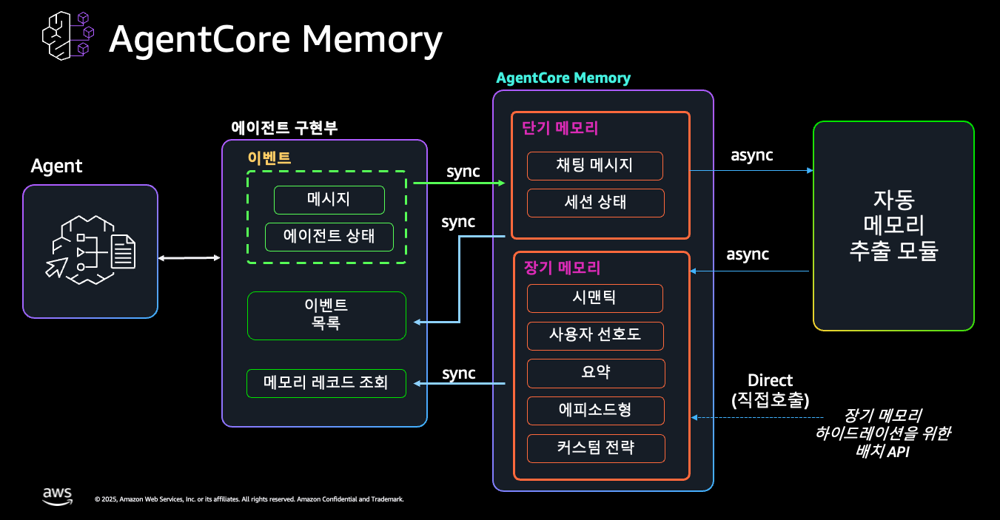
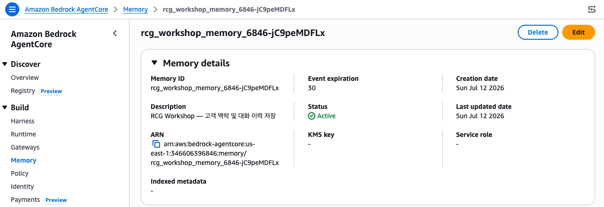
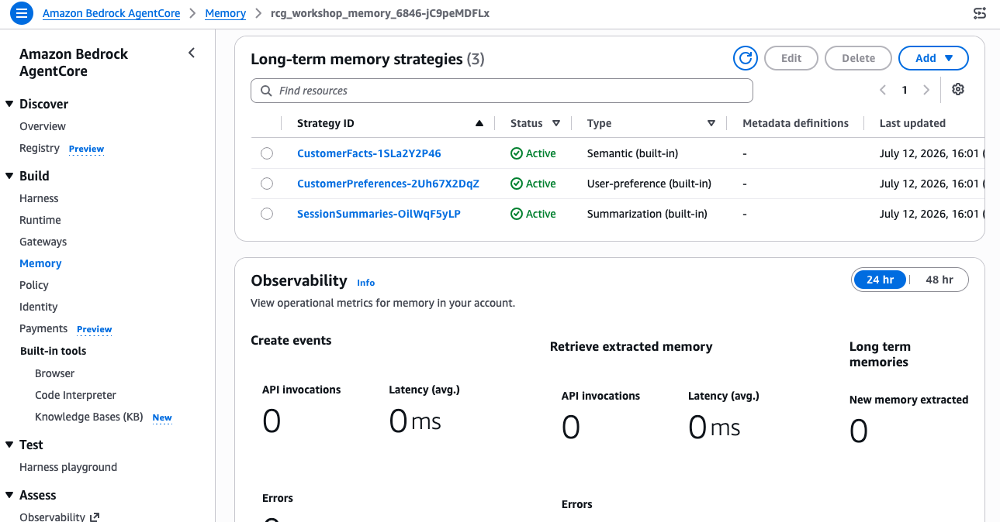

# Step 1: Memory 생성 & Strategy <span class="badge-time">⏱️ 10분</span> <span class="badge-difficulty">★☆☆</span>

<div class="step-progress">
  <span class="step active">● Step 1 Memory</span>
  <span class="step-connector"></span>
  <span class="step">○ Step 2 Gateway+Browser</span>
  <span class="step-connector"></span>
  <span class="step">○ Step 3 Agent</span>
  <span class="step-connector"></span>
  <span class="step">○ Step 4 에스컬레이션</span>
</div>

::: info 이 Step의 목표
**AgentCore Memory**를 생성하고, 고객 맥락을 기억하기 위한 **Strategy**를 설정합니다.

이후 Agent는 이전 대화 내용과 고객 선호를 기억한 채 응대합니다.
:::


<div class="file-target">scripts/setup-memory.py</div>

## Memory란?

```
기존 방식:  매 대화마다 "누구세요?" (상태 없음)
AgentCore: "김건강님, 지난번 반품 건 해결되셨나요?" (맥락 유지)
```

**Memory의 가치:**

- 고객이 같은 말을 반복하지 않아도 됨
- 이전 대화에서 파악한 선호/불만을 활용
- 세션이 끊어져도 맥락이 유지됨
- Agent가 더 자연스럽고 효율적으로 응대

::: tip Memory = Agent의 장기 기억
단기 기억(현재 대화)은 LLM의 Context Window가 담당합니다.

장기 기억(이전 대화, 선호도, 요약)은 **AgentCore Memory**가 담당합니다.
:::

### AgentCore Memory는 어떻게 동작하나



Agent는 대화가 오갈 때마다 **이벤트(Event)** 를 Memory에 저장합니다. 여기까지는 원본 메시지를 그대로 쌓는 **단기 메모리**입니다. 핵심은 그다음입니다 — **자동 메모리 추출 모듈**이 백그라운드에서(`async`) 이 이벤트들을 읽어, Strategy가 정의한 규칙대로 **장기 메모리(시맨틱 사실·사용자 선호·요약)** 를 자동으로 뽑아냅니다.

::: info 이벤트(Event) vs 레코드(Record) — 이 구분이 핵심
- **Event** = Agent가 저장하는 **원본 대화** (내가 `create_event`로 넣는 것)
- **Record** = Strategy가 Event에서 **자동 추출한 장기 기억** (내가 직접 안 만듦)

여러분은 대화(Event)만 저장하면 됩니다. "이 고객은 견과류 알러지가 있다" 같은 **사실(Record)은 Strategy가 알아서 추출**합니다. 그래서 이 Step에서 **어떤 Strategy를 켜느냐**가 곧 "Agent가 무엇을 기억할지"를 결정합니다.
:::

::: warning 추출은 비동기입니다 (즉시 조회 안 됨)
Event를 저장한 직후에는 Record가 아직 없을 수 있습니다. 자동 추출 모듈이 백그라운드로 도는 데 **수 초~수십 초**가 걸립니다. Step 3에서 "방금 저장한 내용이 바로 안 나오는" 이유가 이것입니다.
:::

## 1-1. Memory 생성 스크립트 실행

```bash
cd ~/workshop/starter-code
python3.12 scripts/setup-memory.py
```

::: details 🧪 스크립트가 하는 일 (내부)
`bedrock-agentcore-control` API로 Memory를 생성하고, 3개 Strategy(CustomerFacts, SessionSummaries, CustomerPreferences)를 함께 등록합니다.

```python
client = boto3.client("bedrock-agentcore-control", region_name=REGION)
client.create_memory(
    name=MEMORY_NAME,
    description="RCG Workshop — 고객 맥락 및 대화 이력 저장",
    eventExpiryDuration=30,
    memoryStrategies=[
        {"semanticMemoryStrategy": {"name": "CustomerFacts", "namespaces": ["users/{actorId}/facts"]}},
        {"summaryMemoryStrategy": {"name": "SessionSummaries", "namespaces": ["users/{actorId}/summaries/{sessionId}"]}},
        {"userPreferenceMemoryStrategy": {"name": "CustomerPreferences", "namespaces": ["users/{actorId}/preferences"]}},
    ],
)
```
:::


Console에서 확인 — **Bedrock → AgentCore → Memory** 에서 생성된 Memory를 볼 수 있습니다:



## 1-2. Strategy 이해하기

Console의 Memory 상세 페이지 하단에서 3개 Strategy가 모두 **Active** 상태인지 확인하세요:



| Strategy | 용도 | Namespace 패턴 | 예시 |
|----------|------|---------------|------|
| **CustomerPreferences** (userPreferenceMemoryStrategy) | 고객 선호 자동 추출 | `users/{actorId}/preferences` | "이 고객은 빠른 배송을 선호" |
| **SessionSummaries** (summaryMemoryStrategy) | 세션별 대화 요약 | `users/{actorId}/summaries/{sessionId}` | "지난 대화: 반품 문의 → 처리 완료" |
| **CustomerFacts** (semanticMemoryStrategy) | 의미 기반 사실 저장 | `users/{actorId}/facts` | "주문 ORD-20260620-001 관련 불만 제기" |

::: info Namespace 패턴의 역할
`{actorId}`는 고객 ID로 대체됩니다. 이를 통해:

- 고객별로 데이터가 **격리**됨
- 특정 고객의 기억만 빠르게 **검색** 가능
- 세션별 요약도 독립적으로 관리
:::

## 1-3. 결과 확인

스크립트 출력을 확인합니다:

::: details ✅ 정상 출력 예시
```
🧠 Memory 생성: rcg_workshop_memory_6846
✅ Memory 생성 완료: rcg_workshop_memory_6846-jC9peMDFLx

==================================================
🎉 Memory 설정 완료!
   Memory ID: rcg_workshop_memory_6846-jC9peMDFLx

   환경변수 설정:
   export AGENTCORE_MEMORY_ID=rcg_workshop_memory_6846-jC9peMDFLx
==================================================
```
:::


::: danger 반드시 실행: 출력된 export 명령어를 복사 → 붙여넣기
```bash
export AGENTCORE_MEMORY_ID=<위 출력에 나온 실제 Memory ID>
```
스크립트 출력 마지막의 `export AGENTCORE_MEMORY_ID=...` 줄을 **그대로 복사해서 터미널에 붙여넣기** 하세요.
이 값이 없으면 이후 Agent가 Memory에 접근하지 못합니다.
:::


CLI로 확인:

```bash
aws bedrock-agentcore-control get-memory \
  --memory-id "$AGENTCORE_MEMORY_ID" \
  --query 'memory.{name: name, status: status, strategies: strategies[].name}' \
  --output yaml
```

::: details ✅ 정상 출력
```yaml
name: rcg_workshop_memory_XXXX
status: ACTIVE
strategies:
  - CustomerFacts
  - SessionSummaries
  - CustomerPreferences
```
:::

## 1-3b. (선택) 기억이 정말 쌓이는지 직접 확인

::: details 🔬 시간이 남으면 — Event를 하나 넣고 Record가 추출되는지 관찰
방금 만든 Memory가 실제로 동작하는지 눈으로 확인해봅니다. 테스트 이벤트(대화 한 턴)를 저장해봅니다:

```bash
aws bedrock-agentcore create-event \
  --memory-id "$AGENTCORE_MEMORY_ID" \
  --actor-id "C001" \
  --session-id "verify-$(uuidgen)" \
  --event-timestamp "$(date +%s)" \
  --payload '[{"conversational":{"role":"USER","content":{"text":"저는 견과류 알러지가 있어요"}}}]'
```

바로 조회하면 **아직 안 나옵니다** — 자동 추출이 비동기로 돌기 때문입니다. **1~2분 후** 다시 조회하세요:

```bash
aws bedrock-agentcore retrieve-memory-records \
  --memory-id "$AGENTCORE_MEMORY_ID" \
  --namespace "users/C001/facts" \
  --search-criteria '{"searchQuery":"알러지","topK":5}' \
  --query 'memoryRecordSummaries[].content.text' --output yaml
```

"견과류 알러지" 관련 Record가 나타나면, **Event 저장 → Strategy가 자동으로 사실을 추출**하는 흐름이 실제로 동작한 것입니다. 이게 Step 3에서 Agent가 "이 고객은 견과류 알러지"를 기억하는 원리입니다.

> 💡 아무것도 안 나오면 조금 더 기다리세요. 추출 지연은 정상이며, 이 지연을 감안해 Agent는 응답을 막지 않고 진행하도록 설계합니다(Step 3).
:::

## 1-4. 세션이 끊겼다면 (재접속 복구)

`AGENTCORE_MEMORY_ID`는 현재 터미널 세션에만 저장됩니다. code-server가 끊기거나 새 터미널을 열면 값이 사라지므로, 아래로 복구하세요:

```bash
source ~/workshop/.env.w001   # 이전에 저장해둔 환경변수 일괄 복구
echo $AGENTCORE_MEMORY_ID     # 값이 출력되면 정상
```

::: tip 값이 비어 있다면
`.env.w001`에 아직 `AGENTCORE_MEMORY_ID`가 없을 수 있습니다. 1-3에서 복사한 `export AGENTCORE_MEMORY_ID=...` 줄을 `~/workshop/.env.w001` 파일 맨 아래에 추가해두면, 이후 세션이 끊겨도 `source` 한 번으로 복구됩니다.
:::

## 이해 체크

스스로 답할 수 있으면 다음 Step으로 넘어가세요:

- [ ] Memory는 Agent의 **장기 기억** 저장소다 (단기 기억은 LLM Context Window)
- [ ] **Event**(원본 대화)와 **Record**(Strategy가 추출한 기억)의 차이를 설명할 수 있다
- [ ] Record 추출은 **비동기**라 저장 직후 바로 조회되지 않을 수 있다
- [ ] Strategy = **무엇을 어떻게 기억할지** 정의하는 규칙 (3종: 사실·요약·선호)
- [ ] Namespace(`users/{actorId}/...`)는 고객별·세션별 데이터를 **격리**한다

---

::: tip ✅ 다음
Memory 준비 완료! → [Step 2: CS Gateway Target 추가](step2-gateway.md)
:::

