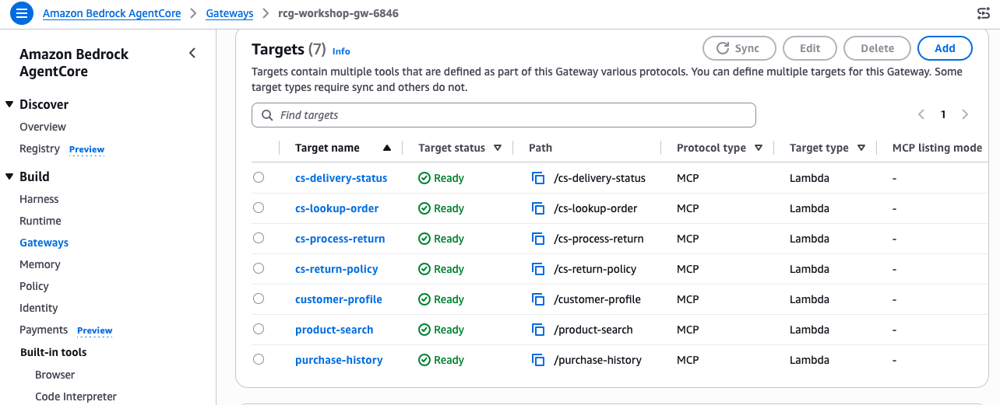
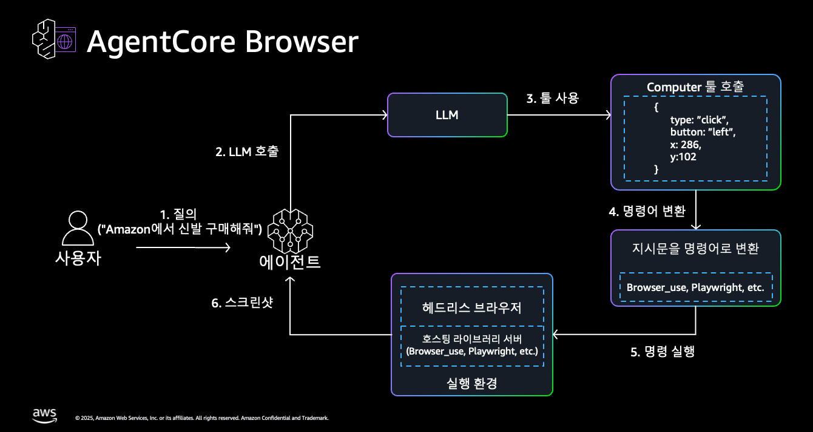
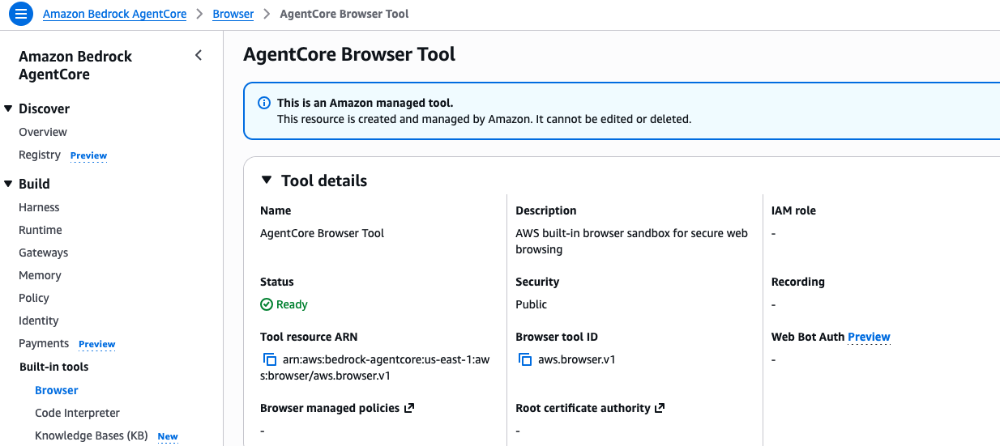
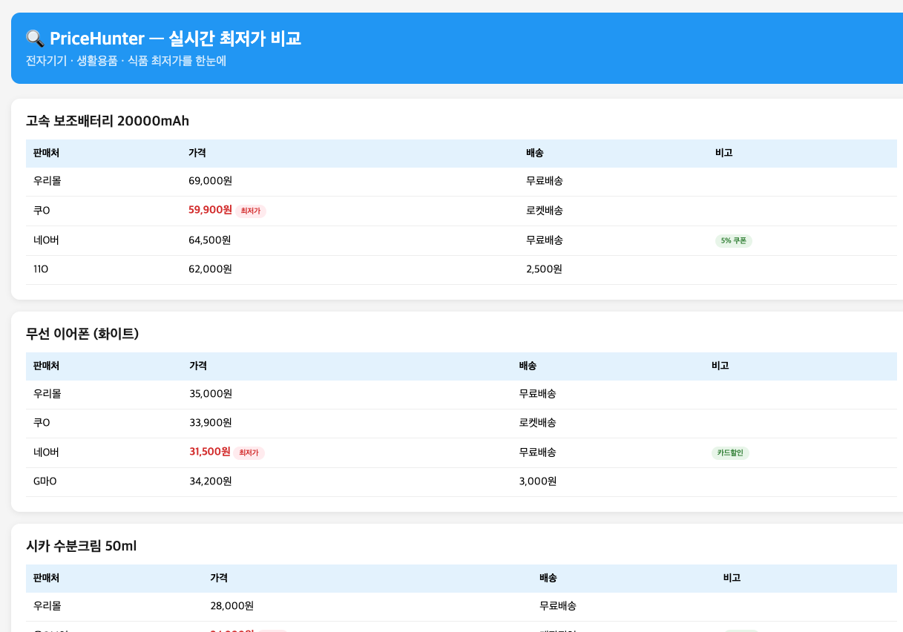
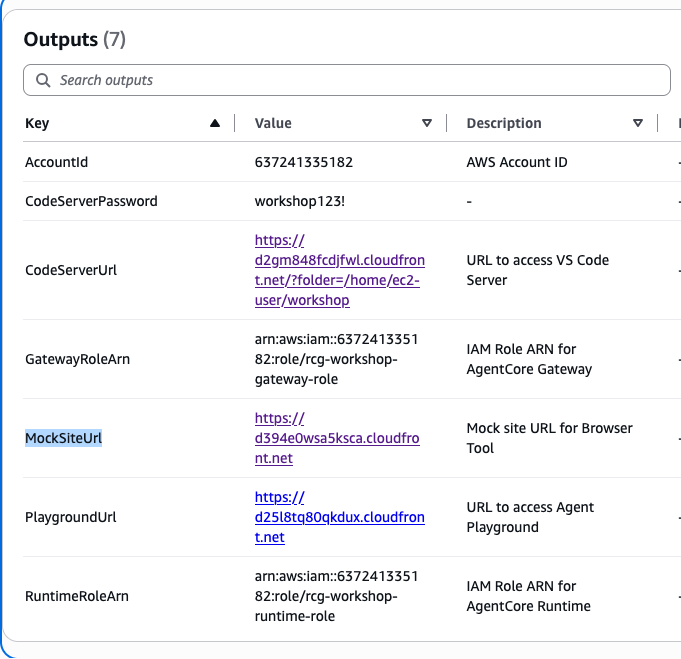
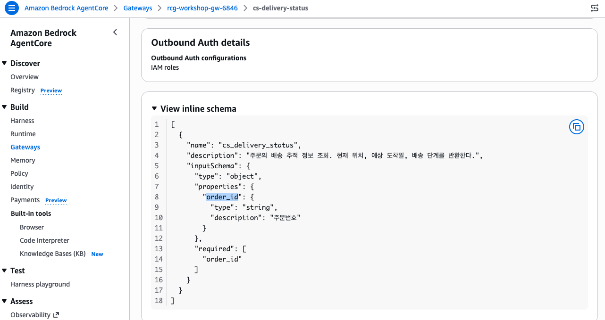

# Step 2: CS 도구 연결하기 (Gateway 확장) <span class="badge-time">⏱️ 15분</span> <span class="badge-difficulty">★★☆</span>

<div class="step-progress">
  <span class="step done">✓ Step 1 Memory</span>
  <span class="step-connector done"></span>
  <span class="step active">● Step 2 Gateway+Browser</span>
  <span class="step-connector"></span>
  <span class="step">○ Step 3 Agent</span>
  <span class="step-connector"></span>
  <span class="step">○ Step 4 에스컬레이션</span>
</div>

::: info 이 Step의 목표
Phase 1에서 만든 Gateway에 **CS Tool 4개**를 추가 등록하고,
**Browser Tool**을 이해합니다.

Gateway 7개 Target + Browser Tool (코드에서 추가) = Agent가 사용할 수 있는 **총 8개 Tool**
:::


<div class="file-target">scripts/add-cs-targets.py</div>

## Phase 1 Gateway에 추가하기

Phase 1에서 이미 Gateway를 생성했습니다. 같은 Gateway에 Target을 추가합니다:

```
Phase 1: customer-profile, product-search, purchase-history (Gateway 3개)
Phase 2A: cs-lookup-order, cs-return-policy, cs-process-return, cs-delivery-status (Gateway 4개 추가)
───────────────────────────────────────────────────────────────
Gateway 합계: 7개 Target

+ Browser Tool (Gateway가 아닌, Agent 코드에서 직접 추가): 1개
───────────────────────────────────────────────────────────────
Agent가 사용하는 총 Tool: 8개
```

::: tip Gateway vs Browser Tool의 차이
- **Gateway Tool** = 사전 배포된 Lambda를 호출 → 정형화된 내부 데이터 (주문, 정책, 재고 등)
- **Browser Tool** = AgentCore 클라우드 브라우저로 외부 웹사이트 방문 → 실시간 비정형 정보

예: 고객이 "다른 곳에서 더 싸게 파는데?" → Browser로 경쟁사 가격 확인 → 정확한 비교 응답
:::

## 2-1. CS Target 추가 스크립트 실행

```bash
cd ~/workshop/starter-code
python3.12 scripts/add-cs-targets.py
```

Console에서 확인 — **Bedrock → AgentCore → Gateways** → 우리 Gateway 클릭하면 7개 Target이 모두 Ready 상태로 보입니다:



::: details 🧪 스크립트가 하는 일 (내부)
기존 Gateway에 CS용 Lambda 4개를 MCP Tool Target으로 등록합니다:

| Target 이름 | Lambda 함수 | 역할 |
|------------|-------------|------|
| `cs-lookup-order` | `rcg-workshop-cs-lookup-order` | 주문 상세 조회 |
| `cs-return-policy` | `rcg-workshop-cs-return-policy` | 반품/교환 정책 확인 |
| `cs-process-return` | `rcg-workshop-cs-process-return` | 반품 처리 (5만원 초과 시 에스컬레이션) |
| `cs-delivery-status` | `rcg-workshop-cs-delivery-status` | 배송 추적 |

```python
# 핵심 로직 (add-cs-targets.py)
for target in CS_TARGETS:
    lambda_arn = f"arn:aws:lambda:{REGION}:{ACCOUNT_ID}:function:{target['lambda_name']}"
    tool_schema = {
        "name": target["name"].replace("-", "_"),
        "description": target["description"],
        "inputSchema": target["input_schema"],
    }
    client.create_gateway_target(
        gatewayIdentifier=GATEWAY_ID,
        name=target["name"],
        targetConfiguration={
            "mcp": {
                "lambda": {
                    "lambdaArn": lambda_arn,
                    "toolSchema": {"inlinePayload": [tool_schema]},
                }
            }
        },
        credentialProviderConfigurations=[{"credentialProviderType": "GATEWAY_IAM_ROLE"}],
    )
```
:::

## 2-2. Browser Tool 이해

경쟁사 가격 비교 등 외부 웹 데이터가 필요할 때 **Browser Tool**을 사용합니다. Gateway Target이 아니라 **Agent 코드에서 직접 추가**합니다.

### Browser Tool은 어떻게 동작하나



AgentCore Browser는 AWS가 관리하는 **클라우드 헤드리스 브라우저**입니다. Agent가 웹에서 정보를 가져와야 한다고 판단하면 다음 흐름이 돕니다:

1. **질의** — 사용자가 "다른 곳이 더 싸다"처럼 외부 정보가 필요한 요청을 함
2. **LLM 호출** — Agent가 LLM에 판단을 요청
3. **툴 사용** — LLM이 `browser` 툴을 `{type: "click", x, y}` 같은 구조화된 액션으로 호출
4. **명령어 변환** — 지시문이 브라우저 자동화 명령(Browser_use, Playwright 등)으로 변환
5. **명령 실행** — 클라우드의 헤드리스 브라우저가 실제 페이지를 열고 조작
6. **스크린샷/결과** — 페이지에서 읽은 내용이 Agent로 돌아와 응답에 반영

::: tip 로컬 브라우저가 아닙니다
브라우저는 **여러분의 PC나 Runtime 컨테이너가 아니라 AgentCore가 관리하는 격리된 클라우드 환경**에서 실행됩니다. 그래서 Runtime 코드는 브라우저를 설치할 필요 없이, `AgentCoreBrowser`로 세션만 열어 CDP(Chrome DevTools Protocol)로 연결합니다.
:::

Console에서 **Built-in tools → Browser** 에서도 확인할 수 있습니다:



Agent 코드에서는 import만 하면 사용 가능합니다:

```python title="app/phase2a/main.py에서 Browser Tool 사용 (이미 포함됨)"
# 지연 생성 + 싱글톤 캐싱 — import 시점에 즉시 만들면 Playwright 초기화가
# Runtime의 30초 콜드스타트 타임아웃에 걸릴 수 있어, 첫 요청에서만 생성합니다
def get_browser_tool():
    global _browser_tool
    if _browser_tool is None:
        from strands_tools.browser import AgentCoreBrowser
        _browser_tool = AgentCoreBrowser(region=REGION)
    return _browser_tool

# Agent에 Gateway + Browser 함께 부여
agent = Agent(
    model=model,
    system_prompt=prompt,
    tools=[mcp_client, get_browser_tool().browser],
)
```

### Mock 경쟁사 사이트 — PriceHunter

실제 경쟁사 사이트를 크롤링할 수는 없으므로, 워크샵은 **PriceHunter**라는 Mock 최저가 비교 사이트를 미리 배포해 제공합니다. Agent가 Browser Tool로 이 페이지를 방문해 실제 가격을 읽어옵니다:



- 경쟁사 가격 비교 페이지: `${MOCK_SITE_URL}/competitor-prices.html`
- 전자기기·생활용품·식품별로 판매처(우리몰/쿠O/네O버 등)·가격·배송비·최저가 표시가 담긴 실제 HTML 페이지입니다.

`MOCK_SITE_URL` 값은 **CloudFormation Outputs의 `MockSiteUrl`**에서 확인할 수 있습니다 (Workshop Studio Event Outputs 또는 스택 Outputs 탭):



::: info 별도 설정 불필요
`MOCK_SITE_URL`은 `deploy-agent.sh phase2a` 실행 시 Runtime 환경변수로 **자동 주입**되고, System Prompt에도 이 URL이 들어가 있어 Agent가 어디를 방문할지 압니다. Browser Tool 코드도 `app/phase2a/main.py`에 이미 포함되어 있습니다.
:::

::: tip 실제로 이렇게 동작합니다
고객이 "보조배터리가 다른 곳에서 더 싸던데요?"라고 물으면 → Agent가 Browser로 PriceHunter를 방문 → "쿠O 59,900원이 최저가로, 우리몰(69,000원)보다 9,100원 저렴한 것이 사실"처럼 **실제 페이지에서 읽은 근거**로 응답합니다. (Step 3에서 배포 후 직접 테스트합니다.)
:::

## 2-3. 등록된 Tool Schema 정리

| Tool 이름 | 설명 (Agent가 읽는 것) | 파라미터 |
|-----------|----------------------|---------|
| `cs_lookup_order` | 주문번호로 주문 상세 조회 (상태, 상품, 결제금액, 배송정보) | `order_id` (string) |
| `cs_return_policy` | 상품 카테고리별 반품/교환 정책 조회 | `category` (string) |
| `cs_process_return` | 반품/환불 처리. 5만원 초과 시 `needs_escalation=true` 반환 | `order_id`, `reason`, `refund_amount` |
| `cs_delivery_status` | 배송 추적 정보 조회 (현재 위치, 예상 도착일) | `order_id` (string) |
| `browser` | 외부 웹사이트 방문 및 정보 추출 (AgentCore 클라우드 브라우저) | URL, action 등 |

Gateway에서 Target을 클릭하면 **Tool Schema**(Agent가 읽는 입출력 정의)를 직접 확인할 수 있습니다:



::: warning `process_return`의 특별한 점
이 Tool은 단순 조회가 아니라 **상태를 변경**합니다.

또한 `refund_amount > 50,000`이면 `needs_escalation: true`를 반환합니다.
Step 4(에스컬레이션)에서 이를 활용합니다.
:::

## 2-4. 결과 확인

```bash
aws bedrock-agentcore-control list-gateway-targets \
  --gateway-identifier "$GATEWAY_ID" \
  --query 'items[].[name, status]' --output table
```

::: details ✅ 정상 출력 (7개 Target)
```
---------------------------------
|      ListGatewayTargets       |
+-------------------+-----------+
|  customer-profile    |  READY  |
|  product-search      |  READY  |
|  purchase-history    |  READY  |
|  cs-lookup-order     |  READY  |
|  cs-return-policy    |  READY  |
|  cs-process-return   |  READY  |
|  cs-delivery-status  |  READY  |
+-------------------+-----------+
```
:::


::: info 7개 모두 READY 확인
Status가 `CREATING`이면 30초 정도 기다린 후 다시 확인하세요.
(일부 환경에서 `ACTIVE`로 표시될 수도 있습니다 — 둘 다 정상입니다)
Browser Tool은 Gateway Target이 아니라 Agent 코드에서 직접 추가하므로 여기에 표시되지 않습니다.
:::

## 이해 체크

- [x] 같은 Gateway에 Target을 **추가**만 하면 Agent가 자동 인식
- [x] Agent 코드 수정 없이 Gateway Tool 확장 가능 (Gateway의 핵심 가치)
- [x] Browser Tool은 Gateway와 별개로 Agent 코드에서 직접 추가

---

::: tip ✅ 다음
CS Tool + Browser 등록 완료! → [Step 3: Agent + Memory 연동](step3-agent.md)
:::

