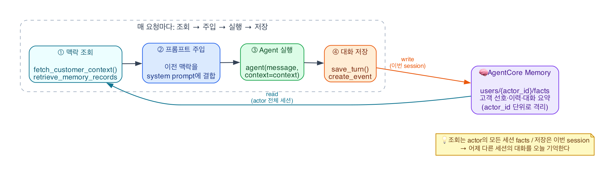
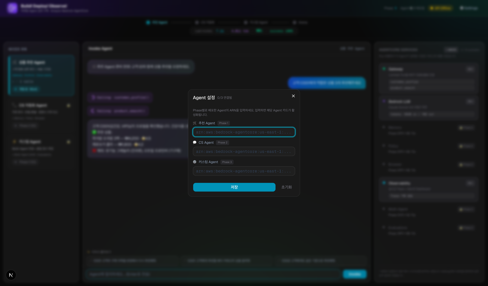
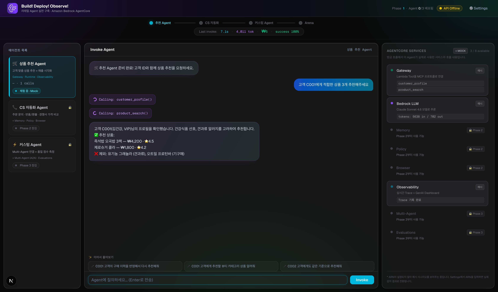
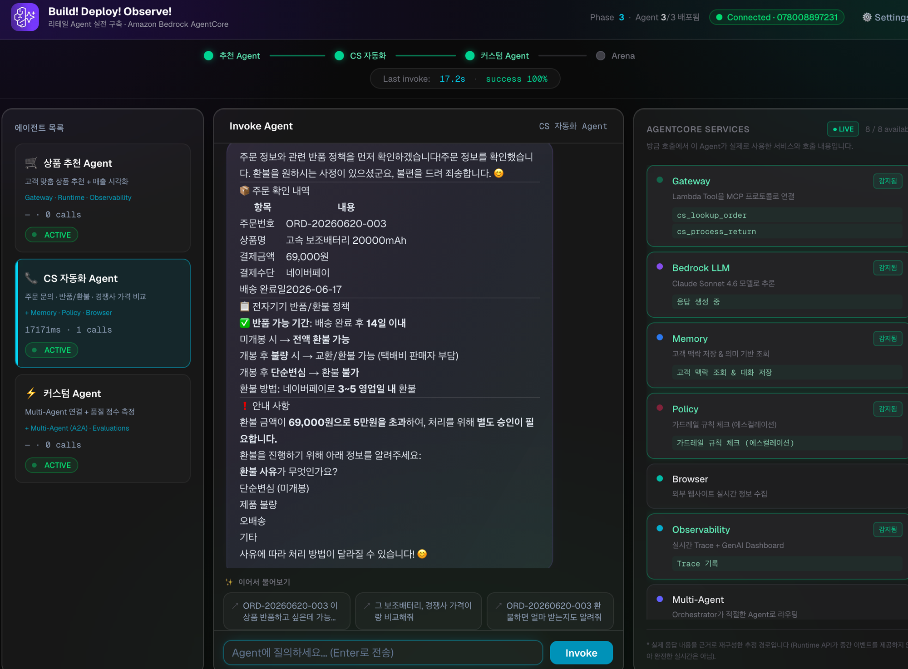

# Step 3: Agent + Memory 연동 <span class="badge-time">⏱️ 20분</span> <span class="badge-difficulty">★★★</span>

<div class="step-progress">
  <span class="step done">✓ Step 1 Memory</span>
  <span class="step-connector done"></span>
  <span class="step done">✓ Step 2 Gateway+Browser</span>
  <span class="step-connector done"></span>
  <span class="step active">● Step 3 Agent</span>
  <span class="step-connector"></span>
  <span class="step">○ Step 4 에스컬레이션</span>
</div>

::: info 이 Step의 목표
Agent에 **Memory를 연동**하여 고객 맥락을 기억하게 합니다.

패턴: Memory 조회 → 프롬프트에 주입 → Agent 실행 → 대화 기록 저장
:::


<div class="file-target">agents/phase2a/app/phase2a/main.py</div>

## 핵심 패턴

<figure style="text-align:center; margin:1.5rem 0;">
  
  <figcaption>매 요청마다 <b>조회 → 주입 → 실행 → 저장</b> — AgentCore Memory가 <b>read</b>(맥락 조회)와 <b>write</b>(대화 저장) 양쪽에 연결됩니다</figcaption>
</figure>

```python
# Phase 1: 상태 없는 Agent
agent("주문 조회해주세요")  # 매번 새로운 대화

# Phase 2: Memory 연동 Agent
context = fetch_customer_context(actor_id, message)   # 이전 맥락 가져오기 (retrieve_memory_records)
agent(message, context=context)                        # 맥락과 함께 실행
save_turn(actor_id, session_id, message, response)     # 이번 대화 저장 (create_event)
```

Agent 호출 **전후**로 Memory 작업이 추가됩니다.

## 3-1. agents/phase2a/app/phase2a/main.py 열기

핵심 구조를 확인합니다:

```python title="app/phase2a/main.py — Import & 설정"
import os
import threading
from datetime import datetime, timezone
import boto3
from strands import Agent
from strands.models.bedrock import BedrockModel
from strands.tools.mcp import MCPClient
from mcp.client.streamable_http import streamablehttp_client
from bedrock_agentcore.runtime import BedrockAgentCoreApp

app = BedrockAgentCoreApp()

GATEWAY_URL = os.environ.get("AGENTCORE_GATEWAY_URL", "")
MEMORY_ID = os.environ.get("AGENTCORE_MEMORY_ID", "")
MOCK_SITE_URL = os.environ.get("MOCK_SITE_URL", "")
REGION = os.environ.get("AWS_REGION", "us-west-2")

memory_client = boto3.client("bedrock-agentcore", region_name=REGION)

# MCPClient는 모듈 로드 시 1회만 생성 (요청마다 재생성하면 매번 핸드셰이크 비용)
mcp_client = MCPClient(lambda: streamablehttp_client(GATEWAY_URL)) if GATEWAY_URL else None

# Browser Tool은 "지연 생성 + 싱글톤 캐싱" — import 시점에 즉시 만들면
# Playwright 초기화가 Runtime의 30초 콜드스타트 타임아웃에 걸릴 수 있어,
# 첫 요청에서만 생성하고 이후 요청은 캐시된 인스턴스를 재사용합니다.
_browser_tool = None
_browser_tool_lock = threading.Lock()


def get_browser_tool():
    global _browser_tool
    if _browser_tool is None:
        with _browser_tool_lock:
            if _browser_tool is None:
                from strands_tools.browser import AgentCoreBrowser
                _browser_tool = AgentCoreBrowser(region=REGION)
    return _browser_tool
```

::: tip Browser Tool은 AgentCore의 관리형 클라우드 브라우저
`AgentCoreBrowser`는 로컬에 브라우저를 띄우는 게 아니라 AWS가 관리하는 클라우드 브라우저 세션을 사용합니다. 경쟁사 가격 페이지 같은 외부 웹사이트를 실시간으로 방문할 때 씁니다 (3-4에서 tools에 연결).
:::

## 3-2. Memory 조회 함수

Agent 호출 **전에** 고객의 이전 맥락을 가져옵니다:

```python title="Memory에서 고객 맥락 가져오기"
def fetch_customer_context(actor_id: str, query: str) -> str:
    """Memory에서 이 고객의 이전 맥락을 검색"""
    if not MEMORY_ID:
        return "신규 고객 (Memory 미설정)"
    try:
        results = memory_client.retrieve_memory_records(
            memoryId=MEMORY_ID,
            namespace=f"users/{actor_id}/facts",
            searchCriteria={
                "searchQuery": query,
                "topK": 5,
            },
        )
        records = results.get("memoryRecordSummaries", [])
        if records:
            return "\n".join(r["content"]["text"] for r in records)
    except Exception as e:
        print(f"[Memory Retrieve Error] {e}")
    return "신규 고객 (이전 맥락 없음)"
```

::: tip retrieve_memory_records의 동작
`searchQuery`로 **의미 기반 검색**을 합니다.

"반품하고 싶어요"라고 물으면, 이전 대화에서 반품 관련 내용을 우선 검색합니다.
:::

## 3-3. 대화 기록 저장 함수

Agent 응답 **후에** 이번 대화를 Memory에 저장합니다:

```python title="이번 대화를 Memory에 저장"
def save_turn(actor_id: str, session_id: str, user_msg: str, agent_response: str):
    """이번 턴(user + agent)을 Memory Event로 저장"""
    if not MEMORY_ID:
        return
    try:
        memory_client.create_event(
            memoryId=MEMORY_ID,
            actorId=actor_id,
            sessionId=session_id,
            eventTimestamp=datetime.now(timezone.utc),
            payload=[
                {"conversational": {"role": "USER", "content": {"text": user_msg}}},
                {"conversational": {"role": "ASSISTANT", "content": {"text": agent_response}}},
            ],
        )
    except Exception as e:
        print(f"[Memory Save Error] {e}")
```

::: info Event vs Record
- **Event**: 원본 대화 (user/assistant 메시지 쌍)
- **Record**: Strategy가 Event에서 자동 추출한 결과 (선호, 요약, 사실)

Event를 저장하면, Strategy가 백그라운드에서 Record를 자동 생성합니다.
:::

## 3-4. Agent Entrypoint (전체 흐름)

```python title="Runtime Entrypoint — Memory 연동 패턴"
model = BedrockModel(model_id="us.anthropic.claude-sonnet-4-6", region_name=REGION)

SYSTEM_PROMPT = """당신은 커머스 고객서비스(CS) 자동화 AI Agent입니다.

## 역할
- 고객의 주문 관련 문의를 처리합니다 (배송조회, 반품, 교환, 환불)
- 필요 시 Browser로 경쟁사 가격을 조회하여 가격 비교 근거를 제공합니다

## 행동 규칙
1. 주문번호로 상세 정보를 조회하고 관련 정책을 확인해 안내
2. 5만원 이상 환불은 에스컬레이션이 필요함을 안내
3. 가격 분쟁 시, Browser로 경쟁사 판매가 페이지를 방문해 비교 근거 제시.
   경쟁사 가격 페이지 URL: {mock_site_url}/competitor-prices.html

## 고객 맥락 (Memory에서 가져온 정보)
{customer_context}
"""

@app.entrypoint
async def invoke(payload, context):
    actor_id = payload.get("actor_id", "anonymous")
    session_id = payload.get("session_id", "")
    prompt = payload.get("prompt", payload.get("message", ""))

    # 1️⃣ Memory에서 고객 맥락 가져오기
    customer_context = fetch_customer_context(actor_id, prompt)

    # 2️⃣ 맥락을 System Prompt에 주입
    system_prompt = SYSTEM_PROMPT.format(
        customer_context=customer_context,
        mock_site_url=MOCK_SITE_URL,
    )

    # 3️⃣ Agent 실행 (Gateway MCP Tool + Browser Tool)
    tools = [mcp_client] if mcp_client else []
    tools.append(get_browser_tool().browser)
    agent = Agent(model=model, system_prompt=system_prompt, tools=tools)

    # 4️⃣ Strands 원시 이벤트를 그대로 흘려보냄 (SSE 스트리밍) + 저장용 텍스트 누적
    full_text = ""
    async for event in agent.stream_async(prompt):
        if not isinstance(event, dict) or "event" not in event:
            continue
        delta = event["event"].get("contentBlockDelta", {}).get("delta", {})
        piece = delta.get("text")
        if isinstance(piece, str):
            full_text += piece
        yield event

    # 5️⃣ Memory 저장은 응답 완료 후 백그라운드 스레드로 — 사용자를 기다리게 하지 않음
    if session_id and full_text:
        threading.Thread(
            target=save_turn,
            args=(actor_id, session_id, prompt, full_text),
            daemon=True,
        ).start()


if __name__ == "__main__":
    app.run()
```

::: info 왜 async generator + 백그라운드 스레드인가
`yield`로 Strands 원시 이벤트를 흘려보내면 Runtime이 이를 SSE 스트리밍 응답으로 내보냅니다(스트리밍 효과는 Playground에서 확인). 여기에 더해 CS Agent는 응답 후 Memory 저장(`save_turn`)이라는 추가 네트워크 호출이 있는데, 응답을 다 보여준 뒤 백그라운드 스레드에서 처리하도록 분리했습니다 — 참가자가 Memory 쓰기 완료까지 기다릴 필요가 없어집니다. (`session_id`가 있을 때만 저장 — CLI `--prompt`처럼 세션이 없으면 저장을 건너뜁니다.)
:::

## 3-5. 배포

```bash
cd ~/workshop/starter-code
chmod +x scripts/*.sh
./scripts/deploy-agent.sh phase2a
```

::: info 환경변수 자동 전달
`deploy-agent.sh phase2a`가 `AGENTCORE_GATEWAY_URL`, `AGENTCORE_MEMORY_ID`, `MOCK_SITE_URL`, `AWS_REGION`을 모두 자동으로 Runtime 환경변수(`agentcore.json`)에 주입합니다.
실행 전에 `echo $AGENTCORE_MEMORY_ID`로 값이 비어있지 않은지 먼저 확인하세요.
:::


::: warning RUNTIME_ROLE_ARN 확인 필수
`RUNTIME_ROLE_ARN`은 사전 구성된 워크샵 환경에서 생성되어 `.env.w001`에 저장되어 있습니다.
Code Editor 터미널을 새로 열었다면 반드시 `source ~/workshop/.env.w001` 후 `echo $RUNTIME_ROLE_ARN`으로 값이 채워졌는지 확인하세요.
이 값이 비어있으면 Memory 접근 권한이 없는 Role로 잘못 배포될 수 있어, `deploy-agent.sh`가 값이 없을 경우 즉시 에러로 중단하도록 되어 있습니다.
:::

## 3-6. 테스트 (Memory 동작 확인)

Memory 시나리오는 `actor_id`(고객 ID)와 `session_id`를 payload로 넘겨야 합니다. `agentcore invoke`는 이런 구조화된 payload를 **`--prompt-file`**(JSON 파일)로 받습니다. 프로젝트 디렉토리에서 실행하세요:

```bash
cd ~/workshop/starter-code/agents/phase2a
```

::: tip 테스트 방법
`actor_id`는 같게(C001), `session_id`만 다르게 — 실제 고객이 채팅창을 닫고 다시 열었을 때를 시뮬레이션합니다. `session_id`는 33자 이상이어야 합니다(짧으면 `runtimeSessionId` 제약 에러).
:::


**첫 번째 대화:**

```bash
cat > /tmp/cs-1.json <<'JSON'
{"prompt": "주문 ORD-20260620-001 배송 상태 확인해주세요", "actor_id": "C001", "session_id": "cs-test-001-aaaaaaaaaaaaaaaaaaaaaaaaaaaa"}
JSON
agentcore invoke --prompt-file /tmp/cs-1.json
```

**두 번째 대화 (같은 고객, 새 세션):**

```bash
cat > /tmp/cs-2.json <<'JSON'
{"prompt": "아까 그 주문 반품하고 싶어요", "actor_id": "C001", "session_id": "cs-test-002-bbbbbbbbbbbbbbbbbbbbbbbbbbbb"}
JSON
agentcore invoke --prompt-file /tmp/cs-2.json
```

::: details ✅ Memory 연동 확인 포인트
두 번째 대화에서 Agent가:

- "아까 그 주문" = ORD-20260620-001을 **기억**하고 있음
- 주문번호를 다시 물어보지 않음 (첫 번째 대화에서 조회했던 주문·상품·배송 정보를 그대로 활용)
- `return_policy` Tool까지 스스로 연계 호출하여 반품 가능 여부·기한·환불 조건을 함께 안내
- Memory에서 이전 세션의 맥락을 가져왔기 때문

```
🤖 Agent: 주문 내역과 반품 정책을 확인했습니다. 아래 내용을 안내드립니다.

## 📦 주문 확인
| 항목 | 내용 |
|------|------|
| 주문번호 | ORD-20260620-001 |
| 상품 | 유기농 프로틴바 (12개입) |
| 결제금액 | 32,000원 |
| 배송완료일 | 2026년 6월 22일 |

## 📋 건강식품 반품 정책
- 반품 가능 기간: 배송 완료 후 7일 이내 (~ 6월 29일까지)
- 환불 조건: 미개봉 시 전액 환불 / 개봉 후 환불 불가(식품위생법) / 유통기한 임박 시 교환만 가능
- 환불 방법: 신용카드로 3~5영업일 내 환불

반품 사유와 개봉 여부를 여쭤보고, 상황에 맞는 처리 방법을 안내드리겠습니다.
```

주문번호를 다시 묻지 않고 "그 주문"만으로 바로 상세 정보를 이어서 안내하는 것이 Memory가 정상 동작하고 있다는 핵심 증거입니다. 이후 반품 사유·개봉 여부에 따라 `process_return` Tool을 호출해 실제 환불/에스컬레이션 여부가 결정됩니다 (Step 4에서 다룹니다).
:::


::: info 출력이 여러 이벤트로 나뉘어 나옵니다
entrypoint가 async generator(`yield`)라서 응답이 **여러 이벤트 조각으로 나뉘어** 출력됩니다. 위 예시는 최종 텍스트만 정리한 것입니다. (실시간 토큰 **스트리밍 효과는 Agent Playground**에서 확인할 수 있습니다.)
:::


**세 번째 대화 (존재하지 않는 주문번호 — 환각 방지 확인):**

```bash
cat > /tmp/cs-3.json <<'JSON'
{"prompt": "주문 ORD-9999-999 배송 상태 알려주세요", "actor_id": "C001", "session_id": "cs-test-003-cccccccccccccccccccccccccccc"}
JSON
agentcore invoke --prompt-file /tmp/cs-3.json
```

::: details ✅ 환각 방지 확인 포인트
존재하지 않는 주문번호를 물어봤을 때, Agent가:

- `lookup_order` Tool 호출 결과가 404(실패)임을 확인하고
- 배송 상태를 그럴듯하게 지어내지 않고 **"해당 주문을 찾을 수 없습니다"**라고 정직하게 답함
- 참고로 고객이 실제로 가진 다른 주문번호를 안내에 덧붙일 수 있음 (Memory에 남은 맥락 활용)

Tool 응답에 없는 정보는 절대 지어내지 않는다는 System Prompt 규칙이 이 시나리오를 위한 것입니다. 만약 Agent가 존재하지 않는 주문에 대해 배송 상태를 답한다면 환각이 발생한 것이므로, `app/phase2a/main.py`의 System Prompt에 있는 "절대 규칙 — Tool 결과만 사용" 섹션을 확인하세요.
:::

## 3-6b. Agent Playground에 연결

CLI로 Memory 동작까지 확인했다면, 이제 웹 화면에서 대화형으로 테스트해봅니다. 배포 시 출력된 **Agent ARN**을 Agent Playground 설정에 등록하면 됩니다.

1. Playground 접속 → **⚙️ Settings** → **CS Agent (Phase 2)** 입력란에 Agent ARN 붙여넣기 → **저장**



2. 좌측 **CS 자동화 Agent** 카드가 `ACTIVE`로 바뀌면 채팅창에서 바로 질문 가능



## 3-7. 호출된 서비스 확인 (Observability)

Playground 우측 **AGENTCORE SERVICES** 패널에서, 방금 호출에서 이 Agent가 **실제로 사용한 서비스와 tool**을 확인할 수 있습니다. Gateway·Bedrock LLM·Memory·Policy·Browser 등 각 서비스가 `감지됨`으로 표시되고, 호출된 tool(`cs_lookup_order`, `cs_process_return` 등)까지 함께 볼 수 있습니다.



## 이해 체크

- [x] Memory 조회 → 프롬프트 주입 → Agent 실행 → 대화 저장 (4단계 패턴)
- [x] `retrieve_memory_records`는 의미 기반 검색 (현재 질문과 관련된 기억 우선)
- [x] `create_event`로 대화를 저장하면 Strategy가 자동으로 Record 생성
- [x] Trace에 MEMORY 스팬이 추가됨

---

::: tip ✅ 다음
Memory 연동 완료! → [Step 4: 에스컬레이션](step4-policy.md)
:::

