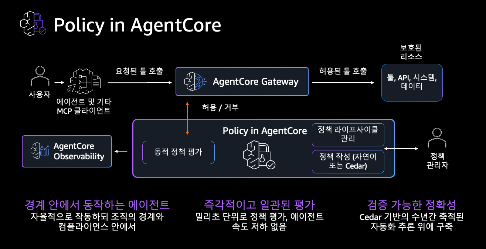

# Step 4: 에스컬레이션 (권한 경계 & Policy 개념) <span class="badge-time">⏱️ 15분</span> <span class="badge-difficulty">★★☆</span>

<div class="step-progress">
  <span class="step done">✓ Step 1 Memory</span>
  <span class="step-connector done"></span>
  <span class="step done">✓ Step 2 Gateway+Browser</span>
  <span class="step-connector done"></span>
  <span class="step done">✓ Step 3 Agent</span>
  <span class="step-connector done"></span>
  <span class="step active">● Step 4 에스컬레이션</span>
</div>

::: info 이 Step의 목표
고객 응대에서 **에스컬레이션(escalation)** — AI가 자기 권한 밖의 결정을 임의로 처리하지 않고 사람(상급자)에게 넘기는 것 — 을 구현합니다.

규칙: 환불 금액 > 50,000원이면 Agent가 직접 처리하지 않고 **CS 팀 리더 승인**으로 넘김
:::


## 에스컬레이션이란?

```
가드레일 없이:  Agent가 100만원 환불도 마음대로 처리
에스컬레이션:   "이 건은 제 권한 밖이라 직접 처리할 수 없습니다. CS 팀 리더에게 전달합니다."
```

**에스컬레이션 = 자율 AI에 안전한 권한 경계를 두는 핵심 패턴**입니다. 콜센터 상담원이 "제 선에서 되는 건 처리하고, 큰 건은 팀장님께 넘기는" 것과 같습니다. AI Agent도 "여기까지가 내 권한, 그 이상은 사람에게"라는 경계를 가져야 합니다.

### 가드레일을 구현하는 두 가지 방법

AgentCore에서 이런 가드레일은 두 가지로 구현할 수 있습니다:

| 방법 | 방식 | 특징 |
|------|------|------|
| **AgentCore Policy** | Gateway를 통한 Tool 호출을 **Cedar 정책으로 가로채 허용/거부** | 시스템 레벨 강제, 코드 무관, 감사 로그. **OAuth 인증 Gateway 필요** |
| **Tool 비즈니스 로직** | Tool(Lambda)이 조건을 판정해 **결과에 플래그 반환** | 구현 단순, 인증 방식 무관 |

::: warning 이 워크샵의 선택: Tool 비즈니스 로직 (Lambda)
**AgentCore Policy(Cedar)는 OAuth 인증(authorizer) Gateway를 전제로 동작**합니다. Cedar 정책은 `principal`(인증된 사용자)을 기준으로 Tool 호출을 평가하기 때문입니다.

이 워크샵의 Gateway는 실습 편의를 위해 **인증 없이(`authorizerType=NONE`)** 구성되어 있어, Cedar 정책이 `principal`을 인식하지 못해 ENFORCE 모드에서는 모든 Tool 호출이 차단됩니다. 따라서 이 워크샵에서는 **에스컬레이션을 `process_return` Lambda의 비즈니스 로직으로 구현**합니다 (금액 조건 → `needs_escalation` 플래그 반환 → Agent가 안내).

> 💡 **실무 적용 시**: 프로덕션에서 Gateway를 OAuth(Cognito 등)로 구성하면, 이 5만원 규칙을 Cedar 정책으로 옮겨 **Agent 코드·Tool 수정 없이 시스템 레벨에서 강제**할 수 있습니다. 이 경우 위 다이어그램의 "동적 정책 평가"가 실제로 동작합니다.
:::

### 참고: AgentCore Policy는 어떻게 동작하나 (OAuth Gateway 기준)



AgentCore Policy를 쓰면(OAuth Gateway 전제), Gateway를 통한 Tool 호출을 Cedar 정책이 가로채 판정합니다:

1. **요청된 Tool 호출** — Agent가 `process_return` 같은 Tool을 호출하려 함
2. **동적 정책 평가** — Policy Engine이 `principal`·입력값을 실시간 평가해 **허용/거부** 결정
3. **허용된 Tool 호출만** 실제 보호된 리소스에 도달
4. **Observability 기록** — 모든 ALLOW/DENY 결정이 감사 로그에 남음

규칙은 **자연어 또는 Cedar**로 작성하고, Agent 코드와 무관하게 관리합니다. 밀리초 단위 평가로 응답 속도 저하가 없고, Cedar 기반의 검증 가능한 정확성을 제공합니다. (이 워크샵에선 위 환경 제약으로 개념만 소개합니다.)

## 4-1. 에스컬레이션 규칙 설계

CS 시나리오의 에스컬레이션 규칙:

```
IF process_return 응답에 needs_escalation == true
THEN Agent는 직접 처리하지 않고 "CS 팀 리더에게 전달" 응답
```

`process_return` Lambda의 로직:

```python title="process_return Lambda (이미 배포됨)"
def handler(event, context):
    refund_amount = event["refund_amount"]
    
    if refund_amount > 50000:
        return {
            "status": "PENDING_APPROVAL",
            "needs_escalation": True,
            "message": "환불 금액이 50,000원을 초과하여 CS 팀 리더 승인이 필요합니다.",
            "escalation_to": "cs-team-lead",
        }
    else:
        return {
            "status": "COMPLETED",
            "needs_escalation": False,
            "message": f"환불 {refund_amount:,}원 처리 완료",
            "refund_method": "원래 결제수단으로 3~5영업일 내 환불",
        }
```

## 4-2. 에스컬레이션 로직은 이미 배포되어 있습니다

이 워크샵의 에스컬레이션은 `process_return` Lambda(Step 2에서 Gateway에 등록한 Tool) 안에 이미 구현되어 있습니다. **별도 설정이 필요 없습니다** — 위 4-1 코드처럼 금액 조건으로 `needs_escalation` 플래그를 반환하고, Agent가 그 플래그를 보고 안내합니다.

::: details 🔧 (심화) AgentCore Policy로 구현한다면
프로덕션에서 Gateway를 OAuth 인증으로 구성했다면, 같은 규칙을 Cedar 정책으로 옮겨 Tool 호출 자체를 시스템 레벨에서 차단할 수 있습니다. 개념 흐름:

```python
import boto3
client = boto3.client("bedrock-agentcore-control", region_name="us-west-2")

# 1) Policy Engine 생성
engine = client.create_policy_engine(name="cs-policy-engine")

# 2) Cedar 정책 — 5만원 초과 환불 Tool 호출을 차단(forbid)
client.create_policy(
    policyEngineId=engine["policyEngineId"],
    name="ForbidHighRefund",
    definition={"cedar": {"statement": '''
        forbid(
          principal,
          action == AgentCore::Action::"cs-process-return___cs_process_return",
          resource == AgentCore::Gateway::"<GATEWAY_ARN>"
        ) when { context.input.refund_amount > 50000 };
    '''}},
)

# 3) Gateway에 Policy Engine 연결 (ENFORCE)
client.update_gateway(gatewayIdentifier="<GW_ID>", ...,
    policyEngineConfiguration={"arn": engine["policyEngineArn"], "mode": "ENFORCE"})
```

⚠️ 단, Cedar 정책은 `principal`(인증된 사용자)을 기준으로 평가하므로 **OAuth authorizer Gateway에서만 동작**합니다. 이 워크샵의 `authorizerType=NONE` Gateway에서는 `principal`이 없어 모든 Tool이 차단되므로, 위 4-1의 Lambda 방식을 사용합니다.
:::

## 4-3. Agent가 에스컬레이션 플래그를 처리하는 방법

Agent의 System Prompt에 규칙을 명시하여, `needs_escalation` 플래그에 따라 다르게 응대하도록 합니다:

```python title="System Prompt에 에스컬레이션 규칙 추가"
SYSTEM_PROMPT = """당신은 리테일 CS 전문 상담사입니다.

## 에스컬레이션 규칙 (반드시 준수)
- process_return 결과에서 needs_escalation=true이면:
  → 직접 처리하지 않음
  → "CS 팀 리더에게 전달하겠습니다"로 안내
  → 예상 처리 시간 안내 (24시간 이내)
- needs_escalation=false이면:
  → 환불 완료 안내
  → 환불 방법 및 소요 기간 안내

## 고객 맥락 (Memory)
{customer_context}
"""
```

::: tip System Prompt + Tool 로직 = 이중 확인
Tool(Lambda)이 금액 조건을 **결정론적으로 판정**(needs_escalation 플래그)하고, Agent는 그 플래그를 보고 응대합니다. 금액 판정을 LLM의 산수에 맡기지 않고 Tool이 확정하므로, "5만원 초과인데 LLM이 잘못 계산해 처리"하는 실수를 막습니다.

> 프로덕션에서 더 강한 보장이 필요하면(LLM이 플래그 자체를 무시하는 것까지 차단), 4-2 심화의 AgentCore Policy로 Tool 호출을 시스템 레벨에서 막습니다.
:::

## 4-4. 2가지 시나리오 테스트

Phase 2 Step 3에서 썼던 `agentcore invoke` CLI 패턴을 그대로 사용합니다. 5만원 경계를 기준으로 **자동 처리 vs 에스컬레이션**이 갈리는 것을 비교합니다.

::: tip 시나리오 선택 팁 — 반품이 확실히 '처리'되는 주문을 쓰세요
에스컬레이션을 보려면 Agent가 `process_return` Tool을 **실제로 호출**해야 합니다. 그런데 주문이 **배송 중(IN_TRANSIT)**이거나 **화장품(개봉 여부 확인 필요)**이면, Agent가 "수령 후에" 또는 "개봉 여부 확인 후"라며 처리를 미뤄 에스컬레이션까지 도달하지 않습니다.
아래 테스트는 **배송 완료 + 전자기기 + 불량 사유** 주문(`ORD-2024-999`)을 써서, Agent가 곧바로 `process_return`을 호출하도록 합니다.
:::


### 테스트 1: 상품 불량 반품 (35,000원 — 자동 처리, 에스컬레이션 없음)

```bash
cd ~/workshop/starter-code/agents/phase2a
cat > /tmp/policy-1.json <<'JSON'
{"prompt": "주문 ORD-2024-101 상품이 불량이에요. 반품하고 싶습니다.", "actor_id": "C001", "session_id": "policy-test-001-aaaaaaaaaaaaaaaaaaaa"}
JSON
agentcore invoke --prompt-file /tmp/policy-1.json
```

::: details ✅ 예상 결과 — 5만원 이하라 자동 환불
```
🤖 Agent: ORD-2024-101 주문을 확인했습니다.

- 상품: 무선 이어폰 (화이트) (35,000원)
- 반품 사유: 상품불량

✅ 환불 처리가 완료되었습니다.
- 환불 금액: 35,000원
- 환불 방법: 원래 결제수단으로 3~5영업일 내 환불
```
`process_return`이 `needs_escalation: false`를 반환 → Agent가 바로 환불 완료를 안내합니다.
:::


### 테스트 2: 고가 반품 (69,000원 — 에스컬레이션 발동!)

```bash
cat > /tmp/policy-2.json <<'JSON'
{"prompt": "주문 ORD-2024-999 상품이 불량입니다. 개봉했지만 불량이라 사용 못 합니다. 69000원 전액 환불을 지금 처리해주세요.", "actor_id": "C001", "session_id": "policy-test-002-bbbbbbbbbbbbbbbbbbbb"}
JSON
agentcore invoke --prompt-file /tmp/policy-2.json
```

::: details ✅ 예상 결과 — 5만원 초과라 에스컬레이션
```
🤖 Agent: ORD-2024-999 주문을 확인했습니다.

- 상품: 고속 보조배터리 20000mAh (69,000원)
- 반품 사유: 상품 불량
- 결제금액: 69,000원

⚠️ 환불 금액이 50,000원을 초과하여, 제가 직접 처리할 수 없습니다.
CS 팀 리더에게 전달하겠습니다.

- 에스컬레이션 사유: 환불 금액 기준 초과 (69,000원 > 50,000원)
- 예상 처리 시간: 24시간 이내
- 담당: CS 팀 리더

처리 결과는 등록된 연락처로 안내드리겠습니다.
```
`process_return`이 `needs_escalation: true`를 반환 → Agent가 직접 처리하지 않고 CS 팀 리더로 넘깁니다. **이것이 에스컬레이션입니다** — 같은 반품 요청이라도 금액이 권한 경계를 넘으면 사람에게 올립니다.
:::

::: warning Agent가 처리를 미루면
만약 Agent가 "수령 후에" 또는 "개봉 여부를 알려달라"며 되물으면, `process_return`을 아직 호출하지 않은 것입니다. "네, 개봉했지만 불량이라 지금 환불해주세요"처럼 한 번 더 확정해 주면 Tool을 호출하고 위 에스컬레이션 결과로 이어집니다.
:::

## 4-5. Trace에서 에스컬레이션 확인

Observability에서 테스트별 Trace를 비교합니다. 에스컬레이션 분기가 `process_return` Tool의 반환값(`needs_escalation`)에서 결정되는 것을 볼 수 있습니다:

```
Trace (테스트 2 — 에스컬레이션, ORD-2024-999 / 69,000원):
  MEMORY_RETRIEVE
  AGENT_START
  TOOL_CALL(lookup_order) → 200 OK
  TOOL_CALL(return_policy) → 200 OK
  TOOL_CALL(process_return) → needs_escalation: true ⚠️  ← 5만원 초과, 승인 필요
  AGENT_END (CS 팀 리더 전달 안내)
  MEMORY_SAVE
```

```
Trace (테스트 1 — 정상 처리, ORD-2024-101 / 35,000원):
  MEMORY_RETRIEVE
  AGENT_START
  TOOL_CALL(lookup_order) → 200 OK
  TOOL_CALL(process_return) → needs_escalation: false ✅  ← 5만원 이하, 자동 처리
  AGENT_END (환불 완료 안내)
  MEMORY_SAVE
```

::: info process_return Tool 스팬
- **needs_escalation: false** → Agent가 환불 완료 안내
- **needs_escalation: true** → Agent가 직접 처리하지 않고 CS 팀 리더 전달 안내
- Tool 입출력(금액, 결정)이 Trace에 기록되어 **어떤 근거로 에스컬레이션됐는지 감사 가능**
:::

## Phase 2 완성!

축하합니다! Phase 2에서 추가한 것들:

| 서비스 | 역할 | 효과 |
|--------|------|------|
| **Memory** | 고객 맥락 유지 | 같은 말 반복 안 해도 됨 |
| **Gateway 확장** | CS Tool 4개 추가 | Agent 코드 수정 없이 확장 |
| **Browser** | 경쟁사 가격 실시간 조회 | 외부 웹 데이터 활용 |
| **에스컬레이션** | 금액 기준 권한 경계 | 5만원 초과는 사람 승인으로 |

## Phase 1 → 2A 성장 비교

```
Phase 1:  Gateway → Agent → Observability
          (도구를 쓸 줄 아는 Agent)

Phase 2: Memory → Gateway → Agent → 에스컬레이션 → Observability
          (기억하고, 권한 경계를 지키는 Agent)
```

::: tip ✅ Phase 2 완료!
Memory + 에스컬레이션을 추가하여 **실제 CS 업무에 투입 가능한** Agent가 되었습니다.

점심 후 [Phase 3: 바이브코딩으로 나만의 Agent 만들기](../phase3/index.md)에서
오늘 배운 서비스들을 조합해 **여러분 회사의 문제를 푸는 Agent**를 직접 만듭니다.
`agents/phase2a/app/phase2a/main.py`가 그때의 **참고 코드**가 됩니다.
:::

