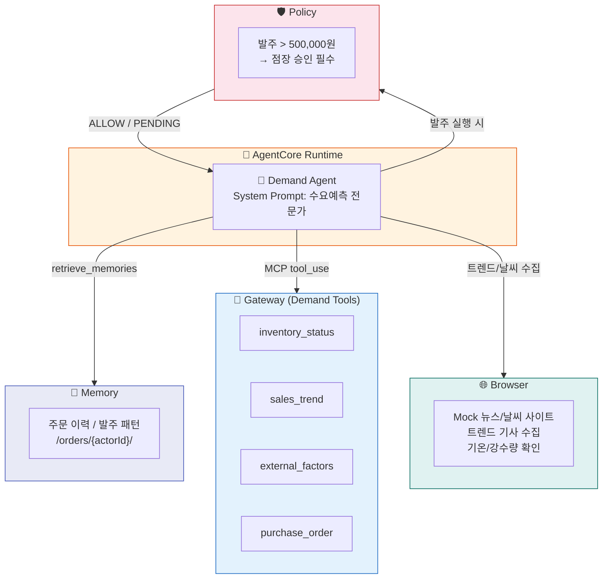
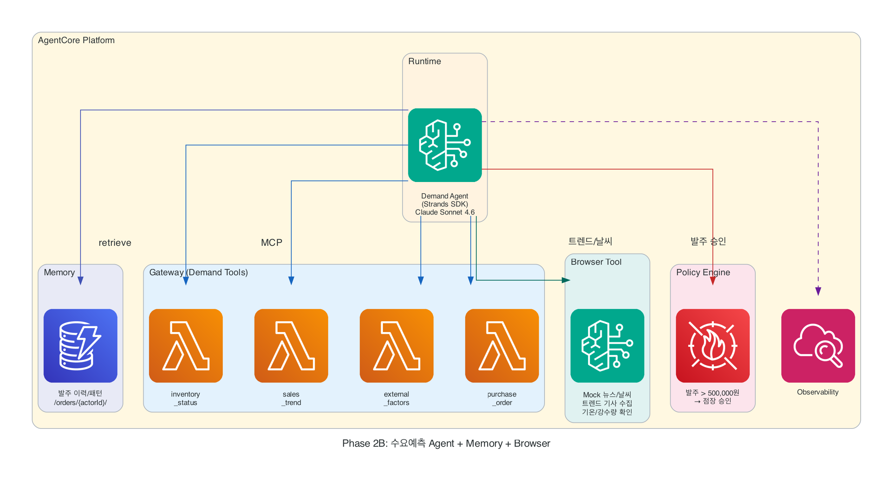

# Phase 2B: 능동적으로 판단하는 수요예측 Agent + 트렌드 수집

폭염이 시작됐습니다. 콜드브루 재고가 3일 치밖에 안 남았는데, 이번 주말에 여름 세일까지 겹칩니다. 이 Agent는 재고를 스캔하고, 브라우저로 트렌드 뉴스와 날씨를 직접 확인해서, 알아서 긴급 발주를 넣습니다.

!!! abstract "이 Phase에서 추가하는 것"
    - **Memory** — 주문 이력과 발주 패턴을 기억
    - **Policy** — 50만원 초과 발주 시 승인 필요
    - **Gateway 확장** — 수요 예측 Tool 4개 추가 등록
    - **Browser** — Mock 뉴스/날씨 사이트에서 트렌드 & 기상 정보 수집

!!! info "Browser는 사전 배포된 Mock 사이트를 조회합니다"
    실제 뉴스/기상청 사이트가 아닌, 운영진이 미리 배포한 Mock 트렌드 뉴스 + 날씨 예보 사이트에 접속합니다.
    Agent가 브라우저로 해당 사이트를 탐색하여 수요에 영향을 주는 외부 요인을 수집합니다.

---

## Phase 2A와의 차이

| Phase 2A (CS Agent) | Phase 2B (수요 예측 + Browser) |
|---------------------|-------------------------------|
| 고객 대화 맥락 기억 | **주문/발주 이력 기억** |
| 에스컬레이션 (5만원) | **발주 승인 (50만원)** |
| 반품/배송 조회 Tool | **재고/트렌드/발주 Tool** |
| Browser: 경쟁사 가격 조회 | Browser: **트렌드 뉴스 + 날씨 예보 수집** |
| 고객 응대 시나리오 | **분석 → 의사결정 시나리오** |

---

## 아키텍처



<!-- AWS 아이콘 버전 (롤백 시 이 블록만 삭제) -->
<figure markdown>
  { width="700" }
  <figcaption>AWS 서비스 아이콘 기반 아키텍처</figcaption>
</figure>

---

## Steps

1. [Memory 네임스페이스 추가](step1-memory.md) — 주문 이력 저장 구조 설계
2. [트렌드/날씨 수집 연결 (Gateway + Browser)](step2-gateway.md) — 분석 Tool 4개 + Browser로 Mock 사이트 수집
3. [Agent + Memory + Browser 연동](step3-agent.md) — 분석 결과 + 외부 요인 기반 발주 판단
4. [Policy (발주 승인)](step4-policy.md) — 금액 기반 자동 승인/보류

---

!!! tip "핵심 학습"
    - Memory = "이전에 어떤 발주를 했고, 어떤 패턴이 있었는지 기억"
    - Policy = "이 금액 이상은 무조건 승인을 받아야 발주 실행"
    - Browser = "트렌드 뉴스와 날씨를 직접 확인하여 수요 예측에 반영"
    - 같은 AgentCore 서비스를 **도메인만 바꿔서** 재활용하는 패턴 체험

---

!!! warning "시작 전 환경 확인"
    터미널에서 아래 명령으로 환경을 복구하세요 (세션 끊겼을 때):
    ```bash
    cd ~/workshop/starter-code && source .venv/bin/activate && source ~/workshop/.env.w001
    ```
