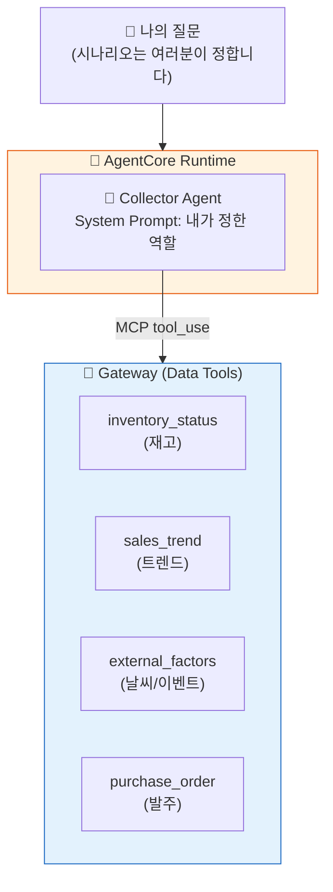

# Phase 2B: 뉴스와 날씨를 수집하는 Agent

이 Phase에서는 Agent에게 **바깥세상을 보는 눈**을 쥐어줍니다 — 뉴스와 날씨를 수집할 수 있는 **툴**을 준비하고, 그 툴을 쓰는 Agent를 직접 만들어 배포합니다.

가이드는 **툴 사용법까지만** 안내합니다. 이 툴로 무엇을 할지 — 예를 들어 날씨를 보고 음료 발주를 제안하게 할지, 지역 이벤트를 모니터링해서 알려주게 할지, 뉴스에서 우리 상품 관련 이슈를 찾게 할지 — **시나리오는 여러분이 직접 정합니다**.

::: info ℹ️ 이 Phase에서 추가하는 것
- **Gateway 확장** — 재고/트렌드/외부요인/발주 등 데이터 Tool 4개 추가 등록
- **나만의 수집 Agent 배포** — 시나리오는 여러분이 정하고, Tool 조합으로 구현
:::


::: tip 이 Phase는 Phase 3의 재료 준비입니다
점심 후 Phase 3에서 **바이브코딩으로 나만의 Agent**를 만듭니다.
여기서 등록하는 데이터 Tool이 그때 조합할 **재료**가 되고,
여기서 배포하는 Agent 코드가 바이브코딩의 **참고 코드**가 됩니다.
:::


::: info 날씨와 이벤트는 `external_factors` Tool이 제공합니다
실제 기상청 API가 아닌, 워크샵용 Mock Lambda가 날씨 예보/지역 이벤트/공휴일 데이터를 반환합니다.
실무 적용 시에는 이 Lambda를 실제 API를 호출하는 Lambda로 교체하면 됩니다 (Agent 코드 변경 불필요).
:::

## Phase 2A와의 차이

| Phase 2A (CS Agent) | Phase 2B (뉴스/날씨 수집 Agent) |
|---------------------|--------------------------------|
| 정해진 시나리오 (CS 응대) | **시나리오를 직접 정함** (수집 툴 활용) |
| 반품/배송 조회 Tool | **재고/트렌드/외부요인 Tool** |
| Memory/Policy 포함 | Memory/Policy 없음 — **Phase 3에서 직접 연동** |

## 아키텍처



## Steps

1. [데이터 재료 준비하기 (Gateway 확장)](step1-gateway.md) — 데이터 Tool 4개 추가 등록
2. [나만의 수집 Agent 만들어 배포하기](step2-agent.md) — 내가 정한 시나리오를 Tool 조합으로 구현

---

::: tip 핵심 학습
- Gateway Tool로 **날씨, 이벤트, 재고, 트렌드** 데이터를 Agent에게 제공
- 같은 AgentCore 서비스를 **도메인만 바꿔서** 재활용하는 패턴 체험
- System Prompt로 Tool 사용 시점을 지시 → Agent가 자율적으로 선택
:::


---

::: warning 시작 전 환경 확인
터미널에서 아래 명령으로 환경을 복구하세요 (세션 끊겼을 때):
```bash
cd ~/workshop/starter-code && source .venv/bin/activate && source ~/workshop/.env.w001
```
:::

