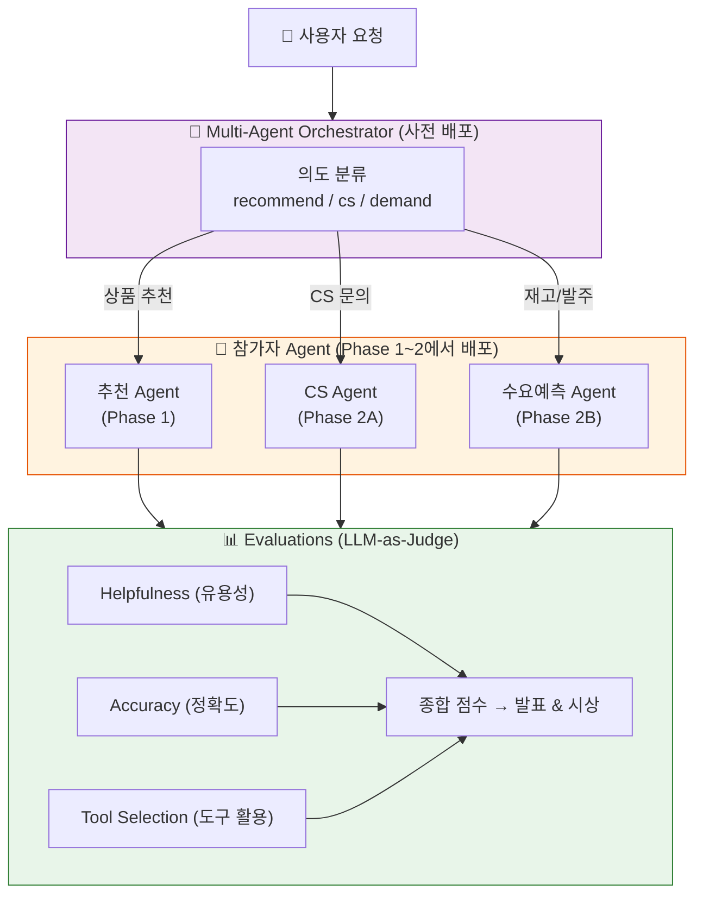
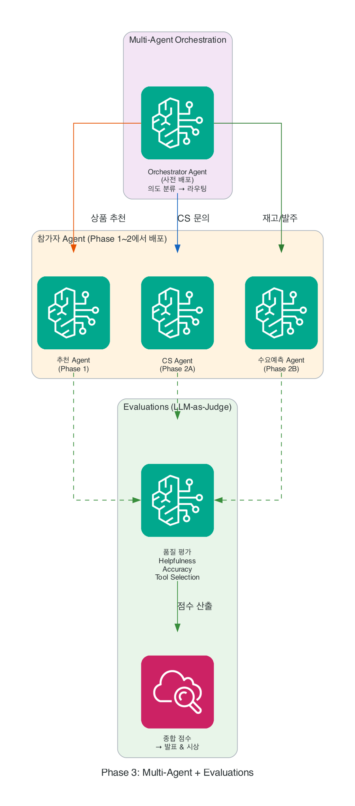

# Phase 3: Multi-Agent + Evaluations

여러분이 만든 Agent가 혼자 일하던 시대는 끝났습니다. 이제 Orchestrator가 고객 요청을 분석하고, 가장 적합한 Agent에게 라우팅합니다. 그리고 Evaluations로 Agent의 품질을 측정하여 점수를 받습니다. 발표에서 이 점수를 공개합니다.

!!! abstract "이 Phase에서 하는 것"
    - **Multi-Agent (A2A)** — 사전 배포된 Orchestrator에 내 Agent를 연결
    - **Evaluations** — Agent 품질 점수 자동 측정 (정확도, 응답 품질, 도구 활용)
    - 연결 → 평가 → 확인 → 발표 (품질 점수 공개)

!!! info "Orchestrator는 운영진이 사전 배포했습니다"
    참가자는 Orchestrator를 직접 만들지 않습니다.
    여러분의 Agent를 Orchestrator에 **등록**하면, Orchestrator가 고객 요청을 분석하여 적절한 Agent로 라우팅합니다.
    여러분은 연결과 평가에 집중하세요.

---

## 타임라인

| 시간 | 활동 | 산출물 |
|------|------|--------|
| 15분 | Orchestrator에 Agent 연결 | 라우팅 동작 확인 |
| 20분 | Evaluations 실행 | 품질 점수 리포트 |
| 10분 | 배포 상태 최종 확인 | 엔드포인트 동작 검증 |
| 15분 | 발표 (2분 시연 + 점수 공개) | 라이브 데모 |

---

## 아키텍처

<!-- AWS 아이콘 버전 (롤백 시 이 블록만 삭제) -->
<figure markdown>
  { width="650" }
  <figcaption>AWS 서비스 아이콘 기반 아키텍처</figcaption>
</figure>

---

## Steps

1. [Orchestrator에 Agent 연결하기 (Multi-Agent)](step1-usecase.md) — A2A 프로토콜로 내 Agent를 등록
2. [Agent 품질 측정하기 (Evaluations)](step2-fullstack.md) — 테스트 시나리오 실행 & 점수 확인
3. [배포 상태 확인하기](step3-deploy.md) — 엔드포인트 동작 최종 검증
4. [발표하기 (품질 점수 공개)](step4-present.md) — 2분 라이브 데모 + Evaluations 점수

---

## 시상 기준

| 평가 항목 | 비중 | 설명 |
|-----------|------|------|
| Evaluations 점수 | 40% | 자동 측정된 품질 점수 |
| 시나리오 완성도 | 30% | 리테일 시나리오의 현실성과 깊이 |
| 라이브 데모 | 20% | 발표에서의 설득력 |
| 기술 활용도 | 10% | AgentCore 서비스를 얼마나 잘 활용했는가 |

---

!!! tip "핵심 메시지"
    Phase 1~2에서 만든 Agent가 이제 **팀의 일원**이 됩니다.
    
    - Orchestrator가 고객 의도를 분석하여 **최적의 Agent로 라우팅**
    - Evaluations가 Agent의 품질을 **객관적 점수로 측정**
    - 단독 Agent에서 → **협업하는 Agent 생태계**로 진화합니다
