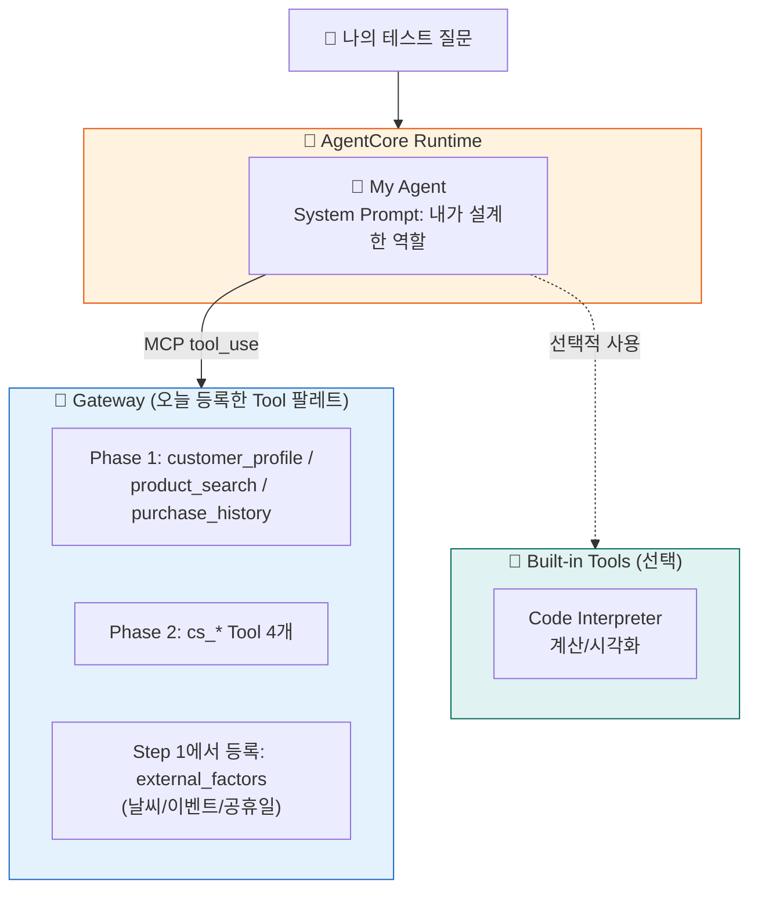

# Phase 3: 바이브코딩으로 나만의 Agent 만들기

지금까지는 가이드가 준비한 Agent를 만들었습니다. 이제 여러분 차례입니다. 먼저 Agent에게 **바깥세상을 보는 눈**(날씨/이벤트 Tool)을 쥐어주고, 오늘 배운 **Runtime + Gateway + Memory**를 조합해 AI 코딩 도구와 함께 **여러분 회사의 문제를 푸는 Agent**를 직접 설계하고, 구현하고, 배포합니다.

::: info ℹ️ 이 Phase에서 하는 것
- **도구 등록** — Gateway에 `external-factors` Tool(날씨/이벤트/공휴일) 추가
- **설계** — 나만의 Agent 설계서 작성 (빈칸 채우기 템플릿)
- **바이브코딩** — AI 코딩 도구에게 설계서 + 참고 코드를 주고 Agent 구현
- **배포** — AgentCore Runtime에 배포하고 Playground에서 테스트
- **제출** — 아레나에 결과물 제출
:::


::: info AI 코딩 도구는 자유롭게 선택하세요
Claude Code, Amazon Q Developer, Kiro 등 **어떤 AI 코딩 도구든 좋습니다**.
이 가이드의 프롬프트 예시는 도구에 무관하게 동작합니다.
도구가 없어도 괜찮습니다 — 제공되는 템플릿을 직접 수정하는 방법도 안내합니다.
:::

## 두 가지 경로

Phase 3는 경험과 시간에 따라 **두 갈래** 중 하나를 선택할 수 있습니다:

::: details 🅰️ 가이드형 — Step 1~5를 순서대로 따라가기 (권장)
**이런 분에게 적합합니다:**
- Agent를 처음 만들어보는 분
- 시간이 40분 이내인 분
- 확실히 동작하는 결과물을 원하는 분

**흐름:**
1. Gateway에 `external-factors` Tool 추가 (Step 1)
2. 기존 Tool 팔레트(8개) 안에서 시나리오를 떠올려 설계서 작성 (Step 2)
3. 바이브코딩으로 `main.py` 생성 (Step 3)
4. 배포 & 테스트 (Step 4)
5. 아레나 제출 (Step 5)
:::

::: details 🅱️ 자유형 — 커스텀 Tool부터 직접 만들기 (도전)
**이런 분에게 적합합니다:**
- Agent 개발 경험이 있거나 Kiro/Claude Code에 익숙한 분
- 독창적인 시나리오를 처음부터 설계하고 싶은 분
- 직접 만든 Lambda Tool을 아레나에 함께 제출하고 싶은 분

**흐름:**
1. Kiro(또는 선호하는 AI 코딩 도구)로 Lambda Tool을 직접 구현
2. Gateway에 커스텀 Tool을 Target으로 등록
3. 설계서(`my-agent-design.md`) 작성 — 직접 만든 Tool 포함
4. `main.py` 구현 (기존 참고 코드 구조는 유지)
5. 배포 & 테스트
6. 아레나 제출 — Lambda 코드도 함께 zip에 포함

::: warning 자유형 제약
`main.py`의 뼈대(`BedrockAgentCoreApp` + `@app.entrypoint` + async yield)는 반드시 유지해야 합니다.
이 구조가 없으면 AgentCore Runtime 배포가 불가능합니다.
:::

두 경로 모두 **최종 제출물은 동일**합니다 → [Step 5: 아레나 제출하기](step5-submit.md)

## 타임라인

| 시간 | 활동 | 산출물 |
|------|------|--------|
| 10분 | Gateway에 `external-factors` Tool 등록 | Tool 팔레트 확장 (8개) |
| 10분 | Agent 설계서 작성 | 나만의 Agent 설계서 |
| 20분 | 바이브코딩으로 구현 | `agents/phase3/app/phase3/main.py` |
| 10분 | Runtime 배포 + Playground 테스트 | 프로덕션 HTTPS 엔드포인트 |
| 5분 | 아레나 제출 | zip → Google Drive 업로드 |

## 아키텍처



## Steps

1. [데이터 재료 준비하기 (Gateway 확장)](step1-gateway.md) — `external-factors` Tool 등록
2. [나만의 Agent 설계하기](step2-design.md) — 빈칸 채우기 설계서로 Use Case 정의
3. [바이브코딩으로 구현하기](step3-vibecoding.md) — AI 도구에게 설계서를 주고 코드 생성
4. [Runtime 배포 & Playground 테스트](step4-deploy.md) — 내 Agent를 세상에 공개
5. [아레나 제출하기](step5-submit.md) — zip 압축 후 Google Drive 업로드

---

::: tip 핵심 메시지
Agent 개발은 "코드를 짜는 것"이 아니라 "서비스를 조합하는 것"입니다.

- Gateway Tool 조합을 바꾸면 **능력**이 바뀌고
- System Prompt를 바꾸면 **역할**이 바뀝니다

바이브코딩은 이 조합을 **말로 지시하는 것**입니다. 좋은 설계서가 곧 좋은 프롬프트입니다.
:::


---

::: warning 시작 전 환경 확인
터미널에서 아래 명령으로 환경을 복구하세요 (세션 끊겼을 때):
```bash
cd ~/workshop/starter-code && source .venv/bin/activate && source ~/workshop/.env.w001
```
:::
