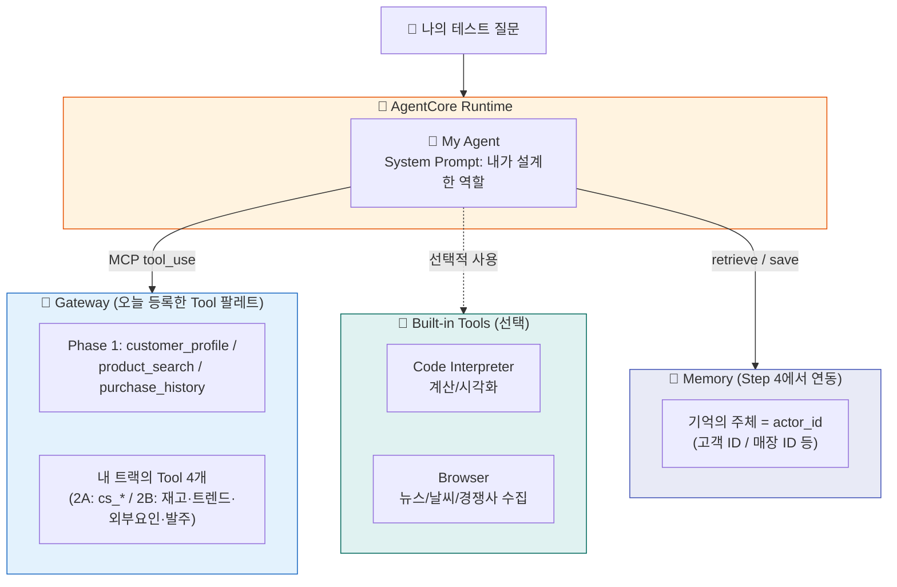

# Phase 3: 바이브코딩으로 나만의 Agent 만들기

지금까지는 가이드가 준비한 Agent를 만들었습니다. 이제 여러분 차례입니다. 오늘 배운 **Runtime + Gateway + Memory**를 조합해, AI 코딩 도구와 함께 **여러분 회사의 문제를 푸는 Agent**를 직접 설계하고, 구현하고, 배포합니다.

::: info ℹ️ 이 Phase에서 하는 것
- **설계** — 나만의 Agent 설계서 작성 (빈칸 채우기 템플릿)
- **바이브코딩** — AI 코딩 도구에게 설계서 + 참고 코드를 주고 Agent 구현
- **배포** — AgentCore Runtime에 배포하고 Playground에서 테스트
- **고도화** — Memory를 연동해 기억하는 Agent로 업그레이드
:::


::: info AI 코딩 도구는 자유롭게 선택하세요
Claude Code, Amazon Q Developer, Kiro 등 **어떤 AI 코딩 도구든 좋습니다**.
이 가이드의 프롬프트 예시는 도구에 무관하게 동작합니다.
도구가 없어도 괜찮습니다 — 제공되는 템플릿을 직접 수정하는 방법도 안내합니다.
:::

## 타임라인

| 시간 | 활동 | 산출물 |
|------|------|--------|
| 10분 | Agent 설계서 작성 | 나만의 Agent 설계서 |
| 25분 | 바이브코딩으로 구현 | `agents/phase3/app/phase3/main.py` |
| 15분 | Runtime 배포 + Playground 테스트 | 프로덕션 HTTPS 엔드포인트 |
| 10분 | Memory 연동 고도화 | 기억하는 Agent |

## 아키텍처



## Steps

1. [나만의 Agent 설계하기](step1-design.md) — 빈칸 채우기 설계서로 Use Case 정의
2. [바이브코딩으로 구현하기](step2-vibecoding.md) — AI 도구에게 설계서를 주고 코드 생성
3. [Runtime 배포 & Playground 테스트](step3-deploy.md) — 내 Agent를 세상에 공개
4. [Memory로 고도화하기](step4-memory.md) — 기억하는 Agent로 업그레이드

---

::: tip 핵심 메시지
Agent 개발은 "코드를 짜는 것"이 아니라 "서비스를 조합하는 것"입니다.

- System Prompt를 바꾸면 **역할**이 바뀌고
- Gateway Tool 조합을 바꾸면 **능력**이 바뀌고
- Memory 전략을 바꾸면 **지능**이 바뀝니다

바이브코딩은 이 조합을 **말로 지시하는 것**입니다. 좋은 설계서가 곧 좋은 프롬프트입니다.
:::


---

::: warning 시작 전 환경 확인
터미널에서 아래 명령으로 환경을 복구하세요 (세션 끊겼을 때):
```bash
cd ~/workshop/starter-code && source .venv/bin/activate && source ~/workshop/.env.w001
```
:::

