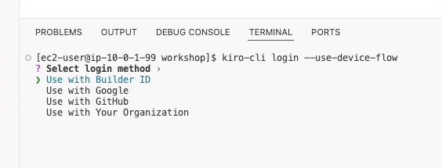
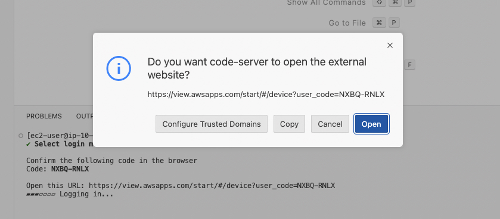
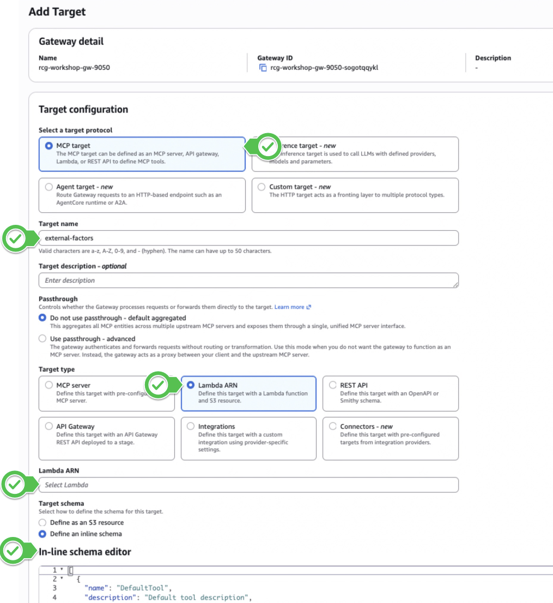
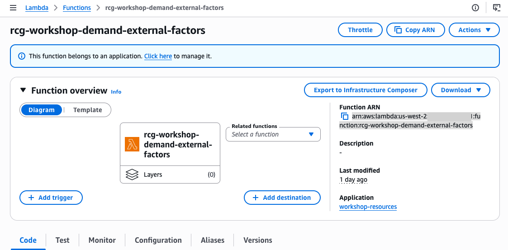
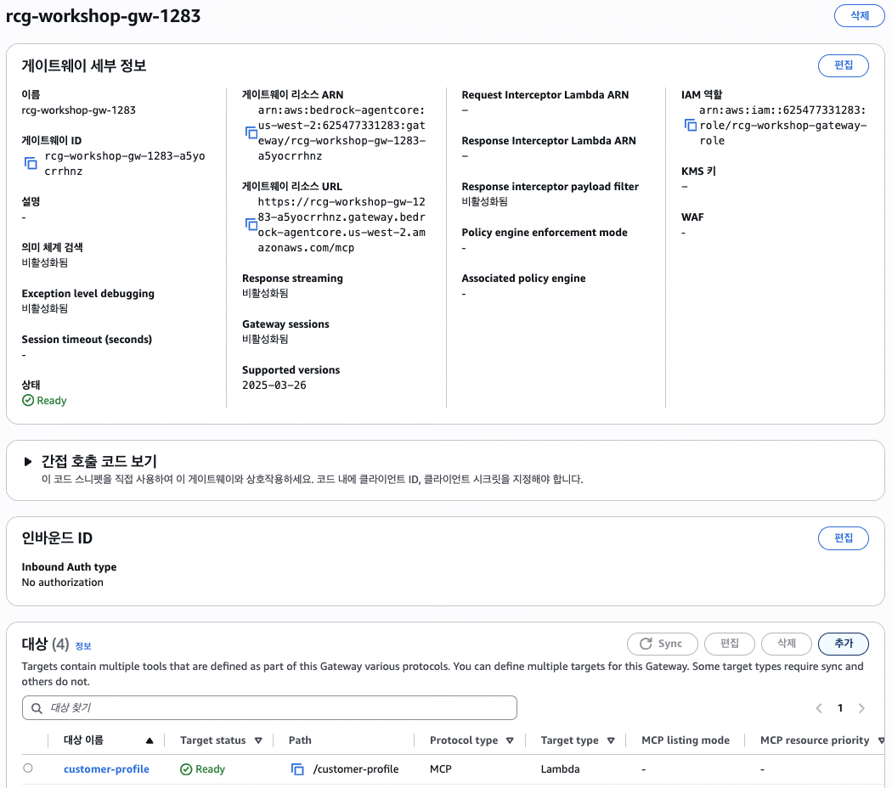

# Step 1: 데이터 재료 준비하기 (Gateway 확장) <span class="badge-time">⏱️ 10분</span> <span class="badge-difficulty">★★☆</span>

<div class="step-progress">
  <span class="step active">● Step 1 Gateway</span>
  <span class="step-connector"></span>
  <span class="step">○ Step 2 설계</span>
  <span class="step-connector"></span>
  <span class="step">○ Step 3 바이브코딩</span>
  <span class="step-connector"></span>
  <span class="step">○ Step 4 배포 & 테스트</span>
  <span class="step-connector"></span>
  <span class="step">○ Step 5 제출</span>
</div>

::: info 이 Step의 목표
나만의 Agent를 만들기 전에, 재료가 되는 Tool을 하나 더 준비합니다.
Phase 1에서 만든 Gateway에 **`external-factors` Tool**을 추가 등록합니다.
이 Tool은 날씨 예보/지역 이벤트/공휴일 데이터를 Agent에게 제공합니다.
:::

## 0. Kiro 셋업 (워크샵 환경)

Phase 3에서는 AI 코딩 도구를 활용합니다. 워크샵 환경에서 Kiro를 사용하려면 먼저 로그인 설정을 완료하세요.

**터미널에서 로그인 명령을 실행합니다:**

```bash
kiro-cli login --use-device-flow
```



명령을 실행하면 브라우저 인증 링크가 표시됩니다. **Use with Builder ID**를 선택하여 로그인합니다.



::: tip Builder ID로 로그인하세요
로그인 옵션이 나타나면 **Use with Builder ID**를 선택합니다.
AWS IAM Identity Center가 아닌 Builder ID를 사용해야 워크샵 환경에서 정상 동작합니다.
:::

---

::: info 날씨와 이벤트는 `external_factors` Tool이 제공합니다
실제 기상청 API가 아닌, 워크샵용 Mock Lambda가 날씨 예보/지역 이벤트/공휴일 데이터를 반환합니다.
실무 적용 시에는 이 Lambda를 실제 API를 호출하는 Lambda로 교체하면 됩니다 (Agent 코드 변경 불필요).
:::

## 현재 Gateway 상태 확인

지금까지 Gateway에 등록한 Target을 정리하면:

```
Phase 1:  customer-profile, product-search, purchase-history      (3개)
Phase 2: cs-lookup-order, cs-return-policy,
          cs-process-return, cs-delivery-status                   (4개)
추가:     external-factors                                         (1개)
───────────────────────────────────────────────────────────────
Gateway 합계: 8개 Target = 나만의 Agent가 조합할 수 있는 Tool
```

::: tip Gateway의 핵심 가치
Agent 코드를 수정하지 않고 Gateway Target만 추가하면 Agent 기능이 확장됩니다.
이것이 Gateway의 관심사 분리 — Tool 확장과 Agent 코드가 분리되어 있습니다.
:::

## 1-1. `external-factors` Target 등록

Bedrock AgentCore Gateway 콘솔에서 등록된 Gateway를 클릭합니다.

등록된 rcg-workshop-gw-xxxx의 target에 아래 설정으로 등록합니다:



- **Target configuration**: MCP target
- **대상 이름**: `external-factors`
- **대상 유형**: Lambda ARN
- **Lambda ARN**: 배포되어 있는 `rcg-workshop-demand-external-factors` 함수의 ARN을 붙여넣습니다(Lambda 콘솔에서 해당 ARN을 찾습니다)



**인라인 스키마**에 아래 JSON을 넣습니다:

```json
{
  "name": "external-factors",
  "description": "매장 운영에 영향을 주는 외부 요인을 조회합니다. 날씨 예보, 지역 이벤트, 공휴일, 프로모션 일정을 포함합니다.",
  "inputSchema": {
    "type": "object",
    "properties": {
      "store_id": {
        "type": "string",
        "description": "매장 ID (예: store-001)"
      },
      "forecast_days": {
        "type": "integer",
        "description": "향후 며칠간의 요인을 조회할지 (기본: 7)"
      }
    },
    "required": ["store_id"]
  }
}
```





::: tip 스키마의 description이 Tool 선택을 좌우합니다
Agent는 이 description을 읽고 "날씨 관련 질문에 이 Tool을 쓸지" 판단합니다.
Step 2에서 나만의 Tool 조합을 설계할 때도 이 원리를 활용하게 됩니다.
:::

## 1-2. 결과 확인

등록 후 터미널에서 확인합니다:

```bash
aws bedrock-agentcore-control list-gateway-targets \
  --gateway-identifier "$GATEWAY_ID" \
  --query 'items[].name' --output table
```

::: details ✅ 정상 출력 (8개 Target)
```
----------------------
| ListGatewayTargets |
+--------------------+
|  customer-profile  |
|  product-search    |
|  purchase-history  |
|  cs-lookup-order   |
|  cs-return-policy  |
|  cs-process-return |
|  cs-delivery-status|
|  external-factors  |
+--------------------+
```
:::


::: info `external-factors`가 목록에 보이면 성공
Status가 `CREATING`이면 30초 정도 기다린 후 다시 확인하세요.
:::

## 이해 체크

- [x] 같은 Gateway에 Target을 **추가**만 하면 Agent가 자동 인식
- [x] Agent는 Tool의 **description**을 읽고 사용 시점을 판단
- [x] `external_factors`로 날씨 예보/지역 이벤트/공휴일을 한 번에 조회 가능

---

::: tip ✅ 다음
데이터 재료 준비 완료! → [Step 2: 나만의 Agent 설계하기](step2-design.md)
:::
