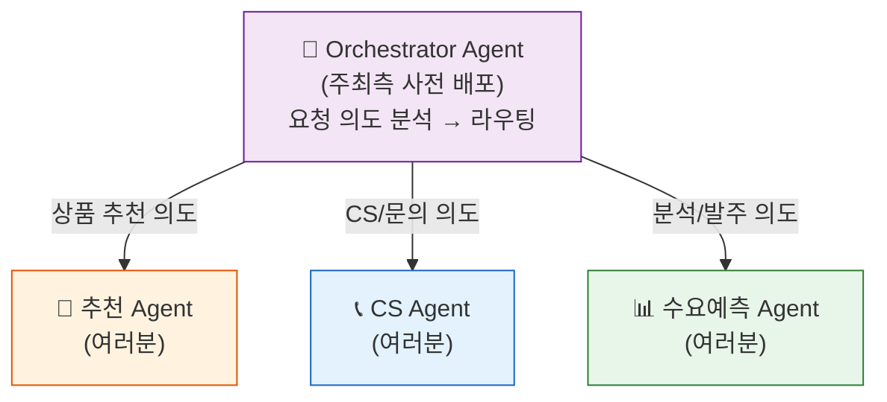

# Step 1: Multi-Agent 오케스트레이션 이해 <span class="badge-time">⏱️ 10분</span> <span class="badge-difficulty">★☆☆</span>

<div class="step-progress">
  <span class="step active">● Step 1 Orchestrator 연결</span>
  <span class="step-connector"></span>
  <span class="step">○ Step 2 Agent 조립</span>
  <span class="step-connector"></span>
  <span class="step">○ Step 3 배포 & 검증</span>
  <span class="step-connector"></span>
  <span class="step">○ Step 4 발표</span>
</div>

!!! info "소요 시간: 10분"
    Phase 3에서는 여러분이 만든 Agent를 **Orchestrator에 등록**하여
    다른 참가자의 Agent와 함께 **Multi-Agent 시스템**으로 동작하게 합니다.

---

## Multi-Agent 아키텍처



**Orchestrator**는 사용자 요청을 분석하여 적절한 전문 Agent에게 라우팅합니다.
여러분은 자신의 Agent를 이 Orchestrator에 **등록**하기만 하면 됩니다.

---

## 사전 배포된 Orchestrator

주최측이 미리 배포한 Orchestrator가 동작 중입니다:

| 항목 | 값 |
|------|---|
| Orchestrator ARN | 워크샵 진행 시 안내됨 |
| 등록 API | `POST /agents/register` |
| 역할 | 사용자 요청을 분석 → 적절한 Agent에 라우팅 |
| 지원 패턴 | 추천, CS/상담, 분석/예측 |

!!! tip "여러분이 할 일은 2가지"
    1. 자신의 Agent를 Runtime에 배포 (Phase 1~2에서 완료)
    2. 배포된 Agent의 ARN을 Orchestrator에 등록

---

## 내 Agent ARN 확인하기

Phase 1~2에서 배포한 Agent의 ARN을 확인합니다:

```bash
# 배포된 Runtime 목록 확인
agentcore list

# 출력 예시:
# ┌────────────────────────┬──────────┬─────────────────────────────────────────────────────┐
# │ Name                   │ Status   │ ARN                                                 │
# ├────────────────────────┼──────────┼─────────────────────────────────────────────────────┤
# │ phase1-recommend       │ ACTIVE   │ arn:aws:bedrock-agentcore:us-east-1:123456:agent/xxx│
# │ phase2a-cs             │ ACTIVE   │ arn:aws:bedrock-agentcore:us-east-1:123456:agent/yyy│
# └────────────────────────┴──────────┴─────────────────────────────────────────────────────┘
```

또는 특정 Agent의 ARN만 가져오기:

```bash
# Agent 이름으로 ARN 조회
AGENT_ARN=$(agentcore describe --name phase1-recommend --query 'agentArn' --output text)
echo "내 Agent ARN: $AGENT_ARN"
```

---

## 패턴 선택 가이드

3가지 패턴 중 하나를 선택하세요:

### A. 추천 Agent 패턴

| 항목 | 내용 |
|------|------|
| 적합한 도메인 | 상품 추천, 콘텐츠 추천, 메뉴 추천 |
| Memory 활용 | 고객 선호 기록, 이전 추천 결과 |
| Gateway Tools | 프로필 조회, 상품 검색, 이력 조회 |
| Policy | VIP 등급별 할인율 제한 |

### B. CS/상담 Agent 패턴

| 항목 | 내용 |
|------|------|
| 적합한 도메인 | 고객 문의, 반품/교환, FAQ |
| Memory 활용 | 대화 이력, 이전 불만 기록 |
| Gateway Tools | 주문 조회, 정책 확인, 처리 실행 |
| Policy | 금액 기반 에스컬레이션 |

### C. 분석/예측 Agent 패턴

| 항목 | 내용 |
|------|------|
| 적합한 도메인 | 수요 예측, 매출 분석, 재고 최적화 |
| Memory 활용 | 과거 분석 결과, 의사결정 이력 |
| Gateway Tools | 데이터 조회, 트렌드 분석, 실행 |
| Policy | 금액/권한 기반 승인 |

---

## 빠른 의사결정 도우미

!!! question "10초 결정법"
    1. 우리 회사에서 **가장 반복적인 업무**는? → 그게 Use Case
    2. 그 업무에서 **사람이 판단하는 포인트**는? → 그게 Agent의 역할
    3. 그 판단에 **과거 데이터가 필요한가**? → 그게 Memory

---

## Fill-in-the-blank 설계서

아래 빈칸을 채우세요 (5분):

```markdown
## 나의 Agent 설계서

**Agent 이름**: _________________________ Agent

**한 줄 설명**: "_________________________를 도와주는 AI Agent"

**패턴**: [ ] 추천  [ ] CS/상담  [ ] 분석/예측

**Gateway Tools (최대 4개)**:
1. _________________ — (기능: __________________)
2. _________________ — (기능: __________________)
3. _________________ — (기능: __________________)
4. _________________ — (기능: __________________)

**추가 Tool**:
- [ ] Code Interpreter (데이터 분석/계산)
- [ ] Browser (외부 사이트 실시간 조회)

**Memory 전략**:
- 네임스페이스: /___________/{actorId}/
- 저장하는 것: _________________________
- 활용 방식: _________________________

**Policy 규칙**:
- 조건: _________________ > _________
- 동작: [ ] 승인 필요  [ ] 차단  [ ] 경고

**테스트 질문** (Agent에게 물어볼 말):
"_________________________________________________"
```

---

## 실전 예시

### 예시 1: 편의점 프로모션 Agent

```markdown
Agent 이름: Promo Planner Agent
한 줄 설명: "매장 맞춤 프로모션 전략을 수립해주는 AI Agent"
패턴: [x] 분석/예측

Tools:
1. store_performance — 매장 실적 조회
2. competitor_promo — 경쟁사 프로모션 현황
3. customer_segment — 고객 세그먼트 분석
4. create_promotion — 프로모션 생성
추가: [x] Browser (경쟁사 실시간 가격 확인)

Memory: /promotions/{store_id}/ — 과거 프로모션 성과 기록
Policy: 할인율 > 30% → 본사 승인 필요

테스트: "이번 주 우리 매장에 맞는 프로모션 추천해줘"
```

### 예시 2: 신선식품 폐기 최소화 Agent

```markdown
Agent 이름: Freshness Agent
한 줄 설명: "신선식품 폐기를 최소화하는 AI Agent"
패턴: [x] 분석/예측

Tools:
1. expiry_check — 유통기한 임박 상품 조회
2. sales_velocity — 판매 속도 분석
3. markdown_suggest — 할인가 추천
4. apply_markdown — 할인 적용
추가: [x] Code Interpreter (할인율 최적화 계산)

Memory: /freshness/{store_id}/ — 과거 폐기율/할인 효과 기록
Policy: 할인율 > 50% → 점장 승인 필요

테스트: "오늘 유통기한 임박 상품 확인하고 할인 전략 세워줘"
```

---

!!! warning "10분 타이머"
    완벽하지 않아도 됩니다. **빈칸을 70%만 채우면** 다음으로 넘어가세요.
    구현하면서 수정할 수 있습니다.

!!! success "다음 단계"
    설계서를 채웠으면 [Step 2: 풀스택 구현](step2-fullstack.md)으로 이동합니다.
