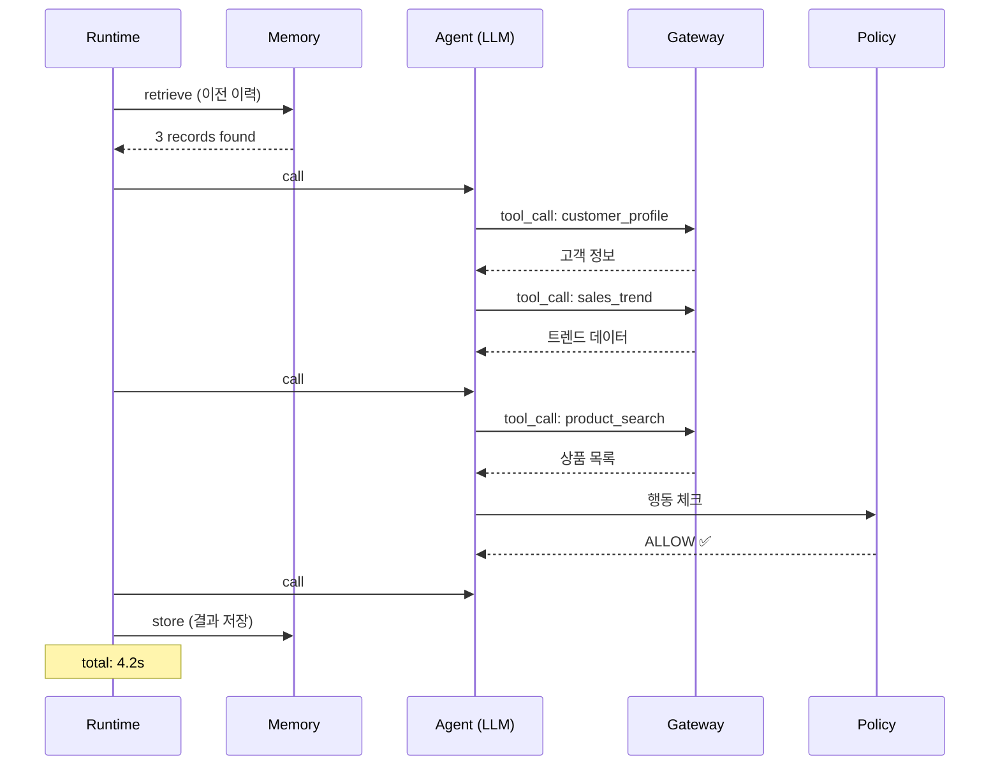

# Step 3: 배포 & 검증 <span class="badge-time">⏱️ 10분</span> <span class="badge-difficulty">★★☆</span>

<div class="step-progress">
  <span class="step done">✓ Step 1 Orchestrator 연결</span>
  <span class="step-connector done"></span>
  <span class="step done">✓ Step 2 Agent 조립</span>
  <span class="step-connector done"></span>
  <span class="step active">● Step 3 배포 & 검증</span>
  <span class="step-connector"></span>
  <span class="step">○ Step 4 발표</span>
</div>

!!! info "소요 시간: 10분"
    Agent를 AgentCore Runtime에 배포하고, Observability에서 풀스택 Trace를 확인합니다.

<div class="file-target">scripts/deploy-agent.sh</div>
---

## 배포

```bash
cd agents/

agentcore deploy \
  --name "my-custom-agent" \
  --entry-point "phase3_custom.handler" \
  --env MEMORY_ID=$MEMORY_ID \
  --env GATEWAY_URL=$GATEWAY_URL
```

배포 완료 메시지:
```
Agent deployed successfully!
   Name: my-custom-agent
   Endpoint: https://runtime.agentcore.us-east-1.amazonaws.com/agents/my-custom-agent
   Status: ACTIVE
```

---

## 테스트 호출

```bash
# Step 1에서 준비한 테스트 질문으로 호출
agentcore invoke \
  --name "my-custom-agent" \
  --payload '{
    "input": "여기에 Step 1에서 작성한 테스트 질문",
    "actor_id": "user-001"
  }'
```

!!! warning "에러가 나면?"
    흔한 실수 Top 3:

    1. **Tool 이름 오타** — `get_tools(["prodcut_search"])` 같은 typo
    2. **환경변수 누락** — `MEMORY_ID` 또는 `GATEWAY_URL` 미설정
    3. **import 에러** — `requirements.txt`에 패키지 누락

    ```bash
    # 로그 확인
    agentcore logs --name "my-custom-agent" --tail 50
    ```

---

## Observability 확인: 풀스택 Trace

AWS Console > CloudWatch > Application Signals > GenAI Dashboard로 이동합니다.

### 확인할 것들



---

## Trace에서 보이는 풀스택 서비스

| 서비스 | Trace에서 보이는 것 | 색상 |
|--------|-------------------|------|
| Runtime | 요청 시작/종료, 총 소요시간 | 파란색 |
| Gateway | Tool 호출별 지연시간 | 초록색 |
| Memory | retrieve/store 호출 | 보라색 |
| Policy | 규칙 평가 결과 | 주황색 |
| LLM | 모델 호출별 토큰/시간 | 빨간색 |

!!! tip "Trace = 발표 자료"
    다음 Step의 발표에서 이 Trace 화면을 라이브로 보여주면 됩니다.
    "보세요, 제 Agent가 Memory에서 이력을 가져오고, 4개 Tool을 호출하고,
    Policy 체크를 통과한 뒤 응답을 생성합니다" — 이 한 마디면 충분합니다.

---

## 두 번째 호출 (Memory 효과 확인)

같은 질문을 한 번 더 호출해보세요:

```bash
agentcore invoke \
  --name "my-custom-agent" \
  --payload '{
    "input": "같은 질문을 다시",
    "actor_id": "user-001"
  }'
```

**기대 결과:** 이번에는 Memory에서 이전 대화 기록을 가져와서 **더 맥락에 맞는 응답**을 합니다.

---

## 검증 체크리스트

- [ ] `agentcore deploy` 성공
- [ ] `agentcore invoke` 정상 응답
- [ ] Observability에서 Trace 확인
- [ ] Memory retrieve/store 동작 확인
- [ ] Policy 체크 포인트 확인 (해당 시)

!!! success "다음 단계"
    배포 완료! [Step 4: 발표](step4-present.md)에서 2분 데모를 준비합니다.
