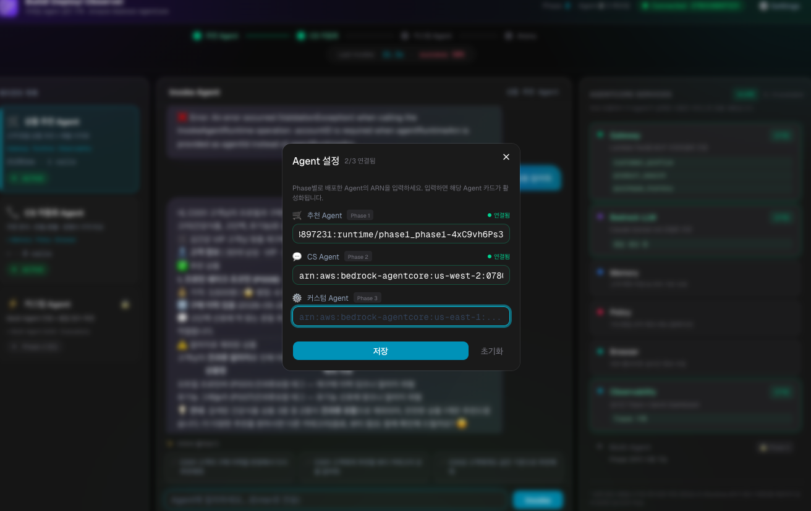
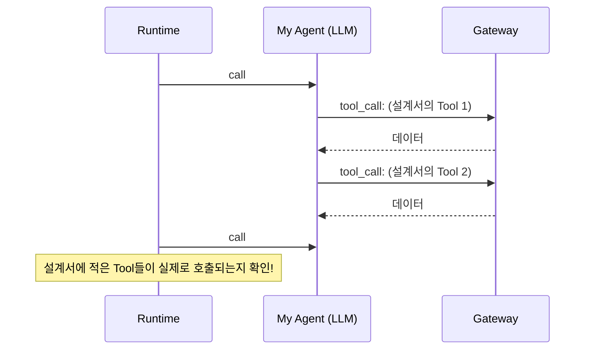

# Step 4: Runtime 배포 & Playground 테스트 <span class="badge-time">⏱️ 10분</span> <span class="badge-difficulty">★★☆</span>

<div class="step-progress">
  <span class="step done">✓ Step 1 Gateway</span>
  <span class="step-connector done"></span>
  <span class="step done">✓ Step 2 설계</span>
  <span class="step-connector done"></span>
  <span class="step done">✓ Step 3 바이브코딩</span>
  <span class="step-connector done"></span>
  <span class="step active">● Step 4 배포 & 테스트</span>
  <span class="step-connector"></span>
  <span class="step">○ Step 5 제출</span>
</div>

::: info 이 Step의 목표
바이브코딩으로 만든 `main.py`를 AgentCore Runtime에 배포하고,
설계서의 테스트 질문으로 검증한 뒤 Playground에 연결합니다.
:::


<div class="file-target">agents/phase3/app/phase3/main.py</div>

## 4-1. 배포

Phase 1~2에서 사용한 배포 스크립트를 그대로 사용합니다:

```bash
cd ~/workshop/starter-code
./scripts/deploy-agent.sh phase3
```

::: info 환경변수 자동 전달
`deploy-agent.sh`가 `AGENTCORE_GATEWAY_URL`, `AWS_REGION`을
`agentcore.json`에 주입한 뒤 `agentcore deploy`를 실행합니다.
:::

배포가 완료되면 상태와 ARN을 확인합니다:

```bash
cd agents/phase3
agentcore status
```

::: details ✅ 정상 출력 예시
```
AgentCore Status (target: default, us-west-2)

Agents
phase3: Deployed - Runtime: READY (arn:aws:bedrock-agentcore:us-west-2:123456789012:runtime/phase3_phase3-xxxxxxxxxx)
URL: https://bedrock-agentcore.us-west-2.amazonaws.com/runtimes/.../invocations
```
:::


출력된 ARN을 환경변수로 저장해두세요 (setup의 `.env.w001` Phase 3 블록):

```bash
export MY_AGENT_ARN=<위 출력에 나온 실제 ARN>
```

::: warning RUNTIME_ROLE_ARN 확인
터미널을 새로 열었다면 `source ~/workshop/.env.w001` 후
`echo $RUNTIME_ROLE_ARN`으로 값이 채워져 있는지 확인하세요.
비어 있으면 `deploy-agent.sh`가 에러로 중단됩니다.
:::

## 4-2. 테스트 호출

**Step 2 설계서에 적은 테스트 질문**으로 호출합니다:

```bash
cd ~/workshop/starter-code/agents/phase3
agentcore invoke --prompt "여기에 설계서의 테스트 질문"
```

::: info 출력이 여러 줄의 JSON으로 나옵니다
entrypoint가 async generator라서 이벤트가 여러 번 출력됩니다 (Phase 1 Step 3-3 참고).
:::

**응답 확인 포인트:**

- 설계서에 적은 Tool(예: `external_factors`)이 호출되어 데이터가 응답에 포함되는가
- System Prompt에 적은 응답 규칙대로 답하는가
- Tool 결과에 없는 내용을 지어내지 않았는가

시나리오와 다르게 동작하면 System Prompt를 수정하고 재배포하세요 — 이 "프롬프트 수정 → 재배포 → 확인" 사이클이 Agent 개발의 기본 리듬입니다.

## 4-3. 에러가 나면? (트러블슈팅)

::: warning 흔한 실수 Top 3

1. **Tool 이름 오타** — System Prompt에 `prodcut_search` 같은 typo. 설계서의 Tool 이름과 [Step 2의 Tool 팔레트](step2-design.md)를 대조하세요
2. **환경변수 누락** — `AGENTCORE_GATEWAY_URL` 미설정. `source ~/workshop/.env.w001` 후 재배포
3. **import 에러** — AI가 존재하지 않는 패키지를 import한 경우. **바이브코딩 특유의 에러입니다** — AI 도구에게 "참고 코드(agents/phase2a/app/phase2a/main.py)의 import 블록만 사용해서 다시 써줘"라고 요청하세요

```bash
# 로그 확인
agentcore logs --name my_agent --tail 50
```
:::


::: tip 에러도 바이브코딩으로 해결
에러 메시지를 그대로 AI 도구에 붙여넣으세요 (Step 3-4의 디버깅 프롬프트).
"참고 코드는 정상 동작한다"는 사실을 알려주면 AI가 diff 관점에서 원인을 빨리 찾습니다.
:::

## 4-4. Agent Playground에 연결

CLI 테스트가 통과했다면, 웹 화면에서 대화형으로 테스트합니다:

1. Playground 접속 → **⚙️ Settings** → **Custom Agent** 입력란에 `MY_AGENT_ARN` 붙여넣기 → **저장**



2. 채팅창에서 설계서의 테스트 질문을 입력하고, 응답이 **응답 규칙**대로 나오는지 확인

3. 설계서에 없는 질문도 던져보세요 — Agent가 범위 밖 질문을 어떻게 처리하는지 보는 것도 중요한 검증입니다

## 4-5. Observability로 내 Agent 들여다보기

AWS Console > CloudWatch > Application Signals > GenAI Dashboard에서 방금 호출의 Trace를 확인합니다:



**확인 포인트:**

- 설계한 Tool이 실제로 호출되는가? (안 쓰이는 Tool이 있다면 System Prompt에서 사용 시점을 더 명확히)
- 불필요한 Tool 호출이 반복되는가? (응답 규칙에 "N개 이하 Tool 사용" 제약 추가)

::: info Agent가 스스로 판단합니다
Agent는 여러분의 질문과 System Prompt를 보고 필요한 Tool을 **자율적으로 선택**합니다.
설계한 Tool이 호출되지 않았다면 System Prompt에서 그 Tool의 사용 시점을 더 명확히 써주세요.
:::


## 검증 체크리스트

- [ ] `./scripts/deploy-agent.sh` 성공
- [ ] `agentcore status` READY
- [ ] `agentcore invoke` 정상 응답 (설계서의 테스트 질문)
- [ ] Playground에서 대화 가능
- [ ] Observability에서 설계한 Tool 호출 확인

---

::: tip ✅ 다음
내 Agent가 세상에 공개됐습니다! → [Step 5: 아레나 제출하기](step5-submit.md)
:::
