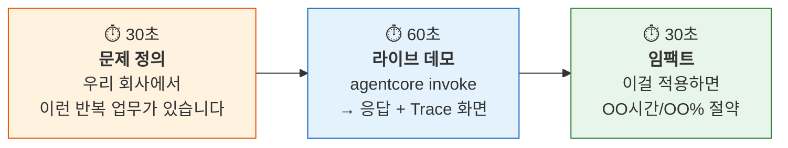

# Step 4: 발표 & 시상 <span class="badge-time">⏱️ 10분</span> <span class="badge-difficulty">★☆☆</span>

<div class="step-progress">
  <span class="step done">✓ Step 1 Orchestrator 연결</span>
  <span class="step-connector done"></span>
  <span class="step done">✓ Step 2 Agent 조립</span>
  <span class="step-connector done"></span>
  <span class="step done">✓ Step 3 배포 & 검증</span>
  <span class="step-connector done"></span>
  <span class="step active">● Step 4 발표</span>
</div>

!!! info "소요 시간: 10분 (팀당 2분)"
    라이브 데모로 자사 Agent를 소개합니다.
    완성도보다 **"이 Agent가 우리 회사에서 어떤 문제를 풀 수 있는지"**가 핵심입니다.

---

## 2분 발표 구조



---

## 30초 — 문제 정의 템플릿

> "저희 팀에서는 매일 **[반복 업무]**를 수작업으로 합니다.
> 한 건당 **[소요 시간]**이 걸리고, 하루에 **[건수]**건 처리합니다.
> 이것을 AgentCore로 자동화했습니다."

---

## 60초 — 라이브 데모

터미널에서 실행:

```bash
# 실제 호출
agentcore invoke \
  --agent "my-custom-agent" \
  '{"input": "테스트 질문", "actor_id": "demo-user"}'
```

동시에 Observability Dashboard를 보여주며:

> "보시면, Agent가 먼저 Memory에서 이전 기록을 확인하고,
> Gateway를 통해 [Tool 이름]을 호출한 뒤,
> Policy 체크를 거쳐 최종 응답을 생성합니다.
> 총 소요시간 [N]초입니다."

!!! tip "데모 팁"
    - 터미널과 Dashboard를 **Split Screen**으로 준비
    - 네트워크 이슈 대비 **응답 스크린샷**도 백업
    - 첫 호출은 Cold Start가 있을 수 있으니 미리 한 번 호출해두세요

---

## 30초 — 임팩트

> "현재 이 업무에 하루 **[X시간]**을 쓰고 있습니다.
> Agent를 적용하면 **[Y분]**으로 줄어들어,
> 연간 **[Z시간/비용]**을 절약할 수 있습니다.
> 실제 적용에는 Gateway Target만 실제 API로 바꾸면 됩니다."

---

## 평가 기준

| 기준 | 배점 | 설명 |
|------|------|------|
| 문제 선정 | 25% | 실제 비즈니스 문제인가? |
| 기술 활용 | 25% | AgentCore 서비스를 잘 조합했는가? |
| 완성도 | 25% | 실제로 동작하는가? (Trace 증거) |
| 임팩트 | 25% | 적용 시 기대 효과가 명확한가? |

---

## 시상 카테고리

| 상 | 기준 |
|----|------|
| Best Agent | 종합 점수 1위 |
| Most Creative | 가장 창의적인 Use Case |
| Best Architecture | AgentCore 서비스를 가장 잘 활용 |
| Speed Demon | 가장 빠른 응답 시간 (Trace 기준) |

---

## 발표 순서 & 준비

1. 발표 전 **반드시 한 번 invoke 테스트** (Cold Start 제거)
2. Dashboard URL을 **미리 열어두기**
3. 터미널 폰트 크기 **키우기** (발표장에서 잘 보이도록)

```bash
# Cold Start 제거용 사전 호출
agentcore invoke \
  --name "my-custom-agent" \
  --payload '{"input": "warmup", "actor_id": "warmup"}'
```

---

## Workshop 완료!

!!! success "축하합니다! 전체 Workshop을 완료했습니다!"

    **오늘 여러분이 구축한 것:**

    | Phase | 구축물 | AgentCore 서비스 |
    |-------|--------|-----------------|
    | Phase 1 | 추천 Agent | Runtime + Gateway + Observability |
    | Phase 2A | CS Agent | + Memory + Policy |
    | Phase 2B | 수요예측 Agent | + Memory + Policy (다른 도메인) |
    | Phase 3 | 자사 Agent | **풀스택** (5개 서비스 전부) |

    **핵심 메시지:**
    
    > Agent 개발은 "코드를 짜는 것"이 아니라 "서비스를 조합하는 것"입니다.
    > Gateway Target만 바꾸면 Tool이 바뀌고,
    > System Prompt만 바꾸면 역할이 바뀌고,
    > Memory 전략만 바꾸면 지능이 바뀝니다.
    > 
    > **여러분은 이미 프로덕션 Agent 개발자입니다.**

---

!!! info "다음 단계"
    - [부록: AgentCore 서비스 맵](../appendix/service-map.md)
    - [부록: 돌아가서 할 일](../appendix/next-steps.md)
