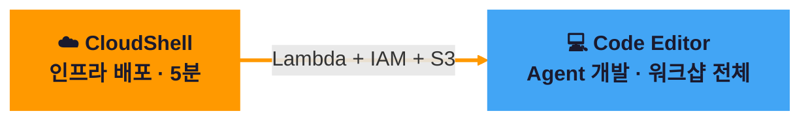
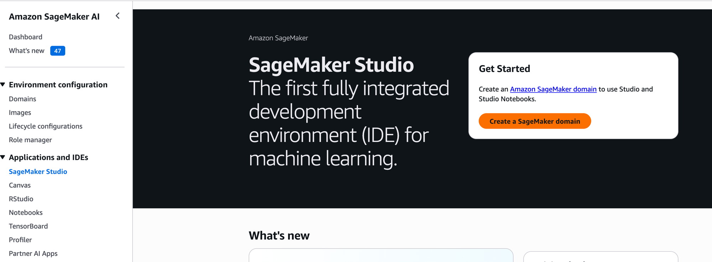
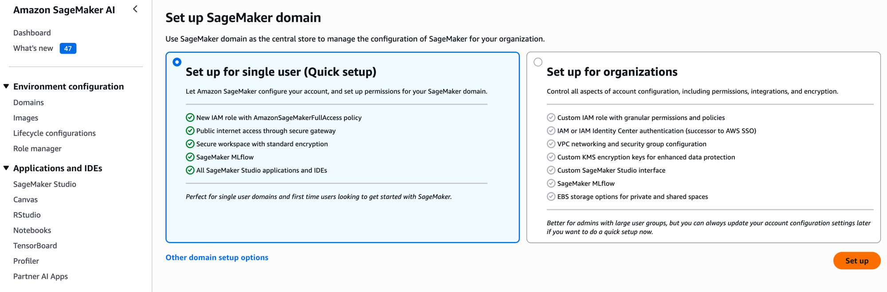
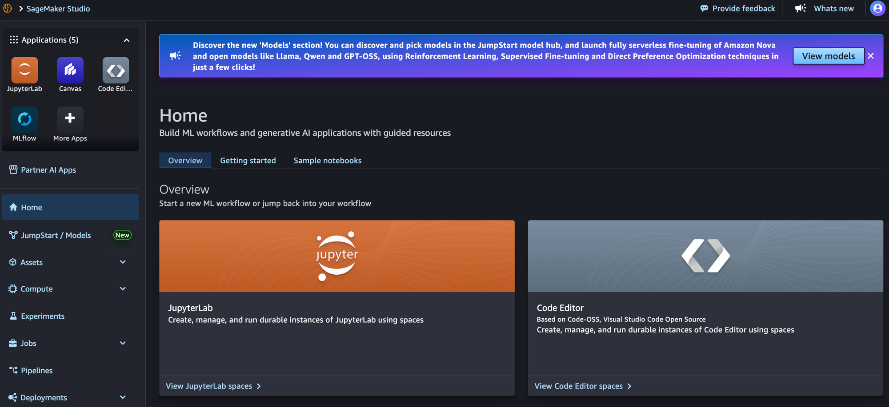
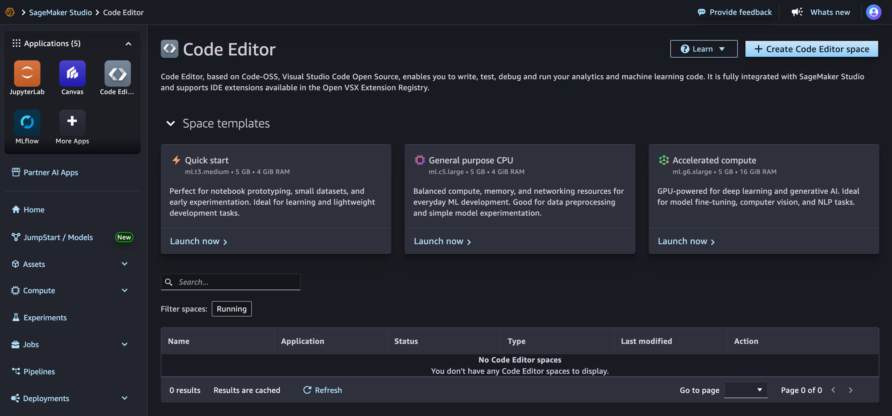
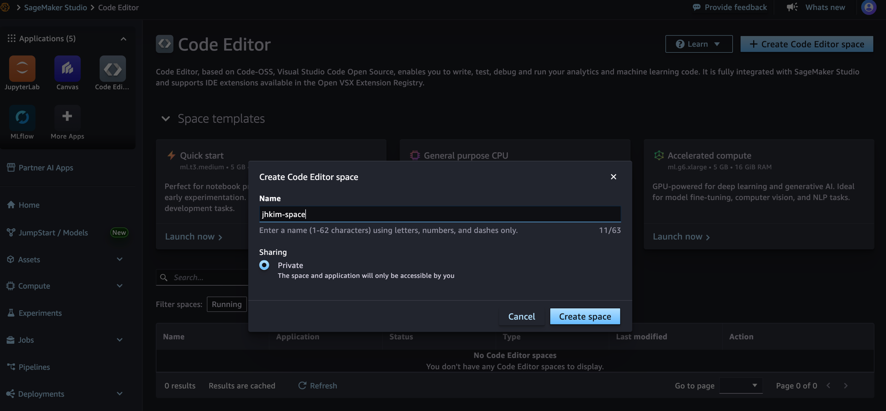
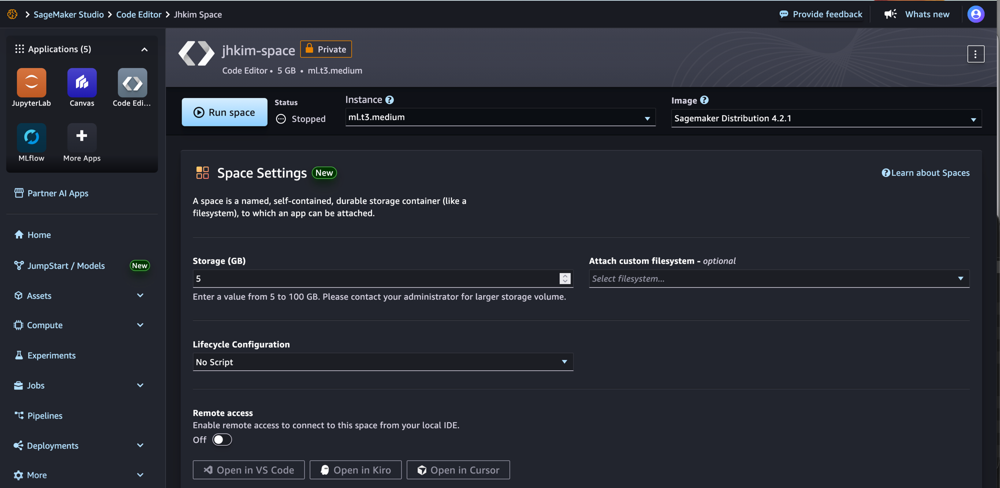
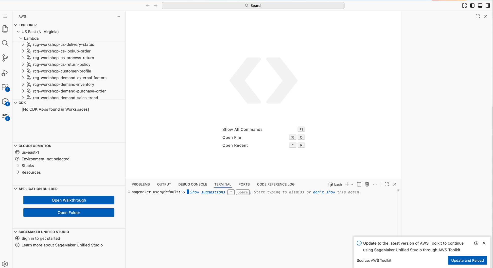

# 환경 세팅

!!! warning "시작 전 반드시 완료"
    이 페이지의 모든 단계를 완료해야 Phase 1을 시작할 수 있습니다.

---

## 전체 흐름



<div style="display:flex;gap:12px;margin:16px 0;flex-wrap:wrap;">
<div style="flex:1;min-width:200px;padding:14px 18px;background:linear-gradient(135deg,#ff9900,#ffb84d);border-radius:12px;color:#1a1a2e;">
<strong>Part A — CloudShell</strong><br/>
<span style="font-size:0.85em;">코드 클론 → Lambda 11개 → IAM → Mock 사이트</span>
</div>
<div style="flex:1;min-width:200px;padding:14px 18px;background:linear-gradient(135deg,#1e88e5,#42a5f5);border-radius:12px;color:#fff;">
<strong>Part B — Code Editor</strong><br/>
<span style="font-size:0.85em;">Python 환경 → Agent 코드 → Gateway → 배포 → 테스트</span>
</div>
</div>

---

## Part A: CloudShell에서 인프라 배포

### A-0. SageMaker Domain 생성 (먼저!)

!!! warning "Domain 생성에 3~5분 소요 — CloudShell 작업 전에 먼저 시작하세요"
    백그라운드로 생성되는 동안 A-1~A-3을 진행할 수 있습니다.

**Step 1.** Console 상단 검색창에 **SageMaker** 입력 → **Amazon SageMaker AI** → 좌측 **SageMaker Studio** 클릭 → **"Create a SageMaker domain"** 클릭



**Step 2.** **"Set up for single user (Quick setup)"** 선택 (기본값) → 우측 하단 **Set up** 클릭



- 3~5분 대기 → Domain Status가 `InService`가 되면 완료
- 이 동안 아래 A-1~A-3 CloudShell 작업을 병행하세요

!!! tip "왜 먼저 만드나요?"
    이후 A-4 단계에서 `grant-sagemaker-permissions.sh`가 SageMaker Execution Role을 **자동 탐색**합니다.
    Domain이 없으면 Role을 찾지 못해 수동 입력이 필요합니다.

---

!!! info "AWS Console → CloudShell 열기"
    콘솔 상단 바에서 `>_` 아이콘을 클릭하면 CloudShell이 열립니다.
    리전을 **us-east-1 (N. Virginia)**로 설정하세요.

### A-1. 코드 클론

```bash
git clone https://github.com/kjhyuok/rcg-agentcore-workshop.git ~/workshop
cd ~/workshop
chmod +x infra/*.sh
```

### A-2. 인프라 원스톱 배포

```bash
./infra/onestop.sh w001
```

이 스크립트가 하는 일:

- ✅ IAM Role 2개 생성 (Lambda 실행용, Gateway용)
- ✅ Lambda 11개 배포 (Phase 1~2B Tool 함수)
- ✅ Mock 사이트 S3 배포 (Browser Tool용)
- ✅ 환경변수 파일 생성 (`.env.w001`)

??? success "정상 출력 예시"
    ```
    ╔══════════════════════════════════════════════════════════╗
    ║  🚀 RCG AgentCore Workshop — 원스톱 배포                ║
    ╠══════════════════════════════════════════════════════════╣
    ║  Participant ID : w001
    ║  Region         : us-east-1
    ║  Account        : 123456789012
    ╚══════════════════════════════════════════════════════════╝

    [1/4] IAM Role 생성...
      ✅ rcg-workshop-lambda-role 생성
      ✅ rcg-workshop-gateway-role 생성

    [2/4] Lambda 11개 배포...
      ✅ rcg-workshop-customer-profile (생성)
      ✅ rcg-workshop-product-search (생성)
      ...

    [3/4] Mock 사이트 배포...
      ✅ Mock 사이트: http://rcg-workshop-mock-123456789012.s3-website-us-east-1.amazonaws.com

    ╔══════════════════════════════════════════════════════════╗
    ║  🎉 배포 완료! 아래 환경변수를 설정하세요               ║
    ╠══════════════════════════════════════════════════════════╣

      export AWS_REGION=us-east-1
      export ACCOUNT_ID=123456789012
      export PARTICIPANT_ID=w001
      export MOCK_SITE_URL=http://rcg-workshop-mock-...
      export GATEWAY_ROLE_ARN=arn:aws:iam::123456789012:role/rcg-workshop-gateway-role

    ╚══════════════════════════════════════════════════════════╝
    ```

### A-2.5. 환경변수 설정 (필수!)

!!! danger "반드시 실행하세요"
    `onestop.sh`는 서브셸에서 실행되므로, 스크립트가 출력한 환경변수가 **현재 CloudShell 세션에 자동 반영되지 않습니다.**
    출력된 `export` 구문을 **복사해서 CloudShell에 붙여넣어야** 이후 단계가 정상 동작합니다.

출력 마지막에 나온 `export` 5줄을 복사하여 CloudShell에 붙여넣기:

```bash
export AWS_REGION=us-east-1
export ACCOUNT_ID=<출력된 값>
export PARTICIPANT_ID=w001
export MOCK_SITE_URL=http://rcg-workshop-mock-<ACCOUNT_ID>.s3-website-us-east-1.amazonaws.com
export GATEWAY_ROLE_ARN=arn:aws:iam::<ACCOUNT_ID>:role/rcg-workshop-gateway-role
```

또는 생성된 `.env` 파일을 `source`해도 됩니다:

```bash
source .env.w001
```

설정 확인:

```bash
echo $ACCOUNT_ID  # 계정 ID가 출력되면 OK
```

### A-3. 배포 확인

```bash
aws lambda list-functions \
  --query "Functions[?starts_with(FunctionName, 'rcg-workshop')].FunctionName" \
  --output table --region us-east-1
```

??? success "정상 출력 (11개 Lambda)"
    ```
    +---------------------------------------+
    |  rcg-workshop-customer-profile        |
    |  rcg-workshop-product-search          |
    |  rcg-workshop-purchase-history        |
    |  rcg-workshop-cs-lookup-order         |
    |  rcg-workshop-cs-return-policy        |
    |  rcg-workshop-cs-process-return       |
    |  rcg-workshop-cs-delivery-status      |
    |  rcg-workshop-demand-inventory        |
    |  rcg-workshop-demand-sales-trend      |
    |  rcg-workshop-demand-external-factors |
    |  rcg-workshop-demand-purchase-order   |
    +---------------------------------------+
    ```

### A-4. SageMaker Code Editor 권한 부여

```bash
./infra/grant-sagemaker-permissions.sh
```

이 스크립트가 하는 일:

- SageMaker Execution Role을 자동 탐색
- Bedrock (모델 호출 + Converse API) 권한 추가
- AWS Marketplace (모델 최초 구독) 권한 추가
- AgentCore (Gateway, Memory, Runtime, Policy) 권한 추가
- Lambda 호출 권한 추가

??? success "정상 출력"
    ```
    🔐 SageMaker Code Editor 권한 설정
       Account: 123456789012
       Region:  us-east-1

    [1/2] SageMaker Execution Role 탐색...
      ✅ Role 찾음: AmazonSageMaker-ExecutionRole-xxxxx
    [2/2] Bedrock + AgentCore 권한 추가...
      ✅ 인라인 정책 추가: RCGWorkshopBedrockAgentCoreAccess

    ╔══════════════════════════════════════════════════════════╗
    ║  ✅ SageMaker 권한 설정 완료!                           ║
    ║                                                        ║
    ║  Code Editor에서 Bedrock + AgentCore 호출이             ║
    ║  가능합니다.                                            ║
    ╚══════════════════════════════════════════════════════════╝
    ```

### A-5. 환경변수 확인 (메모해두세요!)

`onestop.sh` 출력 마지막에 나온 환경변수를 **메모**합니다. Code Editor에서 사용합니다:

```bash
cat .env.w001
```

!!! warning "이 값들을 복사해두세요"
    CloudShell과 Code Editor는 **파일 시스템이 분리**되어 있습니다.
    `.env.w001` 파일은 CloudShell에만 있으므로, 내용을 복사해서 Code Editor에서 붙여넣어야 합니다.

!!! success "Part A 완료!"
    CloudShell 작업 끝. 이제 SageMaker Code Editor로 이동합니다.

---

## Part B: SageMaker Code Editor에서 실습 환경 구성

### B-0. Code Editor Space 생성 & 진입

**Step 1.** Console → **SageMaker AI** → **Studio** → Home 화면에서 우측 **Code Editor** 카드 클릭



**Step 2.** 우측 상단 **"+ Create Code Editor space"** 클릭



**Step 3.** Name에 `workshop` 입력 → **Create space** 클릭



**Step 4.** Instance: `ml.t3.medium` (기본값) → **Run space** 클릭



**Step 5.** Status가 `Running`이 되면 **Open** 클릭 → VS Code 환경 진입 완료



!!! success "여기까지 완료되면"
    왼쪽 AWS Explorer에서 배포된 Lambda 함수들이 보입니다.
    하단 터미널(`sagemaker-user@default:~$`)에서 다음 단계를 진행합니다.

---

### B-1. 코드 클론 & Python 환경

Code Editor 터미널에서:

```bash
git clone https://github.com/kjhyuok/rcg-agentcore-workshop.git ~/workshop
cd ~/workshop
chmod +x infra/*.sh
./infra/setup-python.sh
```

??? note "setup-python.sh이 하는 일"
    Python 가상환경(venv) 생성, 필수 라이브러리 설치, Playwright 브라우저 설치를 자동으로 수행합니다.

### B-2. 가상환경 활성화

```bash
source ~/workshop/starter-code/.venv/bin/activate
```

!!! warning "터미널을 새로 열 때마다 이 명령을 실행하세요"
    Code Editor 세션이 끊겼다 재연결되면 venv가 비활성화됩니다.
    ```bash
    cd ~/workshop && source starter-code/.venv/bin/activate
    ```

### B-3. 환경변수 설정

환경변수 파일을 생성하고 로드합니다:

```bash
cat > ~/workshop/.env.w001 << 'EOF'
export AWS_REGION=us-east-1
export ACCOUNT_ID=$(aws sts get-caller-identity --query Account --output text)
export PARTICIPANT_ID=w001
export MOCK_SITE_URL="http://rcg-workshop-mock-$(aws sts get-caller-identity --query Account --output text).s3-website-us-east-1.amazonaws.com"
export GATEWAY_ROLE_ARN="arn:aws:iam::$(aws sts get-caller-identity --query Account --output text):role/rcg-workshop-gateway-role"
EOF
source ~/workshop/.env.w001
```

확인:

```bash
echo $ACCOUNT_ID  # 계정 ID가 출력되면 OK
```

!!! danger "세션이 끊겼을 때 복구 방법"
    Code Editor 세션이 끊겼다 재연결되면 환경변수가 초기화됩니다. 아래 한 줄로 복구하세요:
    ```bash
    cd ~/workshop && source starter-code/.venv/bin/activate && source .env.w001
    ```

### B-4. Bedrock 모델 접근 확인

```bash
python3 -c "
from strands import Agent
from strands.models import BedrockModel
model = BedrockModel(model_id='us.anthropic.claude-sonnet-4-6', region_name='us-east-1')
agent = Agent(model=model, system_prompt='테스트')
print(agent('안녕? 한 줄로 답해.'))
print('✅ Bedrock 모델 접근 OK')
"
```

### B-5. AgentCore CLI 확인

```bash
agentcore --help
```

??? failure "설치 안 되어 있으면"
    AgentCore CLI는 **pip 패키지**입니다:
    ```bash
    pip install bedrock-agentcore-starter-toolkit
    ```

### B-6. Code Interpreter & Browser 확인

```bash
python3 -c "
from strands_tools.code_interpreter import AgentCoreCodeInterpreter
from strands_tools.browser import AgentCoreBrowser

ci = AgentCoreCodeInterpreter(region='us-east-1')
print('✅ Code Interpreter 초기화 OK')

br = AgentCoreBrowser(region='us-east-1')
print('✅ Browser Tool 초기화 OK')
"
```

??? failure "권한 에러가 발생하면"
    IAM Role에 다음 권한이 필요합니다:
    
    - `bedrock-agentcore:InvokeCodeInterpreter`
    - `bedrock-agentcore:InvokeBrowser`
    
    워크샵 환경에서는 이미 설정되어 있어야 합니다. 에러 발생 시 진행자에게 문의하세요.

---

## 📋 환경변수 한눈에 보기 (워크샵 전체)

!!! tip "이 블록을 저장해두세요"
    아래 환경변수는 워크샵 진행하며 채워집니다. Phase 시작 전에 이 값들이 설정되어 있는지 확인하세요.

<div class="env-block">
<span class="env-label"># --- Part A에서 설정됨 (.env.w001) ---</span><br>
export AWS_REGION=us-east-1<br>
export ACCOUNT_ID=$(aws sts get-caller-identity --query Account --output text)<br>
export MOCK_SITE_URL="http://rcg-workshop-mock-${ACCOUNT_ID}.s3-website-us-east-1.amazonaws.com"<br>
export GATEWAY_ROLE_ARN="arn:aws:iam::${ACCOUNT_ID}:role/rcg-workshop-gateway-role"<br>
<br>
<span class="env-label"># --- Phase 1 (Gateway 생성 후 채워짐) ---</span><br>
export AGENTCORE_GATEWAY_URL=&lt;setup-gateway.py 출력값&gt;<br>
export GATEWAY_ID=&lt;Gateway ID&gt;<br>
<br>
<span class="env-label"># --- Phase 2 (Memory 생성 후 채워짐) ---</span><br>
export AGENTCORE_MEMORY_ID=&lt;setup-memory.py 출력값&gt;<br>
<br>
<span class="env-label"># --- Phase 3 (배포 후 채워짐) ---</span><br>
export MY_AGENT_ARN=&lt;agentcore deploy 출력값&gt;<br>
</div>

---

## 🔍 환경변수 체크 (Phase 시작 전 확인용)

각 Phase 시작 전에 아래 명령어로 환경변수가 설정되어 있는지 확인하세요. 빈 줄이 있으면 해당 값이 누락된 것입니다.

```bash
echo "=== Part A (기본) ==="
echo "AWS_REGION: $AWS_REGION"
echo "ACCOUNT_ID: $ACCOUNT_ID"
echo "MOCK_SITE_URL: $MOCK_SITE_URL"
echo "GATEWAY_ROLE_ARN: $GATEWAY_ROLE_ARN"
echo ""
echo "=== Phase 1 (Gateway 생성 후) ==="
echo "AGENTCORE_GATEWAY_URL: $AGENTCORE_GATEWAY_URL"
echo "GATEWAY_ID: $GATEWAY_ID"
echo ""
echo "=== Phase 2 (Memory 생성 후) ==="
echo "AGENTCORE_MEMORY_ID: $AGENTCORE_MEMORY_ID"
echo ""
echo "=== Phase 3 (배포 후) ==="
echo "MY_AGENT_ARN: $MY_AGENT_ARN"
```

!!! tip "값이 비어 있으면"
    - Part A 값이 비었으면: `source ~/workshop/.env.w001`
    - Phase 1~3 값이 비었으면: 해당 Phase의 setup 스크립트를 아직 실행하지 않은 것 (정상)

---

!!! success "준비 완료!"
    모든 체크가 통과했으면 [Phase 1: Gateway + Runtime + Observability](phase1/index.md)로 이동하세요.
